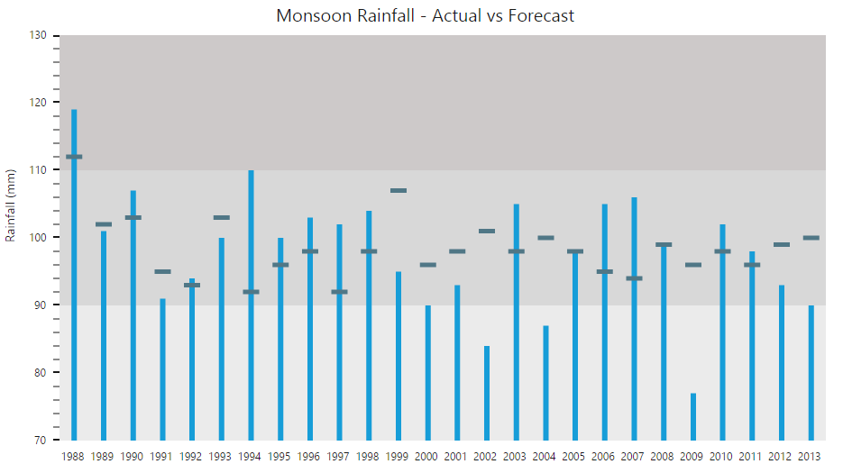
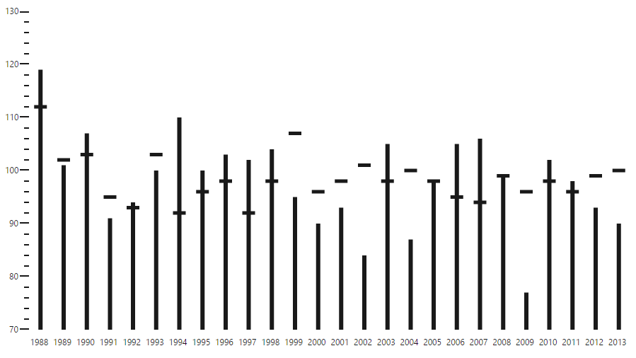
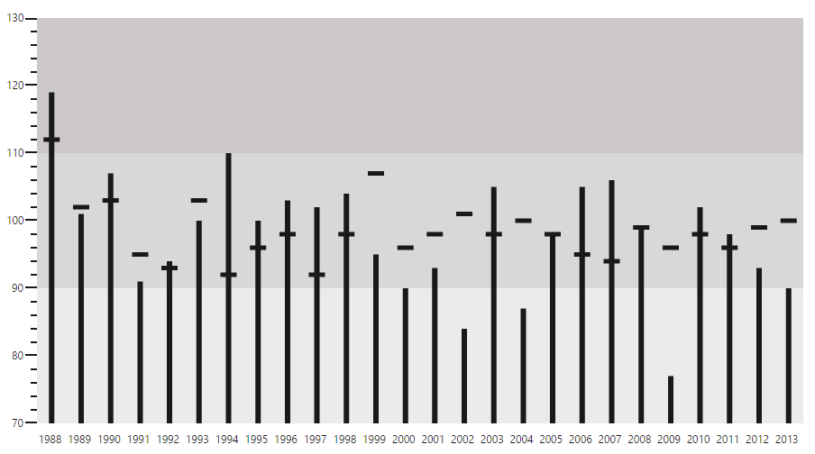
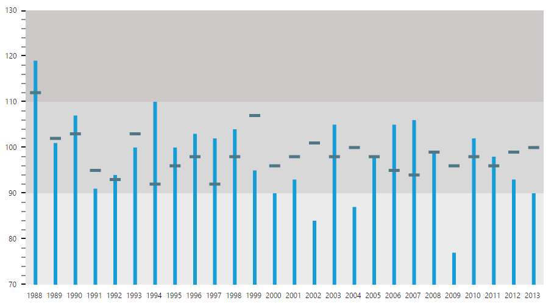
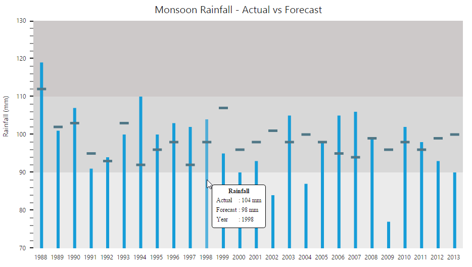

# Getting Started

This section explains briefly about how to create a **BulletGraph** in your application with **PHP**.

## Create your first BulletGraph in PHP

This section encompasses the details on how to configure the **BulletGraph** control in applications. It also helps you to learn how to pass the required data to it and to customize its various options according to their needs. 

In the following screenshot, a **BulletGraph** is used to compare the actual monsoon rainfall received in a state versus its forecasted values for the years ranging from 1988 to 2013. 

 

## Adding PHP EJ source and script reference

Create a first PHP file in Xampp and name it appropriately with .php extension and also place it under the newly created sample folder. Now refer AutoLoad.php file from EJ source of PHP in the sample page. For example, say Index.php with the initial code as shown below -

Refer the required scripts files in your PHP page as mentioned below in order to render the BulletGraph control.



<!DOCTYPE html>
<html>
<head>
<!--  jquery script  -->
        
    <!-- Essential JS UI widget -->
    </head>
<body>
<!--Refer AutoLoad.php common source to render the control-->
   <?php
      require_once '../EJ/AutoLoad.php';
    ?>
</body>
</html>



In the above code, ej.web.all.min.js script reference has been added for demonstration purpose. It is not recommended to use this for deployment purpose, as its file size is larger since it contains all the widgets. Instead, you can use [`CSG`](http://csg.syncfusion.com/) utility to generate a custom script file with the required widgets for deployment purpose.

## Initialize BulletGraph

Add the following code in the index.php file to create the BulletGraph control in index page.



    <?php
      require_once '../EJ/AutoLoad.php';
    ?>

   <?php
       $bullet=new EJ\BulletGraph("bullet");
       echo $bullet->render();
     ?>



Run the above code and the **BulletGraph** is displayed. In order to customize the measure bars within the BulletGraph, either local or remote data should be passed to it.

 

## Provide Required Data

You can customize the values of feature and comparative measure bars in a **BulletGraph**, either locally or remotely. The category data is optional, and is used to display label values in parallel to the measure bars. 

Assign the data in **localData** variable to the **dataSource** property of **BulletGraph** as shown in the following code example.



   <?php

	$Json = '[
                {
                    "value": 90, "comparativeMeasureValue": 100,
                    "category": 2013
                },
                {
                    "value": 93, "comparativeMeasureValue": 99,
                    "category": 2012
                },
                {
                    "value": 98, "comparativeMeasureValue": 96,
                    "category": 2011
                },
                {
                    "value": 102, "comparativeMeasureValue": 98,
                    "category": 2010
                },
                {
                    "value": 77, "comparativeMeasureValue": 96,
                    "category": 2009
                },
                {
                    "value": 99, "comparativeMeasureValue": 99,
                    "category": 2008
                },
                {
                    "value": 106, "comparativeMeasureValue": 94,
                    "category": 2007
                },
                {
                    "value": 105, "comparativeMeasureValue": 95,
                    "category": 2006
                },
                {
                    "value": 98, "comparativeMeasureValue": 98,
                    "category": 2005
                },
                {
                    "value": 87, "comparativeMeasureValue": 100,
                    "category": 2004
                },
                {
                    "value": 105, "comparativeMeasureValue": 98,
                    "category": 2003
                },
                {
                    "value": 84, "comparativeMeasureValue": 101,
                    "category": 2002
                },
                {
                    "value": 93, "comparativeMeasureValue": 98,
                    "category": 2001
                },
                {
                    "value": 90, "comparativeMeasureValue": 96,
                    "category": 2000
                },
                {
                    "value": 95, "comparativeMeasureValue": 107,
                    "category": 1999
                },
                {
                    "value": 104, "comparativeMeasureValue": 98,
                    "category": 1998
                },
                {
                    "value": 102, "comparativeMeasureValue": 92,
                    "category": 1997
                },
                {
                    "value": 103, "comparativeMeasureValue": 98,
                    "category": 1996
                },
                {
                    "value": 100, "comparativeMeasureValue": 96,
                    "category": 1995
                },
                {
                    "value": 110, "comparativeMeasureValue": 92,
                    "category": 1994
                },
                {
                    "value": 100, "comparativeMeasureValue": 103,
                    "category": 1993
                },
                {
                    "value": 94, "comparativeMeasureValue": 93,
                    "category": 1992
                },
                {
                    "value": 91, "comparativeMeasureValue": 95,
                    "category": 1991
                },
                {
                    "value": 107, "comparativeMeasureValue": 103,
                    "category": 1990
                },
                {
                    "value": 101, "comparativeMeasureValue": 102,
                    "category": 1989
                },
                {
                    "value": 119, "comparativeMeasureValue": 112,
                    "category": 1988
                }]';
				
	$Json = json_decode($Json,true);

	$field= new EJ\BulletGraph\Field();
				$field->dataSource($Json);
    echo $bullet->fields($field)->render();
?>



Once the **dataSource** property is assigned with the required values, you can bind the variable names used in the **JSON** data to the corresponding fields of the **BulletGraph** as shown in the following code sample.



    <?php
    $bullet=new EJ\BulletGraph("bullet");
	
    $field= new EJ\BulletGraph\Field();
    $field->dataSource($Json)->comparativeMeasure("comparativeMeasureValue")->
                                                                                 featureMeasures("value")->category("category");

    echo $bullet->fields($field)->qualitativeRangeSize(320)->height(400)->render();
    ?>



## Set Default and Scale Values

You can plot more number of measure bars within the **BulletGraph**, the height and width of the control should be increased to locate all the measure bars within the graph.The **qualitativeRangeSize** and **quantitativeScaleLength** property needs to be set accordingly as shown in the following code example.

By default, the **BulletGraph** is rendered in the Horizontal orientation with its flow direction set to **Forward.** In this example,to achieve the desired output, horizontal orientation should be changed to **Vertical** orientation with the flow direction set to **Backward**.

**Minimum**, **maximum** and **interval** values for the **quantitativeScale** of the **bullet graph** should be set, as shown in the following code example. The ticks and labels within the scale also need to be positioned.



<?php
    $bullet=new EJ\BulletGraph("bullet");
				$Json = json_decode($Json,true);
				$field= new EJ\BulletGraph\Field();
				$field->dataSource($Json)->comparativeMeasure("comparativeMeasureValue")->featureMeasures("value")->category("category");
				
				$label = new EJ\BulletGraph\LabelSetting();
				$label->position("above");
				$quantitaiveScale = new EJ\BulletGraph\QuantitativeScaleSetting();
				$quantitaiveScale->minimum(70)->maximum(130)->interval(10)->tickPosition("above")->labelSettings($label);
				
    echo $bullet->fields($field)->qualitativeRangeSize(800)->height(400)->quantitativeScaleSettings($quantitaiveScale)
	->width(850)->quantitativeScaleLength(425)
	      ->orientation("vertical")->flowDirection("backward")
	->render();
    ?>



 

As you can see in the image above, the bullet graph without any ranges is displayed in the background. The steps to add the **qualitativeRanges** are described in the next section.

## Add Qualitative Ranges

By default, 3 ranges are displayed in the **BulletGraph** control during the initial rendering of the control with its default values. In order to customize it, you need to set appropriate values for the **rangeEnd** and its **rangeStroke** properties.  Any number of **qualitativeRanges** can be added to the control. 



    <?php
    $bullet=new EJ\BulletGraph("bullet");
				$Json = json_decode($Json,true);
				$field= new EJ\BulletGraph\Field();
				$field->dataSource($Json)->comparativeMeasure("comparativeMeasureValue")->featureMeasures("value")->category("category");
				
				$label = new EJ\BulletGraph\LabelSetting();
				$label->position("above");
				$quantitaiveScale = new EJ\BulletGraph\QuantitativeScaleSetting();
				$quantitaiveScale->minimum(70)->maximum(130)->interval(10)->tickPosition("above")->labelSettings($label);
				
				$qualityRange1 = new EJ\BulletGraph\QualitativeRange();
				$qualityRange2 = new EJ\BulletGraph\QualitativeRange();
				$qualityRange3 = new EJ\BulletGraph\QualitativeRange();
				$qualityRange1->rangeEnd(90);$qualityRange2->rangeEnd(110);$qualityRange3->rangeEnd(130)->rangeStroke("#CDC9C9");
				
				$qualitativeRangeColl = array($qualityRange1, $qualityRange2, $qualityRange3);
				
    echo $bullet->fields($field)->qualitativeRangeSize(800)->height(400)->quantitativeScaleSettings($quantitaiveScale)
	->width(850)->quantitativeScaleLength(425)->qualitativeRanges($qualitativeRangeColl)
	      ->orientation("vertical")->flowDirection("backward")
	->render();
    ?>



After adding **qualitativeRanges** to the **BulletGraph**, the control will be rendered as follows.

 

## Ticks and Measure Bars Customization

You have to do the following code changes in the quantitative scale in order to customize the tick size, the colors of the feature bar and comparative measure symbols. 



    <?php
    $bullet=new EJ\BulletGraph("bullet");
				$Json = json_decode($Json,true);
				$field= new EJ\BulletGraph\Field();
				$field->dataSource($Json)->comparativeMeasure("comparativeMeasureValue")->featureMeasures("value")->category("category");
				
				$label = new EJ\BulletGraph\LabelSetting();
				$label->position("above");
				
				$featureMeasure = new EJ\BulletGraph\FeaturedMeasureSetting();
				$featureMeasure->stroke("#507786");
				$comparativeMeasure = new EJ\BulletGraph\ComparativeMeasureSetting();
				$comparativeMeasure->stroke("#169DD8");
				
				$majorTick = new EJ\BulletGraph\MajorTickSetting();
				$majorTick->width(1)->size(7);
				$minorTick = new EJ\BulletGraph\MinorTickSetting();
				$minorTick->width(1);
				
				$quantitaiveScale = new EJ\BulletGraph\QuantitativeScaleSetting();
				$quantitaiveScale->minimum(70)->maximum(130)->interval(10)->tickPosition("above")->labelSettings($label)
				  ->comparativeMeasureSettings($comparativeMeasure)->majorTickSettings($majorTick)->minorTickSettings($minorTick )
		          ->featuredMeasureSettings($featureMeasure);
				
				$qualityRange1 = new EJ\BulletGraph\QualitativeRange();
				$qualityRange2 = new EJ\BulletGraph\QualitativeRange();
				$qualityRange3 = new EJ\BulletGraph\QualitativeRange();
				$qualityRange1->rangeEnd(90);$qualityRange2->rangeEnd(110);$qualityRange3->rangeEnd(130)->rangeStroke("#CDC9C9");
				
				$qualitativeRangeColl = array($qualityRange1, $qualityRange2, $qualityRange3);
				
				
				
    echo $bullet->fields($field)->qualitativeRangeSize(800)->height(400)->quantitativeScaleSettings($quantitaiveScale)
	->width(850)->quantitativeScaleLength(425)->qualitativeRanges($qualitativeRangeColl)
	      ->orientation("vertical")->flowDirection("backward")
	->render();
    ?>



When customization of ticks and measure bars is done, **BulletGraph** looks as follows

 

## Add Caption and Subtitle

You can display an appropriate Caption and Subtitle in the **BulletGraph** by adding the following code example.



    <?php
    $bullet=new EJ\BulletGraph("bullet");

				$Json = json_decode($Json,true);
				$field= new EJ\BulletGraph\Field();
				$field->dataSource($Json)->comparativeMeasure("comparativeMeasureValue")->featureMeasures("value")->category("category");
				
				$label = new EJ\BulletGraph\LabelSetting();
				$label->position("above");
				
				$featureMeasure = new EJ\BulletGraph\FeaturedMeasureSetting();
				$featureMeasure->stroke("#507786");
				$comparativeMeasure = new EJ\BulletGraph\ComparativeMeasureSetting();
				$comparativeMeasure->stroke("#169DD8");
				
				$majorTick = new EJ\BulletGraph\MajorTickSetting();
				$majorTick->width(1)->size(7);
				$minorTick = new EJ\BulletGraph\MinorTickSetting();
				$minorTick->width(1);
				
				$quantitaiveScale = new EJ\BulletGraph\QuantitativeScaleSetting();
				$quantitaiveScale->minimum(70)->maximum(130)->interval(10)->tickPosition("above")->labelSettings($label)
				  ->comparativeMeasureSettings($comparativeMeasure)->majorTickSettings($majorTick)->minorTickSettings($minorTick )
		          ->featuredMeasureSettings($featureMeasure);
				
				$qualityRange1 = new EJ\BulletGraph\QualitativeRange();
				$qualityRange2 = new EJ\BulletGraph\QualitativeRange();
				$qualityRange3 = new EJ\BulletGraph\QualitativeRange();
				$qualityRange1->rangeEnd(90);$qualityRange2->rangeEnd(110);$qualityRange3->rangeEnd(130)->rangeStroke("#CDC9C9");
				
				$qualitativeRangeColl = array($qualityRange1, $qualityRange2, $qualityRange3);
				
				$font = new EJ\BulletGraph\Font();
				$font->fontFamily("Segoe UI")->size("14px")->fontWeight("regular")->opacity(1);
				$subtitlelocation = new EJ\BulletGraph\SubTitleLocation();
                $subtitlelocation->x(180)->y(4);
                $subtitle = new EJ\BulletGraph\SubTitle();
                $subtitle->textAngle(0)->text("Rainfall (mm)")->location($subtitlelocation)->font($font);
				
				$font->size("20px");
				$captionlocation=new EJ\BulletGraph\CaptionSettingsLocation();
                $captionlocation->x(470)->y(270);  
                $captions = new EJ\BulletGraph\CaptionSetting();
                $captions->textAngle(0)->text("Monsoon Rainfall - Actual vs Forecast")
	                     ->location($captionlocation)->textAngle(90)
						 ->subTitle($subtitle)->font($font);
				
    echo $bullet->fields($field)->qualitativeRangeSize(800)->height(400)->quantitativeScaleSettings($quantitaiveScale)
	      ->width(850)->quantitativeScaleLength(425)->qualitativeRanges($qualitativeRangeColl)
	      ->orientation("vertical")->flowDirection("backward")
		  ->captionSettings($captions)
	->render();
    ?>



The following screenshot displays a **BulletGraph** in the caption and title in the **BulletGraph**.

 

## Show Tooltip

You can use a Tooltip in your application to display any information. In this example, a tooltip is used to show the values (in millimeter) of forecasted rainfall, actual rainfall received in (mm) and also the appropriate year. The tooltip is enabled by setting the **visible** property in tooltip to **True.** Also, in order to set the template tooltip, you can pass the template id to it as shown in the following code example.



    <?php
      $bullet=new EJ\BulletGraph("bullet");

      $tooltip = new EJ\BulletGraph\TooltipSetting();
      $tooltip->visible(true) ->template("Tooltip");

     echo $bullet->tooltipSettings($tooltip)->render();

     
  

**Template content**



           Rainfall 

<table>
<tr><td>Actual</td>
<td>: mm</td></tr>
<tr><td>Forecast</td>
<td>: mm</td></tr>
<tr><td>Year</td>
<td>: </td></tr>
</table>



By using the customization options discussed in this section, the **BulletGraph** is rendered as displayed on the following screenshot.

 

