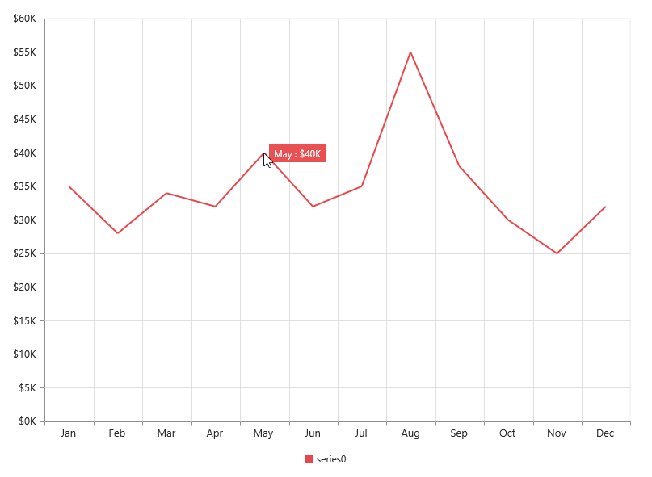
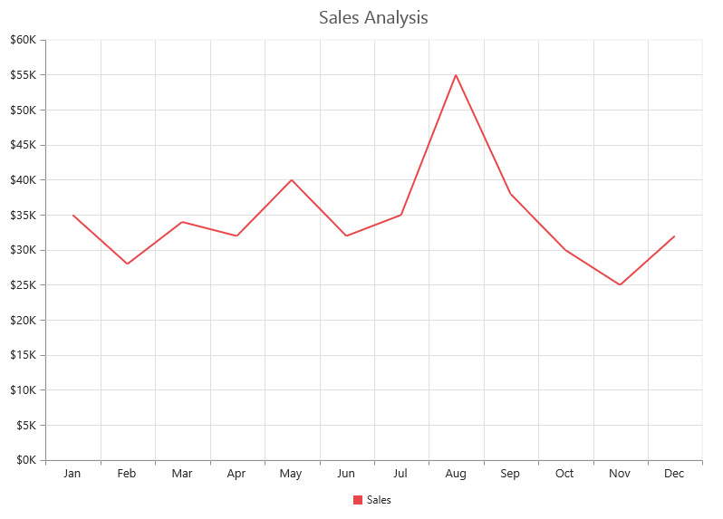

# Getting Started with PHP Chart

This section explains you the steps required to populate the Chart with data, add data labels, tooltips and title to the Chart. This section covers only the minimal features that you need to know to get started with the Chart.

## Adding PHP EJ source and script reference

Create a first PHP file in Xampp and name it appropriately with .php extension and also place it under the newly created sample folder. Now refer AutoLoad.php file from EJ source of PHP in the sample page. For example, say Index.php with the initial code as shown below -

Refer the required scripts files in your PHP page as mentioned below in order to render the Chart control.



<!DOCTYPE html>
<html>
<head>
<!--  jquery script  -->
        
    <!-- Essential JS UI widget -->
    </head>
<body>
<!--Refer AutoLoad.php common source to render the control-->
   <?php
      require_once '../EJ/AutoLoad.php';
    ?>
</body>
</html>



In the above code, ej.web.all.min.js script reference has been added for demonstration purpose. It is not recommended to use this for deployment purpose, as its file size is larger since it contains all the widgets. Instead, you can use [`CSG`](http://csg.syncfusion.com/) utility to generate a custom script file with the required widgets for deployment purpose.

## Initialize chart

Add the following code in the index.php file to create the Chart control in index page.



    <?php
    require_once '../EJ/AutoLoad.php';
    ?>

    <?php
    $chart=new EJ\Chart("container");
    echo $chart->render();
    ?>



Now, the Chart is rendered with some auto-generated random values and with default Column chart type.

## Populate chart with data

Now, this section explains how to plot JSON data to the Chart. First, let us prepare a sample JSON data with each object containing following fields – month and sales.



<?php
  $Json = '[
      { "month": "Jan", "sales": 35 },
      { "month": "Feb", "sales": 28 },
      { "month": "Mar", "sales": 34 },
      { "month": "Apr", "sales": 32 },
      { "month": "May", "sales": 40 },
      { "month": "Jun", "sales": 32 },
      { "month": "Jul", "sales": 35 },
      { "month": "Aug", "sales": 55 },
      { "month": "Sep", "sales": 38 },
      { "month": "Oct", "sales": 30 },
      { "month": "Nov", "sales": 25 },
      { "month": "Dec", "sales": 32 }]';
    $Json = json_decode($Json,true);
?>



Add a series object to the chart by using the series option and set the chart type as line by using the type option. 



    <?php
    $chart=new EJ\Chart("container");

    $series1 = new EJ\Chart\Series();
    // set series type
    $series1-> type("line");

    $seriesCollection = array($series1);

    echo $chart->series($seriesCollection)->render();
    ?>



You can also add multiple series objects based on your requirement. Refer to the Chart Types and Chart Series sections to know more about chart types, how to add multiple series and customize series appearance.

Now, map the month and sales values in the data source to the line series by setting the *xName* and *yName* with the field names respectively and then set the actual data by using the *dataSource* option. Refer to the Data Binding section to know more about binding the local and remote data to the chart.



<?php
    $chart=new EJ\Chart("container");

    $series1 = new EJ\Chart\Series();
    //Set datasource, xName and yName
    $series1->dataSource($Json)->xName("month")->yName("sales");

    $seriesCollection = array($series1);

    echo $chart->series($seriesCollection)->render();
    ?>



Since the data is related to sales, format the vertical axis labels by adding ‘$’ as a prefix and ‘K’ as a suffix to each label. This can be achieved by setting the “${value}K” to the *labelFormat* option of the axis. Here, {value} acts as a placeholder for each axis label, “$” and “K” are the actual prefix and suffix added to each axis label. 



<?php
    $chart=new EJ\Chart("container");
    $yAxis = new EJ\Chart\PrimaryYAxis();
       
    // Customize the axis label format.
    $yAxis->labelFormat('${value}K');
    echo $chart-> primaryYAxis($yAxis)->render();
  ?>



Refer to the Axis section to know more about axis types, adding multiple axes and other customization options.

## Add Data Labels

You can add data labels to improve the readability of the chart. This can be achieved by enabling the *visible* option in the *dataLabel* option. Now, the data labels are rendered at the top of all the data points

The following code example illustrates this,



  <?php
    $chart=new EJ\Chart("container");
    $marker = new EJ\Chart\Marker();
    $datalabel = new EJ\Chart\DataLabel();

    //Enable data label in the chart
    $datalabel->visible(true);
    $marker->dataLabel($datalabel);

    $series1 = new EJ\Chart\Series();
    $series1-> marker($marker);
    $seriesCollection = array($series1);

   echo $chart->series($seriesCollection) ->render();
  ?>



There are situations where the default label content is not sufficient to the user. In this case, you can use the *template* option to format the label content with some additional information.

 

<!DOCTYPE html>
<html>
<body>
      

         
#point.x#:$#point.y#K

      

</body>
</html>



The above HTML template is used as a template for each data label. Here, “point.x” and “point.y” are the placeholder text used to display the corresponding data point’s x & y value.

The following code example shows how to set the id of the above template to *template* option,



<?php
    $chart=new EJ\Chart("container");
    $marker = new EJ\Chart\Marker();
    $datalabel = new EJ\Chart\DataLabel();

    //Set the id of HTML template to the chart series
    $datalabel->visible(true) ->template("dataLabelTemplate");
    $marker->dataLabel($datalabel);

    $series1 = new EJ\Chart\Series();
    $series1-> marker($marker);
    $seriesCollection = array($series1);

   echo $chart->series($seriesCollection) ->render();
  ?>



Refer to the Data Markers section to know more about the options available to customize it.

## Enable Legend

You can enable or disable the legend by using the *visible* option in the **legend**. It is enabled in the chart, by default.



<?php
    $chart=new EJ\Chart("container");

    $series1 = new EJ\Chart\Series();	
    // set legend name
    $series1 ->name("Sales");
    $seriesCollection = array($series1);

    $chartLegend = new EJ\Chart\Legend();
    //Enable chart legend
    $chartLegend->visible(true);

    echo $chart->series($seriesCollection) ->legend($chartLegend)->render();
    ?>



Refer to the Legend section to know more about how to position legend and customize its appearance.

## Enable Tooltip

The Tooltip is useful when you cannot display information by using the Data Labels due to the space constraints. You can enable tooltip by using the *visible* option of the **tooltip** in the specific series.

The following code example illustrates this,



<?php
    $chart=new EJ\Chart("container");

    $tooltip = new EJ\Chart\Tooltip();
    $tooltip->visible(true);

    $series1 = new EJ\Chart\Series();	
    // visible tooltip to chart series
    $series1->tooltip($tooltip);
    $seriesCollection = array($series1);

    echo $chart->series($seriesCollection)->render();
    ?>



Refer to the Tooltip section to know more about formatting tooltip contents and customizing its appearance.

## Add Chart Title

You need to add a title to the chart to provide quick information to the user about the data being plotted in the chart. You can add it by using the text option of the title.



  <?php
    $chart=new EJ\Chart("container");

     $chartTitle= new EJ\Chart\Title();
     //Add title to chart control
     $chartTitle->text("Sales Analysis");

    echo $chart->title($chartTitle)->render();
    ?>



Refer to the Chart Title section to know more about aligning title, customizing its appearance and adding subtitle to the chart.
