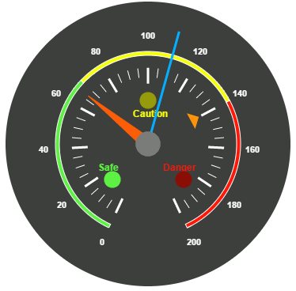
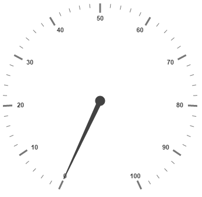
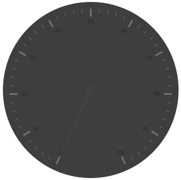
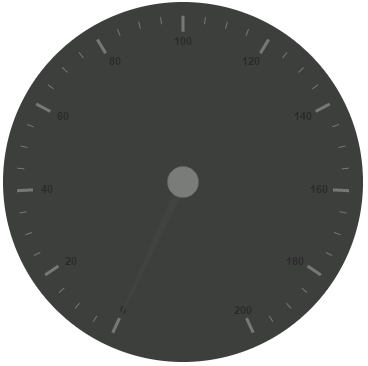
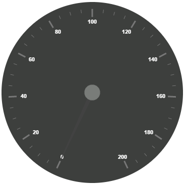
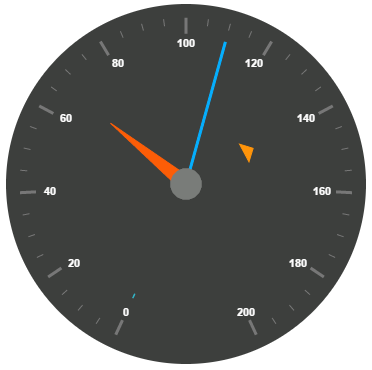
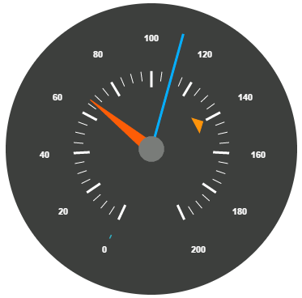
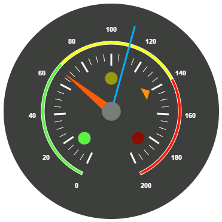

# Getting Started

This section encompasses how to configure **Circular Gauge**. You can provide data to a **Circular Gauge** and make them to display  in a required way. 

The following screen shot displays a **Circular Gauge**, which visually represents the functions of an Automobile speedometer with RPM (Rotation per Minute), kph (Kilometer per hour) and it denotes the speed level indicators (Safe, Caution and Danger). 

## Adding PHP EJ source and script reference

Create a first PHP file in Xampp and name it appropriately with .php extension and also place it under the newly created sample folder. Now refer AutoLoad.php file from EJ source of PHP in the sample page. For example, say Index.php with the initial code as shown below -

Refer the required scripts files in your PHP page as mentioned below in order to render the CircularGauge control.



<!DOCTYPE html>
<html>
<head>
<link href="http://cdn.syncfusion.com/14.4.0.15/js/web/flat-azure/ej.web.all.min.css" rel="stylesheet" />
<!--  jquery script  -->
        
    <!-- Essential JS UI widget -->
    
</head>
<body>
<!--Refer AutoLoad.php common source to render the control-->
   <?php
      require_once '../EJ/AutoLoad.php';
    ?>
</body>
</html>



In the above code, ej.web.all.min.js script reference has been added for demonstration purpose. It is not recommended to use this for deployment purpose, as its file size is larger since it contains all the widgets. Instead, you can use [`CSG`](http://csg.syncfusion.com/) utility to generate a custom script file with the required widgets for deployment purpose.

## Initialize CircularGauge

Add the following code in the index.php file to create the Sparkline control in index page.



    <?php
    require_once '../EJ/AutoLoad.php';
    ?>

 <?php
      $circular=new EJ\CircularGauge("circular1");    
	
      echo $circular->render();
    ?>



On executing the above code, sample renders a default **Circular Gauge** with default values as follows.

## Set Height and Width values

Pointers have different height and range. You can set the height and width of the gauge.



     <?php
    $circular=new EJ\CircularGauge("circular1");    
	
    echo $circular->width(500)->height(500)->render();
    ?>



The following screenshot displays a **Gauge** in which height and width are set.

## Set Background Color

You can draw the speedometer with dark background and to vary the speed of the pointer, set the **readOnly** option as **False** for user interaction. 



    <?php
    $circular=new EJ\CircularGauge("circular1");    
	
    echo $circular->width(500)->height(500)
	              ->backgroundColor("#3D3F3D")
				  ->readOnly(false)->render();
    ?>



The above code example renders a **Gauge** as shown in the following screen shot.

## Provide scale values

* You can customize the pointer cap using the following options- Cap radius, Cap border color, cap background color, pointer cap border width. 

* Set the maximum speed limit in the **Gauge** as 200KmpH.

* Major Ticks and Minor Ticks have the interval values 20 and 5 respectively. Show ranges and show indicators are used to display the ranges and indicators in their respective positions.



   <?php
    $circular=new EJ\CircularGauge("circular1");    
	
	$scale=new EJ\CircularGauge\Scale();
	
	$pointerCap=new EJ\CircularGauge\PointerCap();
	$pointerCap->radius(15)->borderWidth(0)->backgroundColor("#797C79")->borderColor("#797C79");
	$scale->showRanges(true)->showIndicators(true)->maximum(200)->pointerCap($pointerCap)
	      ->majorIntervalValue(20)->minorIntervalValue(5);
 	$scales=array($scale);	  
	
    echo $circular->width(500)->height(500)->scales($scales)
	              ->backgroundColor("#3D3F3D")
				  ->readOnly(false)->render();
?>



On executing the above code, sample renders a **Circular Gauge** with customized labels as follows.

## Add Label Customization

To display the values in the **Gauge,** scale labels are used. You can customize the label color.  



     <?php
    $circular=new EJ\CircularGauge("circular1");    
	
	$scale=new EJ\CircularGauge\Scale();
	
	
	$label=new EJ\CircularGauge\Label();
	$label->color("#ffffff");
	$labels=array($label);
       //Add the pointers customization code here
	$scale->showRanges(true)->labels($labels);
 	$scales=array($scale);	  
	
    echo $circular->width(500)->height(500)->scales($scales)
	              ->backgroundColor("#3D3F3D")
				  ->readOnly(false)->render();
    ?>



On executing the above code, sample renders a default **Circular Gauge** with customized labels as follows.

## Add pointer data

You can use three pointers that denote kilometer value, rotation per minute value and torque value.The torque value pointer should not be similar to other two pointers. Set the torque pointer as marker pointer. You can set other attributes for pointer such as background color, border color, Length, width and distance from scale.



    <?php
    $circular=new EJ\CircularGauge("circular1");

	$pborder1=new EJ\CircularGauge\Border();
	$pborder1->color("#FF940A");
	$pborder2=new EJ\CircularGauge\Border();
	$pborder2->color("#05AFFF");
	$pborder3=new EJ\CircularGauge\Border();
	$pborder3->color("#FC5D07");
	$pointer1 = new EJ\CircularGauge\Pointer(); 
    $pointer1-> type("marker")->length(20)->width(10)->distanceFromScale(60)->value(140)->markerType("triangle")->backgroundColor("#FF940A")->border($pborder1)->radius(10);
    $pointer2 = new EJ\CircularGauge\Pointer();   
    $pointer2->length(150)->width(2)->value(110)->showBackNeedle(false)->needleType("rectangle")->backgroundColor("#05AFFF")->border($pborder2)->radius(10);
    $pointer3 = new EJ\CircularGauge\Pointer();   
    $pointer3->length(100)->width(15)->value(67)->showBackNeedle(false)->backgroundColor("#FC5D07")->border($pborder3)->radius(10);
    $pointers = array($pointer1, $pointer2, $pointer3);
	
	
	$scale->showRanges(true)->showIndicators(true)->maximum(200)
	      ->majorIntervalValue(20)->minorIntervalValue(5)->pointers($pointers);
 	$scales=array($scale);	  
	
    echo $circular->width(500)->height(500)->scales($scales)
	              ->backgroundColor("#3D3F3D")
				  ->readOnly(false)->render();
    ?>



On executing the above code, sample renders a customized **Circular Gauge** as follows.

## Add Tick Details

You can display the tick value with customization as given in the following code example. You can set width and height of the Major ticks greater than the Minor ticks. You can set dark background for tick Color to have a better visibility.



    <?php
    $circular=new EJ\CircularGauge("circular1");
        //Add the ranges customization code here
        //Add the indicators customization code here
        //Add the Custom labels customization code here
              $tick1=new EJ\CircularGauge\Tick();
	$tick1->type("major")->distanceFromScale(70)->height(20)->width(3)->color("#ffffff");
	$tick2=new EJ\CircularGauge\Tick();
	$tick2->type("minor")->distanceFromScale(70)->height(12)->width(1)->color("#ffffff");
	$ticks=array($tick1, $tick2);
	
	$scale->showRanges(true)->showIndicators(true)-> ticks($ticks)
	      ->majorIntervalValue(20)->minorIntervalValue(5);
 	$scales=array($scale);	  
	
    echo $circular->width(500)->height(500)->scales($scales)
	              ->backgroundColor("#3D3F3D")
				  ->readOnly(false)->render();
    ?>



On executing the above code, sample renders a **Circular Gauge** with customized labels as follows.

## Add Range Values

Ranges denote the property of scale value in the speedometer. The color values of the ranges specify the speed variation. Set **showRanges** property to **“True”** to show the ranges in the **Circular Gauge**. Select safe zone for low speed, caution zone for moderate speed and high zone for high speed.You can customize the range with the properties such as start value, end value, start width, end width,  background color , border color, etc.,



 <?php
             $circular=new EJ\CircularGauge("circular1");  
	$rborder1=new EJ\CircularGauge\Border();
	$rborder1->color("#FFFFFF");
	$rborder2=new EJ\CircularGauge\Border();
	$rborder2->color("#FFFFFF");
	$rborder3=new EJ\CircularGauge\Border();
	$rborder3->color("#FFFFFF");
	$range1=new EJ\CircularGauge\Range();
	$range1->distanceFromScale(30)->startValue(0)->endValue(70)->backgroundColor("#5DF243")->border($rborder1);
	$range2=new EJ\CircularGauge\Range();
	$range2->distanceFromScale(30)->startValue(70)->endValue(140)->backgroundColor("#F6FF0A")->border($rborder2);
	$range3=new EJ\CircularGauge\Range();
	$range3->distanceFromScale(30)->startValue(140)->endValue(200)->backgroundColor("#FF1807")->border($rborder3);
	$ranges=array($range1, $range2, $range3);
	$scale->showRanges(true)->showIndicators(true)->maximum(200)->pointerCap($pointerCap)
	      ->majorIntervalValue(20)->minorIntervalValue(5)
		   ->ranges($ranges);
 	$scales=array($scale);	  
	
    echo $circular->width(500)->height(500)->scales($scales)
	              ->backgroundColor("#3D3F3D")->readOnly(false)->render();
    ?>



On executing the above code, sample renders a **Circular Gauge** with customized range as follows.

## Add Indicator Details

Indicators denote whether the pointer values are placed in their respective zones. You can position the indicator on the respective range value for the required changes. You can set the location of the indicator using **position** property. The **stateRanges** property defines how the indicator should behave when the pointer is in certain values. 



    <?php
    $circular=new EJ\CircularGauge("circular1");
             //Add the labels customization code here
      //Add the pointers customization code here
      //Add the ticks customization code here
      //Add the ranges customization code here
      //Add the indicators customization code here
              $iposition1=new EJ\CircularGauge\Position();
	$iposition1->x(210)->y(300);
	$stateRange11=new EJ\CircularGauge\StateRange();
	$stateRange11->endValue(70)->startValue(0)->backgroundColor("#5DF243")->borderColor("#5DF243")->text("")-> textColor("#870505");
	$stateRange12=new EJ\CircularGauge\StateRange();
	$stateRange12->endValue(200)->startValue(70)->backgroundColor("#145608")->borderColor("#145608")->text("")-> textColor("#870505");
	$stateRanges1=array($stateRange11,$stateRange12);
	$indicator1=new EJ\CircularGauge\Indicator();
	$indicator1->height(10)->width(10)->type("circle")->position($iposition1)->stateRanges($stateRanges1);
	
	$iposition2=new EJ\CircularGauge\Position();
	$iposition2->x(255)->y(200);
	$stateRange21=new EJ\CircularGauge\StateRange();
	$stateRange21->endValue(140)->startValue(70)->backgroundColor("#F6FF0A")->borderColor("#F6FF0A")->text("");
	$stateRange22=new EJ\CircularGauge\StateRange();
	$stateRange22->endValue(70)->startValue(0)->backgroundColor("#969B0C")->borderColor("#969B0C")->text("");
	$stateRange23=new EJ\CircularGauge\StateRange();
	$stateRange23->endValue(200)->startValue(140)->backgroundColor("#969B0C")->borderColor("#969B0C")->text("");
	$stateRanges2=array($stateRange21,$stateRange22, $stateRange23);
	$indicator2=new EJ\CircularGauge\Indicator();
	$indicator2->height(10)->width(10)->type("circle")->position($iposition2)->stateRanges($stateRanges2);
	
	$iposition3=new EJ\CircularGauge\Position();
	$iposition3->x(300)->y(300);
	$stateRange31=new EJ\CircularGauge\StateRange();
	$stateRange31->endValue(140)->startValue(0)->backgroundColor("#890F06")->borderColor("#890F06")->text("");
	$stateRange32=new EJ\CircularGauge\StateRange();
	$stateRange32->endValue(200)->startValue(140)->backgroundColor("#FF1807")->borderColor("#FF1807")->text("");
	$stateRanges3=array($stateRange31,$stateRange32);
	$indicator3=new EJ\CircularGauge\Indicator();
	$indicator3->height(10)->width(10)->type("circle")->position($iposition3)->stateRanges($stateRanges3);
	$indicators=array($indicator1, $indicator2, $indicator3);
	
	$scale->showRanges(true)->showIndicators(true)->maximum(200)->pointerCap($pointerCap)-> indicators($indicators);
 	$scales=array($scale);	  
	
    echo $circular->width(500)->height(500)->scales($scales)
	              ->backgroundColor("#3D3F3D") ->readOnly(false)->render();
    ?>



On executing the above code, sample renders a **Circular Gauge** with customized indicators as follows.

## Add Custom Label Details

You can specify the text in the **Gauge** using **Custom labels** and you can customize it through various properties. You can use custom texts to display the three range description.



     <?php
    $circular=new EJ\CircularGauge("circular1");
      //Add the labels customization code here
    //Add the pointers customization code here
    //Add the ticks customization code here
    //Add the ranges customization code here
    //Add the indicators customization code here
    //Add the Custom labels customization code here

	$cposition1=new EJ\CircularGauge\Position();
	$cposition1->x(200)->y(280);
	$customLabel1=new EJ\CircularGauge\CustomLabel();
	$customLabel1->value("Safe")->color("#5DF243")->position($cposition1);
	$cposition2=new EJ\CircularGauge\Position();
	$cposition2->x(253)->y(212);
	$customLabel2=new EJ\CircularGauge\CustomLabel();
	$customLabel2->value("Caution")->color("#F6FF0A")->position($cposition2);
	$cposition3=new EJ\CircularGauge\Position();
	$cposition3->x(290)->y(283);
	$customLabel3=new EJ\CircularGauge\CustomLabel();
	$customLabel3->value("Danger")->color("#FF1807")->position($cposition3);
	$customLabels=array($customLabel1, $customLabel2, $customLabel3);

	$scale->showRanges(true)->showIndicators(true)->customLabels($customLabels);
 	$scales=array($scale);	  
	
    echo $circular->width(500)->height(500)->scales($scales)
	              ->backgroundColor("#3D3F3D")->readOnly(false)->render();
    ?>



The following screenshot displays a **Circular Gauge** control with all customization properties.

