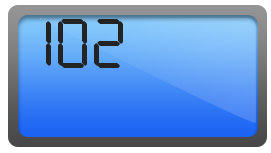
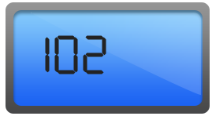
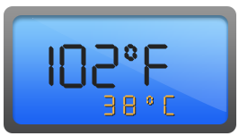

# Getting Started

* This section encompasses on how to configure **Digital Gauge**. You can provide your own data for a **Digital Gauge** and make them to display in a required way. 

* You can also customize the default **Digital Gauge** appearance. As a result, **Digital Gauge** looks like a Digital thermometer. 

* **Digital gauge** is used in advertisement, decorative purpose, displaying share details in share market, game score boards, token systems, etc.

## Create a Digital Gauge

Create a first PHP file in Xampp and name it appropriately with .php extension and also place it under the newly created sample folder. Now refer AutoLoad.php file from EJ source of PHP in the sample page. For example, say Index.php with the initial code as shown below -

Refer the required scripts files in your PHP page as mentioned below in order to render the DigitalGauge control.



<!DOCTYPE html>
<html>
<head>
<link href="http://cdn.syncfusion.com/14.4.0.15/js/web/flat-azure/ej.web.all.min.css" rel="stylesheet" />
<!--  jquery script  -->
        
    <!-- Essential JS UI widget -->
    
</head>
<body>
<!--Refer AutoLoad.php common source to render the control-->
   <?php
      require_once '../EJ/AutoLoad.php';
    ?>
</body>
</html>



In the above code, ej.web.all.min.js script reference has been added for demonstration purpose. It is not recommended to use this for deployment purpose, as its file size is larger since it contains all the widgets. Instead, you can use [`CSG`](http://csg.syncfusion.com/) utility to generate a custom script file with the required widgets for deployment purpose.

## Initialize Sparkline

Add the following code in the index.php file to create the DigitalGauge control in index page.



    <?php
    require_once '../EJ/AutoLoad.php';
    ?>

    <?php
    $digitalGauge=new EJ\DigitalGauge("digital1");    
	
    echo $digitalGauge->render();
    ?>



On executing the above code, sample renders a default **Digital Gauge** with default values as follows.

## Set Height and Width values

Basic attributes of each canvas elements are height and width. You can set the height and width of the gauge.



    <?php
    $digitalGauge=new EJ\DigitalGauge("digital1");    
	
    echo $digitalGauge->height(145)->width(260)->render();
    ?>



On executing the above code, sample renders a default **Digital Gauge** with the specified height and width values.

## Set Items Property

You can customize the **Digital Gauge** using different properties.

**Add Segment and Character Properties**

* In this example, the **Digital Gauge** uses a welcome board in which the text color must be distinctly visible in nature. In order to meet this requirement, you can give some segment properties such as segment spacing, segment width, segment color, segment length and segment opacity.

* **Character** type is used to define the Digital representation of the character. Thee five types of character representation are as follows:

  * EightCrossEightDotMatrix

  * SevenSegment

  * FourteenSegment

  * SixteenSegment 

  * EightCrossEightSquareMatrix.



<?php
    $digitalGauge=new EJ\DigitalGauge("digital1");    
	
	$segment = new EJ\DigitalGauge\SegmentSetting();
	$segment->width(2)->length(20);
	$character = new EJ\DigitalGauge\CharacterSetting();
	$character->type("sevensegment")->spacing(12);
	$item1 = new EJ\DigitalGauge\Item();
	$item1->segmentSettings($segment)->characterSettings($character)->value("102");
	$items = array($item1);
    echo $digitalGauge->height(145)->width(260)->items($items)->render();
    ?>



On executing the above code, sample renders a **Digital Gauge** with default values as follows.

## Add Background Image

You can add a **&lt;div&gt;** element to set the background for the **Digital Gauge** and attach the styles to the **HTML** page such as height , width, background image **URL** ,background repeat property, etc.In the following code example, image used is a road in California. You can pass the text as **“WELCOME TO CALIFORNIA”**



    

    





 #frameDiv {
        align: center;
        position: relative;
        margin: 0px auto;
        display: table;
        background-image: url("script/frame.png");
        background-repeat: no-repeat;
    }



On executing the above code, sample renders a default **Digital Gauge** as follows.           

## Add Location

You can position the digital letters inside the canvas element using **location** property.



<?php
    $digitalGauge=new EJ\DigitalGauge("digital1");    
	
	$segment = new EJ\DigitalGauge\SegmentSetting();
	$segment->width(2)->length(20);
	$character = new EJ\DigitalGauge\CharacterSetting();
	$character->type("sevensegment")->spacing(12);
	$position = new EJ\DigitalGauge\Position();
	$position->x(15)->y(40);
	
	$item1 = new EJ\DigitalGauge\Item();
	$item1->segmentSettings($segment)->characterSettings($character)->value("102")->position($position);
	$items = array($item1);
    echo $digitalGauge->height(145)->width(260)->items($items)->render();
    ?>



On executing the above code, sample renders a default **Digital Gauge** as follows.

## Add Items collection

You can add **Items collection** to display the temperature value as used in the Digital thermometer.



 <?php
    require_once '../EJ/AutoLoad.php';
    ?>

    <?php
    $digitalGauge=new EJ\DigitalGauge("digital1");    
	
	$segment1 = new EJ\DigitalGauge\SegmentSetting();
	$segment1->width(2)->length(20)->spacing(0);
	$character1 = new EJ\DigitalGauge\CharacterSetting();
	$character1->type("sevensegment")->spacing(12);
	$position1 = new EJ\DigitalGauge\Position();
	$position1->x(15)->y(40);
	
	$item1 = new EJ\DigitalGauge\Item();
	$item1->segmentSettings($segment1)->characterSettings($character1)->value("102")->position($position1);
	
	$item2 = new EJ\DigitalGauge\Item();
	$segment2 = new EJ\DigitalGauge\SegmentSetting();
	$character2 = new EJ\DigitalGauge\CharacterSetting();
	$position2 = new EJ\DigitalGauge\Position();
	$segment2->width(2)->length(5)->spacing(0);
	$character2->type("sevensegment")->spacing(5);
	$position2->x(70)->y(28);
	$item2->segmentSettings($segment2)->characterSettings($character2)->value("0")->position($position2);
	
	$item3 = new EJ\DigitalGauge\Item();
	$segment3 = new EJ\DigitalGauge\SegmentSetting();
	$character3 = new EJ\DigitalGauge\CharacterSetting();
	$position3 = new EJ\DigitalGauge\Position();
	$segment3->width(2)->length(20)->spacing(0);
	$character3->type("sevensegment")->spacing(12);
	$position3->x(170)->y(40);
	$item3->segmentSettings($segment3)->characterSettings($character3)->value("F")->position($position3);
	
	$item4 = new EJ\DigitalGauge\Item();
	$segment4 = new EJ\DigitalGauge\SegmentSetting();
	$character4 = new EJ\DigitalGauge\CharacterSetting();
	$position4 = new EJ\DigitalGauge\Position();
	$segment4->width(1)->length(9)->spacing(0)->color("#F5b43f");
	$character4->type("sevensegment")->spacing(12);
	$position4->x(70)->y(90);
	$item4->segmentSettings($segment4)->characterSettings($character4)->value("38")->position($position4);
	
	$item5 = new EJ\DigitalGauge\Item();
	$segment5 = new EJ\DigitalGauge\SegmentSetting();
	$character5 = new EJ\DigitalGauge\CharacterSetting();
	$position5 = new EJ\DigitalGauge\Position();
	$segment5->width(1)->length(3)->spacing(0)->color("#F5b43f");
	$character5->type("sevensegment")->spacing(12);
	$position5->x(90)->y(80);
	$item5->segmentSettings($segment5)->characterSettings($character5)->value("0")->position($position5);
	
	$item6 = new EJ\DigitalGauge\Item();
	$segment6 = new EJ\DigitalGauge\SegmentSetting();
	$character6 = new EJ\DigitalGauge\CharacterSetting();
	$position6 = new EJ\DigitalGauge\Position();
	$segment6->width(1)->length(9)->spacing(0)->color("#F5b43f");
	$character6->type("sevensegment")->spacing(12);
	$position6->x(120)->y(90);
	$item6->segmentSettings($segment6)->characterSettings($character6)->value("C")->position($position6);
	
	$items = array($item1, $item2, $item3, $item4, $item5, $item6);
    echo $digitalGauge->height(145)->width(260)->items($items)->render();
    ?>



The following screenshot displays a **Digital Gauge** with all the customizations discussed earlier.

