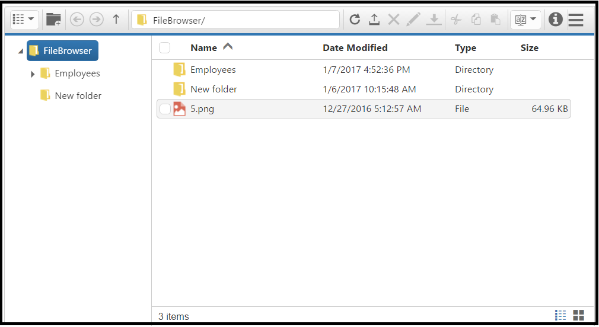

# Getting Started

The external script dependencies of the FileExplorer widget are,

* [jQuery 1.7.1](http://jquery.com/) and later versions.

And the internal script dependencies of the FileExplorer widget are:

<table>
<tr>
<th>
File</th><th>
Description/Usage</th></tr>
<tr>
<td>
ej.core.min.js  </td><td>
Must be referred always before using all the JS controls.  </td></tr>
<tr>
<td>
ej.data.min.js  </td><td>
Used to handle data operation and should be used while binding data to JS controls.  </td></tr>
<tr>
<td>
ej. draggable.min.js  </td><td>
Used to handle the drag and drop functionality  </td></tr>
<tr>
<td>
ej.scroller.min.js  </td><td>
Used to show the scroller in the layout area  </td></tr>
<tr>
<td>
ej.button.min.js  </td><td>
Used to display the buttons in the toolbar  </td></tr>
<tr>
<td>
ej.treeview.min.js  </td><td>
Used to display the treeview in the navigation pane  </td></tr>
<tr>
<td>
ej.uploadbox.min.js  </td><td>
Used to perform the upload functionality   </td></tr>
<tr>
<td>
ej.waitingpopup.min.js  </td><td>
Used to showcase the waiting popup  </td></tr>
<tr>
<td>
ej.dialog.min.js  </td><td>
Used to create the alert windows   </td></tr>
<tr>
<td>
ej.splitter.min.js  </td><td>
Used as the body section to separate the navigation and layout area  </td></tr>
<tr>
<td>
ej.toolbar.min.js  </td><td>
Used to showcase the hearer section  </td></tr>
<tr>
<td>
ej.menu.min.js  </td><td>
Used to showcase the context menu  </td></tr>
<tr>
<td>
ej.grid.min.js  </td><td>
Used to showcase the grid layout view  </td></tr>

</table>

For getting started you can use the ‘ej.web.all.min.js’ file, which encapsulates all the 'ej' controls and frameworks in one single file.  

For themes, you can use the ‘ej.web.all.min.css’ CDN link from the snippet given. To add the themes in your application, please refer [this link](http://help.syncfusion.com/js/theming-in-essential-javascript-components#adding-specific-theme-to-your-application).

## Preparing HTML document

You can create a PHP Project and add necessary scripts and styles with the help of the given PHP Getting Started Documentation.

Create a first PHP file in Xampp and name it appropriately with `.php` extension and also place it under the newly created sample folder. For example, say Index.php with the initial code as shown below 

Refer the required scripts and CSS files in your PHP page as mentioned below in order to render the FileExplorer control  



    <!DOCTYPE html>
       <html>
        <head>
                <title>Getting Started - DropDownList</title>
                <link href="http://cdn.syncfusion.com/{{ site.releaseversion }}/js/web/flat-azure/ej.web.all.min.css" rel="stylesheet" />
                <link href="http://cdn.syncfusion.com/{{ site.releaseversion }}/js/web/responsive-css/ej.responsive.css" rel="stylesheet" />
                
                
                
        </head>
        <body>
           <?php require_once 'EJ/AutoLoad.php'; ?>
        </body>
    </html>



## Creating FileExplorer

The FileExplorer can be created in **PHP** by using the below given code.


	
	<?php
        $fileexplorer=new EJ\FileExplorer('default');
        echo $fileexplorer->width('100%')->minWidth('150px')->layout('grid')->path('http://mvc.syncfusion.com/ODataServices/FileBrowser/')->ajaxAction('http://mvc.syncfusion.com/OdataServices/fileExplorer/fileoperation/doJSONAction')->isResponsive(true)->fileTypes('*.png, *.gif, *.jpg, *.jpeg, *.docx')->render();
        ?>

	

