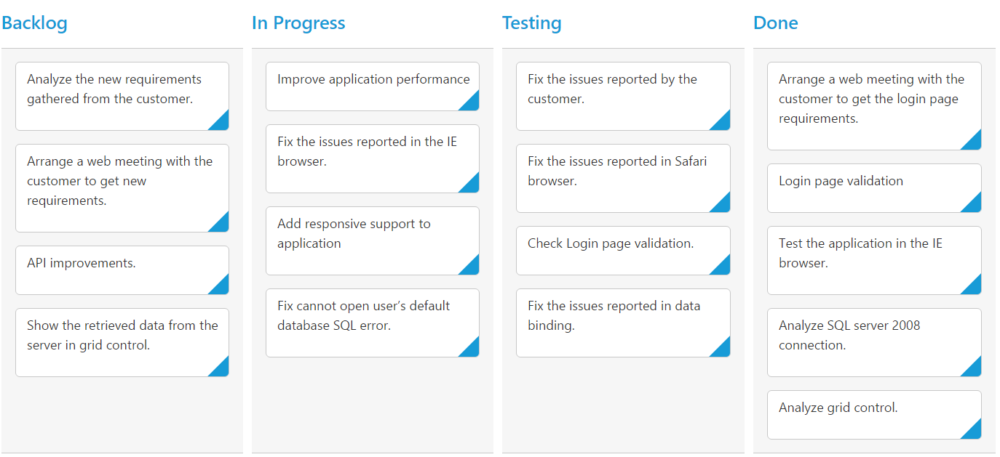

# Columns 

Column fields are present in the `dataSource` schema and it is rendering cards based its mapping column values.

## Key Mapping

To render Kanban with simple cards, you need to map the `dataSource` fields to Kanban cards and `columns`. The required mapping field are listed as follows

The following code example describes the above behavior.



    <?php
    require_once '../EJ/AutoLoad.php';
    ?>
    

    <?php    
    $Json = '[{"Id": 1, "Status": "Open", "Summary": "Analyze the new requirements gathered from the customer.", "Type": "Story", "Priority": "Low", "Tags": "Analyze,Customer", "Estimate": 3.5, "Assignee": "Nancy Davloio", "ImgUrl": "Content/images/kanban/1.png", "RankId":1 }, { "Id": 2, "Status": "InProgress", "Summary": "Improve application performance", "Type": "Improvement", "Priority": "Normal", "Tags": "Improvement", "Estimate": 6, "Assignee": "Andrew Fuller", "ImgUrl": "Content/images/kanban/2.png", "RankId":1 }, { "Id": 3, "Status": "Open", "Summary": "Arrange a web meeting with the customer to get new requirements.", "Type": "Others", "Priority": "Critical", "Tags": "Meeting", "Estimate": 5.5, "Assignee": "Janet Leverling", "ImgUrl": "Content/images/kanban/3.png", "RankId":2 }, { "Id": 4, "Status": "InProgress", "Summary": "Fix the issues reported in the IE browser.", "Type": "Bug", "Priority": "Release Breaker", "Tags": "IE", "Estimate": 2.5, "Assignee": "Janet Leverling", "ImgUrl": "Content/images/kanban/3.png", "RankId":2 }, { "Id": 5, "Status": "Testing", "Summary": "Fix the issues reported by the customer.", "Type": "Bug", "Priority": "Low", "Tags": "Customer", "Estimate": "3.5", "Assignee": "Steven walker", "ImgUrl": "Content/images/kanban/5.png", "RankId":1 }, { "Id": 6, "Status": "Close", "Summary": "Arrange a web meeting with the customer to get the login page requirements.", "Type": "Others", "Priority": "Low", "Tags": "Meeting", "Estimate": 2, "Assignee": "Michael Suyama", "ImgUrl": "Content/images/kanban/6.png", "RankId":1 }, { "Id": 7, "Status": "Validate", "Summary": "Validate new requirements", "Type": "Improvement", "Priority": "Low", "Tags": "Validation", "Estimate": 1.5, "Assignee": "Robert King", "ImgUrl": "Content/images/kanban/7.png", "RankId":1 }, { "Id": 8, "Status": "Close", "Summary": "Login page validation", "Type": "Story", "Priority": "Release Breaker", "Tags": "Validation,Fix", "Estimate": 2.5, "Assignee": "Laura Callahan", "ImgUrl": "Content/images/kanban/8.png", "RankId":2 }, { "Id": 9, "Status": "Testing", "Summary": "Fix the issues reported in Safari browser.", "Type": "Bug", "Priority": "Release Breaker", "Tags": "Fix,Safari", "Estimate": 1.5, "Assignee": "Nancy Davloio", "ImgUrl": "Content/images/kanban/1.png", "RankId":2 }, { "Id": 10, "Status": "Close", "Summary": "Test the application in the IE browser.", "Type": "Story", "Priority": "Low", "Tags": "Testing,IE", "Estimate": 5.5, "Assignee": "Margaret hamilt", "ImgUrl": "Content/images/kanban/4.png", "RankId":3 }, { "Id": 11, "Status": "Validate", "Summary": "Validate the issues reported by the customer.", "Type": "Story", "Priority": "High", "Tags": "Validation,Fix", "Estimate": 1, "Assignee": "Steven walker", "ImgUrl": "Content/images/kanban/5.png", "RankId":1 }, { "Id": 12, "Status": "Testing", "Summary": "Check Login page validation.", "Type": "Story", "Priority": "Release Breaker", "Tags": "Testing", "Estimate": 0.5, "Assignee": "Michael Suyama", "ImgUrl": "Content/images/kanban/6.png", "RankId":3 }, { "Id": 13, "Status": "Open", "Summary": "API improvements.", "Type": "Improvement", "Priority": "High", "Tags": "Grid,API", "Estimate": 3.5, "Assignee": "Robert King", "ImgUrl": "Content/images/kanban/7.png", "RankId":3 }, { "Id": 14, "Status": "InProgress", "Summary": "Add responsive support to application", "Type": "Epic", "Priority": "Critical", "Tags": "Responsive", "Estimate": 6, "Assignee": "Laura Callahan", "ImgUrl": "Content/images/kanban/8.png", "RankId":3 }, { "Id": 15, "Status": "Open", "Summary": "Show the retrieved data from the server in grid control.", "Type": "Story", "Priority": "High", "Tags": "Database,SQL", "Estimate": 5.5, "Assignee": "Margaret hamilt", "ImgUrl": "Content/images/kanban/4.png", "RankId":4 }]';
    $Json = json_decode($Json,true);
    $kanban = new EJ\Kanban("default");    
    $column = new EJ\Kanban\Column();
    $column ->key("Open")->headerText("Backlog");    
    $column1 = new EJ\Kanban\Column();
    $column1 ->key("InProgress")->headerText("In Progress");    
    $column2 = new EJ\Kanban\Column();
    $column2 ->key("Testing")->headerText("Testing");    
    $column3 = new EJ\Kanban\Column();
    $column3 ->key("Close")->headerText("Done");    
    $fields = new EJ\Kanban\Field();
    $fields ->content("Summary")->primaryKey("Id");
    $columns = array( 
        $column,$column1,$column2,$column3
        );    
    echo $kanban ->columns($columns)->dataSource($Json)->fields($fields)->keyField("Status")->render();
    ?>
    

     



The following output is displayed as a result of the above code example.

## Headers

### Header Template

The template design that applies on for the column header. To render template, set `headerTemplate` property of the `columns`.

You can use JsRender syntax in the template. For more information about JsRender syntax, please refer the `link`.

The following code example describes the above behavior.



    <?php
    require_once '../EJ/AutoLoad.php';
    ?>
    

    
        

             Done
        

    <?php    
    $Json = '[{"Id": 1, "Status": "Open", "Summary": "Analyze the new requirements gathered from the customer.", "Type": "Story", "Priority": "Low", "Tags": "Analyze,Customer", "Estimate": 3.5, "Assignee": "Nancy Davloio", "ImgUrl": "Content/images/kanban/1.png", "RankId":1 }, { "Id": 2, "Status": "InProgress", "Summary": "Improve application performance", "Type": "Improvement", "Priority": "Normal", "Tags": "Improvement", "Estimate": 6, "Assignee": "Andrew Fuller", "ImgUrl": "Content/images/kanban/2.png", "RankId":1 }, { "Id": 3, "Status": "Open", "Summary": "Arrange a web meeting with the customer to get new requirements.", "Type": "Others", "Priority": "Critical", "Tags": "Meeting", "Estimate": 5.5, "Assignee": "Janet Leverling", "ImgUrl": "Content/images/kanban/3.png", "RankId":2 }, { "Id": 4, "Status": "InProgress", "Summary": "Fix the issues reported in the IE browser.", "Type": "Bug", "Priority": "Release Breaker", "Tags": "IE", "Estimate": 2.5, "Assignee": "Janet Leverling", "ImgUrl": "Content/images/kanban/3.png", "RankId":2 }, { "Id": 5, "Status": "Testing", "Summary": "Fix the issues reported by the customer.", "Type": "Bug", "Priority": "Low", "Tags": "Customer", "Estimate": "3.5", "Assignee": "Steven walker", "ImgUrl": "Content/images/kanban/5.png", "RankId":1 }, { "Id": 6, "Status": "Close", "Summary": "Arrange a web meeting with the customer to get the login page requirements.", "Type": "Others", "Priority": "Low", "Tags": "Meeting", "Estimate": 2, "Assignee": "Michael Suyama", "ImgUrl": "Content/images/kanban/6.png", "RankId":1 }, { "Id": 7, "Status": "Validate", "Summary": "Validate new requirements", "Type": "Improvement", "Priority": "Low", "Tags": "Validation", "Estimate": 1.5, "Assignee": "Robert King", "ImgUrl": "Content/images/kanban/7.png", "RankId":1 }, { "Id": 8, "Status": "Close", "Summary": "Login page validation", "Type": "Story", "Priority": "Release Breaker", "Tags": "Validation,Fix", "Estimate": 2.5, "Assignee": "Laura Callahan", "ImgUrl": "Content/images/kanban/8.png", "RankId":2 }, { "Id": 9, "Status": "Testing", "Summary": "Fix the issues reported in Safari browser.", "Type": "Bug", "Priority": "Release Breaker", "Tags": "Fix,Safari", "Estimate": 1.5, "Assignee": "Nancy Davloio", "ImgUrl": "Content/images/kanban/1.png", "RankId":2 }, { "Id": 10, "Status": "Close", "Summary": "Test the application in the IE browser.", "Type": "Story", "Priority": "Low", "Tags": "Testing,IE", "Estimate": 5.5, "Assignee": "Margaret hamilt", "ImgUrl": "Content/images/kanban/4.png", "RankId":3 }, { "Id": 11, "Status": "Validate", "Summary": "Validate the issues reported by the customer.", "Type": "Story", "Priority": "High", "Tags": "Validation,Fix", "Estimate": 1, "Assignee": "Steven walker", "ImgUrl": "Content/images/kanban/5.png", "RankId":1 }, { "Id": 12, "Status": "Testing", "Summary": "Check Login page validation.", "Type": "Story", "Priority": "Release Breaker", "Tags": "Testing", "Estimate": 0.5, "Assignee": "Michael Suyama", "ImgUrl": "Content/images/kanban/6.png", "RankId":3 }, { "Id": 13, "Status": "Open", "Summary": "API improvements.", "Type": "Improvement", "Priority": "High", "Tags": "Grid,API", "Estimate": 3.5, "Assignee": "Robert King", "ImgUrl": "Content/images/kanban/7.png", "RankId":3 }, { "Id": 14, "Status": "Validate", "Summary": "Add responsive support to application", "Type": "Epic", "Priority": "Critical", "Tags": "Responsive", "Estimate": 6, "Assignee": "Laura Callahan", "ImgUrl": "Content/images/kanban/8.png", "RankId":3 }, { "Id": 15, "Status": "Validate", "Summary": "Show the retrieved data from the server in grid control.", "Type": "Story", "Priority": "High", "Tags": "Database,SQL", "Estimate": 5.5, "Assignee": "Margaret hamilt", "ImgUrl": "Content/images/kanban/4.png", "RankId":4 }]';
    $Json = json_decode($Json,true);
    $kanban = new EJ\Kanban("default");    
    $column = new EJ\Kanban\Column();
    $column ->key("Open")->headerText("Backlog")->headerTemplate("#column1");    
    $column1 = new EJ\Kanban\Column();
    $column1 ->key("InProgress")->headerText("In Progress");    
    $column2 = new EJ\Kanban\Column();
    $column2 ->key("Testing")->headerText("Testing");    
    $column3 = new EJ\Kanban\Column();
    $column3 ->key("Close")->headerText("Done")->headerTemplate("#column4");   
    $fields = new EJ\Kanban\Field();
    $fields ->content("Summary")->primaryKey("Id");
    $columns = array( 
        $column,$column1,$column2,$column3
        );    
    echo $kanban ->columns($columns)->dataSource($Json)->fields($fields)->keyField("Status")->render();
    ?>
    

    



The following output is displayed as a result of the above code example.

## Visibility 

You can hide particular column in Kanban by setting `visible` property of it as false.

The following code example describes the above behavior.



    <?php
    require_once '../EJ/AutoLoad.php';
    ?>
    

    <?php    
    $Json = '[{"Id": 1, "Status": "Open", "Summary": "Analyze the new requirements gathered from the customer.", "Type": "Story", "Priority": "Low", "Tags": "Analyze,Customer", "Estimate": 3.5, "Assignee": "Nancy Davloio", "ImgUrl": "Content/images/kanban/1.png", "RankId":1 }, { "Id": 2, "Status": "InProgress", "Summary": "Improve application performance", "Type": "Improvement", "Priority": "Normal", "Tags": "Improvement", "Estimate": 6, "Assignee": "Andrew Fuller", "ImgUrl": "Content/images/kanban/2.png", "RankId":1 }, { "Id": 3, "Status": "Open", "Summary": "Arrange a web meeting with the customer to get new requirements.", "Type": "Others", "Priority": "Critical", "Tags": "Meeting", "Estimate": 5.5, "Assignee": "Janet Leverling", "ImgUrl": "Content/images/kanban/3.png", "RankId":2 }, { "Id": 4, "Status": "InProgress", "Summary": "Fix the issues reported in the IE browser.", "Type": "Bug", "Priority": "Release Breaker", "Tags": "IE", "Estimate": 2.5, "Assignee": "Janet Leverling", "ImgUrl": "Content/images/kanban/3.png", "RankId":2 }, { "Id": 5, "Status": "Testing", "Summary": "Fix the issues reported by the customer.", "Type": "Bug", "Priority": "Low", "Tags": "Customer", "Estimate": "3.5", "Assignee": "Steven walker", "ImgUrl": "Content/images/kanban/5.png", "RankId":1 }, { "Id": 6, "Status": "Close", "Summary": "Arrange a web meeting with the customer to get the login page requirements.", "Type": "Others", "Priority": "Low", "Tags": "Meeting", "Estimate": 2, "Assignee": "Michael Suyama", "ImgUrl": "Content/images/kanban/6.png", "RankId":1 }, { "Id": 7, "Status": "Validate", "Summary": "Validate new requirements", "Type": "Improvement", "Priority": "Low", "Tags": "Validation", "Estimate": 1.5, "Assignee": "Robert King", "ImgUrl": "Content/images/kanban/7.png", "RankId":1 }, { "Id": 8, "Status": "Close", "Summary": "Login page validation", "Type": "Story", "Priority": "Release Breaker", "Tags": "Validation,Fix", "Estimate": 2.5, "Assignee": "Laura Callahan", "ImgUrl": "Content/images/kanban/8.png", "RankId":2 }, { "Id": 9, "Status": "Testing", "Summary": "Fix the issues reported in Safari browser.", "Type": "Bug", "Priority": "Release Breaker", "Tags": "Fix,Safari", "Estimate": 1.5, "Assignee": "Nancy Davloio", "ImgUrl": "Content/images/kanban/1.png", "RankId":2 }, { "Id": 10, "Status": "Close", "Summary": "Test the application in the IE browser.", "Type": "Story", "Priority": "Low", "Tags": "Testing,IE", "Estimate": 5.5, "Assignee": "Margaret hamilt", "ImgUrl": "Content/images/kanban/4.png", "RankId":3 }, { "Id": 11, "Status": "Validate", "Summary": "Validate the issues reported by the customer.", "Type": "Story", "Priority": "High", "Tags": "Validation,Fix", "Estimate": 1, "Assignee": "Steven walker", "ImgUrl": "Content/images/kanban/5.png", "RankId":1 }, { "Id": 12, "Status": "Testing", "Summary": "Check Login page validation.", "Type": "Story", "Priority": "Release Breaker", "Tags": "Testing", "Estimate": 0.5, "Assignee": "Michael Suyama", "ImgUrl": "Content/images/kanban/6.png", "RankId":3 }, { "Id": 13, "Status": "Open", "Summary": "API improvements.", "Type": "Improvement", "Priority": "High", "Tags": "Grid,API", "Estimate": 3.5, "Assignee": "Robert King", "ImgUrl": "Content/images/kanban/7.png", "RankId":3 }, { "Id": 14, "Status": "Validate", "Summary": "Add responsive support to application", "Type": "Epic", "Priority": "Critical", "Tags": "Responsive", "Estimate": 6, "Assignee": "Laura Callahan", "ImgUrl": "Content/images/kanban/8.png", "RankId":3 }, { "Id": 15, "Status": "Validate", "Summary": "Show the retrieved data from the server in grid control.", "Type": "Story", "Priority": "High", "Tags": "Database,SQL", "Estimate": 5.5, "Assignee": "Margaret hamilt", "ImgUrl": "Content/images/kanban/4.png", "RankId":4 }]';
    $Json = json_decode($Json,true);
    $kanban = new EJ\Kanban("default");    
    $column = new EJ\Kanban\Column();
    $column ->key("Open")->headerText("Backlog");    
    $column1 = new EJ\Kanban\Column();
    $column1 ->key("InProgress")->headerText("In Progress");    
    $column2 = new EJ\Kanban\Column();
    $column2 ->key("Testing")->headerText("Testing")->visible(false) ;    
    $column3 = new EJ\Kanban\Column();
    $column3 ->key("Close")->headerText("Done");   
    $fields = new EJ\Kanban\Field();
    $fields ->content("Summary")->primaryKey("Id");
    $columns = array( 
        $column,$column1,$column2,$column3
        );    
    echo $kanban ->columns($columns)->dataSource($Json)->fields($fields)->keyField("Status")->render();
    ?>
    



The following output is displayed as a result of the above code example.

## Allow Dragging

You can enable and disable drag behavior to the cards in the Kanban columns using the `allowDrag` property and the default value is `true`.

The following code example describes the above behavior.



    <?php
    require_once '../EJ/AutoLoad.php';
    ?>
    

    <?php    
    $Json = '[{"Id": 1, "Status": "Open", "Summary": "Analyze the new requirements gathered from the customer.", "Type": "Story", "Priority": "Low", "Tags": "Analyze,Customer", "Estimate": 3.5, "Assignee": "Nancy Davloio", "ImgUrl": "Content/images/kanban/1.png", "RankId":1 }, { "Id": 2, "Status": "InProgress", "Summary": "Improve application performance", "Type": "Improvement", "Priority": "Normal", "Tags": "Improvement", "Estimate": 6, "Assignee": "Andrew Fuller", "ImgUrl": "Content/images/kanban/2.png", "RankId":1 }, { "Id": 3, "Status": "Open", "Summary": "Arrange a web meeting with the customer to get new requirements.", "Type": "Others", "Priority": "Critical", "Tags": "Meeting", "Estimate": 5.5, "Assignee": "Janet Leverling", "ImgUrl": "Content/images/kanban/3.png", "RankId":2 }, { "Id": 4, "Status": "InProgress", "Summary": "Fix the issues reported in the IE browser.", "Type": "Bug", "Priority": "Release Breaker", "Tags": "IE", "Estimate": 2.5, "Assignee": "Janet Leverling", "ImgUrl": "Content/images/kanban/3.png", "RankId":2 }, { "Id": 5, "Status": "Testing", "Summary": "Fix the issues reported by the customer.", "Type": "Bug", "Priority": "Low", "Tags": "Customer", "Estimate": "3.5", "Assignee": "Steven walker", "ImgUrl": "Content/images/kanban/5.png", "RankId":1 }, { "Id": 6, "Status": "Close", "Summary": "Arrange a web meeting with the customer to get the login page requirements.", "Type": "Others", "Priority": "Low", "Tags": "Meeting", "Estimate": 2, "Assignee": "Michael Suyama", "ImgUrl": "Content/images/kanban/6.png", "RankId":1 }, { "Id": 7, "Status": "Validate", "Summary": "Validate new requirements", "Type": "Improvement", "Priority": "Low", "Tags": "Validation", "Estimate": 1.5, "Assignee": "Robert King", "ImgUrl": "Content/images/kanban/7.png", "RankId":1 }, { "Id": 8, "Status": "Close", "Summary": "Login page validation", "Type": "Story", "Priority": "Release Breaker", "Tags": "Validation,Fix", "Estimate": 2.5, "Assignee": "Laura Callahan", "ImgUrl": "Content/images/kanban/8.png", "RankId":2 }, { "Id": 9, "Status": "Testing", "Summary": "Fix the issues reported in Safari browser.", "Type": "Bug", "Priority": "Release Breaker", "Tags": "Fix,Safari", "Estimate": 1.5, "Assignee": "Nancy Davloio", "ImgUrl": "Content/images/kanban/1.png", "RankId":2 }, { "Id": 10, "Status": "Close", "Summary": "Test the application in the IE browser.", "Type": "Story", "Priority": "Low", "Tags": "Testing,IE", "Estimate": 5.5, "Assignee": "Margaret hamilt", "ImgUrl": "Content/images/kanban/4.png", "RankId":3 }, { "Id": 11, "Status": "Validate", "Summary": "Validate the issues reported by the customer.", "Type": "Story", "Priority": "High", "Tags": "Validation,Fix", "Estimate": 1, "Assignee": "Steven walker", "ImgUrl": "Content/images/kanban/5.png", "RankId":1 }, { "Id": 12, "Status": "Testing", "Summary": "Check Login page validation.", "Type": "Story", "Priority": "Release Breaker", "Tags": "Testing", "Estimate": 0.5, "Assignee": "Michael Suyama", "ImgUrl": "Content/images/kanban/6.png", "RankId":3 }, { "Id": 13, "Status": "Open", "Summary": "API improvements.", "Type": "Improvement", "Priority": "High", "Tags": "Grid,API", "Estimate": 3.5, "Assignee": "Robert King", "ImgUrl": "Content/images/kanban/7.png", "RankId":3 }, { "Id": 14, "Status": "Validate", "Summary": "Add responsive support to application", "Type": "Epic", "Priority": "Critical", "Tags": "Responsive", "Estimate": 6, "Assignee": "Laura Callahan", "ImgUrl": "Content/images/kanban/8.png", "RankId":3 }, { "Id": 15, "Status": "Validate", "Summary": "Show the retrieved data from the server in grid control.", "Type": "Story", "Priority": "High", "Tags": "Database,SQL", "Estimate": 5.5, "Assignee": "Margaret hamilt", "ImgUrl": "Content/images/kanban/4.png", "RankId":4 }]';
    $Json = json_decode($Json,true);
    $kanban = new EJ\Kanban("default");    
    $column = new EJ\Kanban\Column();
    $column ->key("Open")->headerText("Backlog")->allowDrag(false);    
    $column1 = new EJ\Kanban\Column();
    $column1 ->key("InProgress")->headerText("In Progress");    
    $column2 = new EJ\Kanban\Column();
    $column2 ->key("Close")->headerText("Done");   
    $fields = new EJ\Kanban\Field();
    $fields ->content("Summary")->primaryKey("Id")->priority("RankId");
    $columns = array( 
        $column,$column1,$column2
        );    
    echo $kanban ->columns($columns)->dataSource($Json)->fields($fields)->keyField("Status")->render();
    ?>
    

    


The following output is displayed as a result of the above code example.

## Allow Dropping

You can enable and disable drop behavior to the cards in the Kanban columns using the `allowDrop` property and the default value is `true`.

The following code example describes the above behavior.



    <?php
    require_once '../EJ/AutoLoad.php';
    ?>
    

    <?php    
    $Json = '[{"Id": 1, "Status": "Open", "Summary": "Analyze the new requirements gathered from the customer.", "Type": "Story", "Priority": "Low", "Tags": "Analyze,Customer", "Estimate": 3.5, "Assignee": "Nancy Davloio", "ImgUrl": "Content/images/kanban/1.png", "RankId":1 }, { "Id": 2, "Status": "InProgress", "Summary": "Improve application performance", "Type": "Improvement", "Priority": "Normal", "Tags": "Improvement", "Estimate": 6, "Assignee": "Andrew Fuller", "ImgUrl": "Content/images/kanban/2.png", "RankId":1 }, { "Id": 3, "Status": "Open", "Summary": "Arrange a web meeting with the customer to get new requirements.", "Type": "Others", "Priority": "Critical", "Tags": "Meeting", "Estimate": 5.5, "Assignee": "Janet Leverling", "ImgUrl": "Content/images/kanban/3.png", "RankId":2 }, { "Id": 4, "Status": "InProgress", "Summary": "Fix the issues reported in the IE browser.", "Type": "Bug", "Priority": "Release Breaker", "Tags": "IE", "Estimate": 2.5, "Assignee": "Janet Leverling", "ImgUrl": "Content/images/kanban/3.png", "RankId":2 }, { "Id": 5, "Status": "Testing", "Summary": "Fix the issues reported by the customer.", "Type": "Bug", "Priority": "Low", "Tags": "Customer", "Estimate": "3.5", "Assignee": "Steven walker", "ImgUrl": "Content/images/kanban/5.png", "RankId":1 }, { "Id": 6, "Status": "Close", "Summary": "Arrange a web meeting with the customer to get the login page requirements.", "Type": "Others", "Priority": "Low", "Tags": "Meeting", "Estimate": 2, "Assignee": "Michael Suyama", "ImgUrl": "Content/images/kanban/6.png", "RankId":1 }, { "Id": 7, "Status": "Validate", "Summary": "Validate new requirements", "Type": "Improvement", "Priority": "Low", "Tags": "Validation", "Estimate": 1.5, "Assignee": "Robert King", "ImgUrl": "Content/images/kanban/7.png", "RankId":1 }, { "Id": 8, "Status": "Close", "Summary": "Login page validation", "Type": "Story", "Priority": "Release Breaker", "Tags": "Validation,Fix", "Estimate": 2.5, "Assignee": "Laura Callahan", "ImgUrl": "Content/images/kanban/8.png", "RankId":2 }, { "Id": 9, "Status": "Testing", "Summary": "Fix the issues reported in Safari browser.", "Type": "Bug", "Priority": "Release Breaker", "Tags": "Fix,Safari", "Estimate": 1.5, "Assignee": "Nancy Davloio", "ImgUrl": "Content/images/kanban/1.png", "RankId":2 }, { "Id": 10, "Status": "Close", "Summary": "Test the application in the IE browser.", "Type": "Story", "Priority": "Low", "Tags": "Testing,IE", "Estimate": 5.5, "Assignee": "Margaret hamilt", "ImgUrl": "Content/images/kanban/4.png", "RankId":3 }, { "Id": 11, "Status": "Validate", "Summary": "Validate the issues reported by the customer.", "Type": "Story", "Priority": "High", "Tags": "Validation,Fix", "Estimate": 1, "Assignee": "Steven walker", "ImgUrl": "Content/images/kanban/5.png", "RankId":1 }, { "Id": 12, "Status": "Testing", "Summary": "Check Login page validation.", "Type": "Story", "Priority": "Release Breaker", "Tags": "Testing", "Estimate": 0.5, "Assignee": "Michael Suyama", "ImgUrl": "Content/images/kanban/6.png", "RankId":3 }, { "Id": 13, "Status": "Open", "Summary": "API improvements.", "Type": "Improvement", "Priority": "High", "Tags": "Grid,API", "Estimate": 3.5, "Assignee": "Robert King", "ImgUrl": "Content/images/kanban/7.png", "RankId":3 }, { "Id": 14, "Status": "Validate", "Summary": "Add responsive support to application", "Type": "Epic", "Priority": "Critical", "Tags": "Responsive", "Estimate": 6, "Assignee": "Laura Callahan", "ImgUrl": "Content/images/kanban/8.png", "RankId":3 }, { "Id": 15, "Status": "Validate", "Summary": "Show the retrieved data from the server in grid control.", "Type": "Story", "Priority": "High", "Tags": "Database,SQL", "Estimate": 5.5, "Assignee": "Margaret hamilt", "ImgUrl": "Content/images/kanban/4.png", "RankId":4 }]';
    $Json = json_decode($Json,true);
    $kanban = new EJ\Kanban("default");    
    $column = new EJ\Kanban\Column();
    $column ->key("Open")->headerText("Backlog");    
    $column1 = new EJ\Kanban\Column();
    $column1 ->key("InProgress")->headerText("In Progress");    
    $column2 = new EJ\Kanban\Column();
    $column2 ->key("Close")->headerText("Done")->allowDrop(false);   
    $fields = new EJ\Kanban\Field();
    $fields ->content("Summary")->primaryKey("Id")->priority("RankId");
    $columns = array( 
        $column,$column1,$column2
        );    
    echo $kanban ->columns($columns)->dataSource($Json)->fields($fields)->keyField("Status")->render();
    ?>
    



The following output is displayed as a result of the above code example.

## Items Count

You can show total cards count in each column's header using the property `enableTotalCount` and the default value is `false`.

The following code example describes the above behavior.



    <?php
    require_once '../EJ/AutoLoad.php';
    ?>
    

    <?php    
    $Json = '[{"Id": 1, "Status": "Open", "Summary": "Analyze the new requirements gathered from the customer.", "Type": "Story", "Priority": "Low", "Tags": "Analyze,Customer", "Estimate": 3.5, "Assignee": "Nancy Davloio", "ImgUrl": "Content/images/kanban/1.png", "RankId":1 }, { "Id": 2, "Status": "InProgress", "Summary": "Improve application performance", "Type": "Improvement", "Priority": "Normal", "Tags": "Improvement", "Estimate": 6, "Assignee": "Andrew Fuller", "ImgUrl": "Content/images/kanban/2.png", "RankId":1 }, { "Id": 3, "Status": "Open", "Summary": "Arrange a web meeting with the customer to get new requirements.", "Type": "Others", "Priority": "Critical", "Tags": "Meeting", "Estimate": 5.5, "Assignee": "Janet Leverling", "ImgUrl": "Content/images/kanban/3.png", "RankId":2 }, { "Id": 4, "Status": "InProgress", "Summary": "Fix the issues reported in the IE browser.", "Type": "Bug", "Priority": "Release Breaker", "Tags": "IE", "Estimate": 2.5, "Assignee": "Janet Leverling", "ImgUrl": "Content/images/kanban/3.png", "RankId":2 }, { "Id": 5, "Status": "Testing", "Summary": "Fix the issues reported by the customer.", "Type": "Bug", "Priority": "Low", "Tags": "Customer", "Estimate": "3.5", "Assignee": "Steven walker", "ImgUrl": "Content/images/kanban/5.png", "RankId":1 }, { "Id": 6, "Status": "Close", "Summary": "Arrange a web meeting with the customer to get the login page requirements.", "Type": "Others", "Priority": "Low", "Tags": "Meeting", "Estimate": 2, "Assignee": "Michael Suyama", "ImgUrl": "Content/images/kanban/6.png", "RankId":1 }, { "Id": 7, "Status": "Validate", "Summary": "Validate new requirements", "Type": "Improvement", "Priority": "Low", "Tags": "Validation", "Estimate": 1.5, "Assignee": "Robert King", "ImgUrl": "Content/images/kanban/7.png", "RankId":1 }, { "Id": 8, "Status": "Close", "Summary": "Login page validation", "Type": "Story", "Priority": "Release Breaker", "Tags": "Validation,Fix", "Estimate": 2.5, "Assignee": "Laura Callahan", "ImgUrl": "Content/images/kanban/8.png", "RankId":2 }, { "Id": 9, "Status": "Testing", "Summary": "Fix the issues reported in Safari browser.", "Type": "Bug", "Priority": "Release Breaker", "Tags": "Fix,Safari", "Estimate": 1.5, "Assignee": "Nancy Davloio", "ImgUrl": "Content/images/kanban/1.png", "RankId":2 }, { "Id": 10, "Status": "Close", "Summary": "Test the application in the IE browser.", "Type": "Story", "Priority": "Low", "Tags": "Testing,IE", "Estimate": 5.5, "Assignee": "Margaret hamilt", "ImgUrl": "Content/images/kanban/4.png", "RankId":3 }, { "Id": 11, "Status": "Validate", "Summary": "Validate the issues reported by the customer.", "Type": "Story", "Priority": "High", "Tags": "Validation,Fix", "Estimate": 1, "Assignee": "Steven walker", "ImgUrl": "Content/images/kanban/5.png", "RankId":1 }, { "Id": 12, "Status": "Testing", "Summary": "Check Login page validation.", "Type": "Story", "Priority": "Release Breaker", "Tags": "Testing", "Estimate": 0.5, "Assignee": "Michael Suyama", "ImgUrl": "Content/images/kanban/6.png", "RankId":3 }, { "Id": 13, "Status": "Open", "Summary": "API improvements.", "Type": "Improvement", "Priority": "High", "Tags": "Grid,API", "Estimate": 3.5, "Assignee": "Robert King", "ImgUrl": "Content/images/kanban/7.png", "RankId":3 }, { "Id": 14, "Status": "Validate", "Summary": "Add responsive support to application", "Type": "Epic", "Priority": "Critical", "Tags": "Responsive", "Estimate": 6, "Assignee": "Laura Callahan", "ImgUrl": "Content/images/kanban/8.png", "RankId":3 }, { "Id": 15, "Status": "Validate", "Summary": "Show the retrieved data from the server in grid control.", "Type": "Story", "Priority": "High", "Tags": "Database,SQL", "Estimate": 5.5, "Assignee": "Margaret hamilt", "ImgUrl": "Content/images/kanban/4.png", "RankId":4 }]';
    $Json = json_decode($Json,true);
    $kanban = new EJ\Kanban("default");    
    $column = new EJ\Kanban\Column();
    $column ->key("Open")->headerText("Backlog");    
    $column1 = new EJ\Kanban\Column();
    $column1 ->key("InProgress")->headerText("In Progress");    
    $column2 = new EJ\Kanban\Column();
    $column2 ->key("Close")->headerText("Done")->allowDrop(false);   
    $fields = new EJ\Kanban\Field();
    $fields ->content("Summary")->primaryKey("Id")->priority("RankId");
    $columns = array( 
        $column,$column1,$column2
        );    
    echo $kanban ->columns($columns)->dataSource($Json)->fields($fields)->enableTotalCount(true)->keyField("Status")->render();
    ?>
    



The following output is displayed as a result of the above code example.

