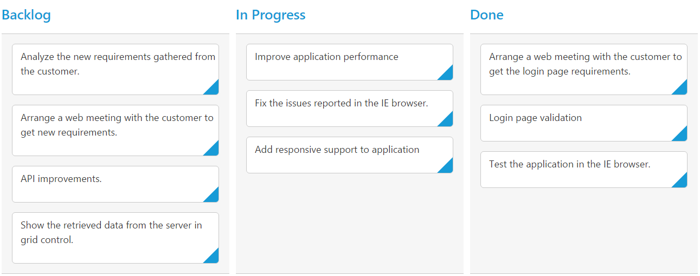

# Data Binding  

The Kanban control uses `ej.DataManager` which supports both RESTful JSON data services binding and local JSON array binding. The `dataSource` property can be assigned either with the instance of `ej.DataManager` or JSON data array collection. It supports different kinds of data binding methods such as

1.	Local data
2.	Remote data

## Local Data

To bind local data to the Kanban, you can assign a JSON array to the `dataSource` property.

The JSON array to the `dataSource` property can also be provided as an instance of the `ej.DataManager`. When the JSON array is passed as an instance of `ej.DataManager`, the `ej.JsonAdaptor` will be used to manipulate the Kanban data source.

The following code example describes the above behavior.



    

 





    <?php
    require_once '../EJ/AutoLoad.php';
    ?>
    
       
    <?php    
    $Json = '[{"Id": 1, "Status": "Open", "Summary": "Analyze the new requirements gathered from the customer.", "Type": "Story", "Priority": "Low", "Tags": "Analyze,Customer", "Estimate": 3.5, "Assignee": "Nancy Davloio", "ImgUrl": "Content/images/kanban/1.png", "RankId":1 }, { "Id": 2, "Status": "InProgress", "Summary": "Improve application performance", "Type": "Improvement", "Priority": "Normal", "Tags": "Improvement", "Estimate": 6, "Assignee": "Andrew Fuller", "ImgUrl": "Content/images/kanban/2.png", "RankId":1 }, { "Id": 3, "Status": "InProgress", "Summary": "Arrange a web meeting with the customer to get new requirements.", "Type": "Others", "Priority": "Critical", "Tags": "Meeting", "Estimate": 5.5, "Assignee": "Janet Leverling", "ImgUrl": "Content/images/kanban/3.png", "RankId":2 }, { "Id": 4, "Status": "InProgress", "Summary": "Fix the issues reported in the IE browser.", "Type": "Bug", "Priority": "Release Breaker", "Tags": "IE", "Estimate": 2.5, "Assignee": "Janet Leverling", "ImgUrl": "Content/images/kanban/3.png", "RankId":2 }, { "Id": 5, "Status": "Close", "Summary": "Fix the issues reported by the customer.", "Type": "Bug", "Priority": "Low", "Tags": "Customer", "Estimate": "3.5", "Assignee": "Steven walker", "ImgUrl": "Content/images/kanban/5.png", "RankId":1 }]';
    $Json = json_decode($Json,true);
    $kanban = new EJ\Kanban("default");    
	 $constraint = new EJ\Kanban\Constraint();
    $constraint ->max(2);
     $column = new EJ\Kanban\Column();
    $column ->key("Open")->headerText("Backlog");
    $column1 = new EJ\Kanban\Column();    
    $column1 ->key("InProgress")->headerText("In Progress");
    $column2 = new EJ\Kanban\Column();
    $column2 ->key("Close")->headerText("Done");
    $fields = new EJ\Kanban\Field();
    $fields ->content("Summary")->primaryKey("Id");
    $columns = array( 
        $column,$column1,$column2
        );    
    echo $kanban ->columns($columns)->dataSource($Json)->fields($fields)->keyField("Status")->render();
    ?>
    



The following output is displayed as a result of the above code example.

## Remote Data

To bind remote data to Kanban Control, you can assign a service data as an instance of `ej.DataManager` to the `dataSource` property.

### OData

OData is a standardized protocol for creating and consuming data. You can provide the `OData service` URL directly to the `ej.DataManager` class and then you can assign it to Kanban `dataSource`.

The following code example describes the above behavior.



    <?php
    require_once '../EJ/AutoLoad.php';
    ?>
    
       
    <?php    
    $dataManager= new EJ\DataManager();
    $dataManager->url('http://mvc.syncfusion.com/Services/Northwnd.svc/Tasks')->offline(false);
    $kanban = new EJ\Kanban("default");    
	 $constraint = new EJ\Kanban\Constraint();
    $constraint ->max(2);
     $column = new EJ\Kanban\Column();
    $column ->key("Open")->headerText("Backlog");
    $column1 = new EJ\Kanban\Column();    
    $column1 ->key("InProgress")->headerText("In Progress");
    $column2 = new EJ\Kanban\Column();
    $column2 ->key("Close")->headerText("Done");
    $fields = new EJ\Kanban\Field();
    $fields ->content("Summary")->primaryKey("Id");
    $columns = array( 
        $column,$column1,$column2
        );    
    echo $kanban ->columns($columns)->dataSource($dataManager)->fields($fields)->keyField("Status")->render();
    ?>
    

    


The following output is displayed as a result of the above code example.

