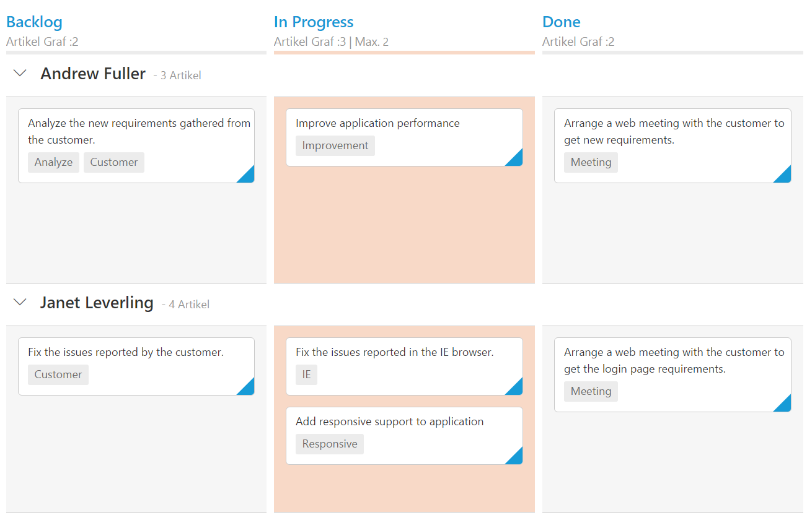

# Localization

## Localization

All text in Kanban can be localized using `ej.Kanban.Locale` object. Please find the table with list of properties and its value in locale object.

<table>
<tr>
<th>
Locale key words </th><th>
Text</th></tr>
<tr>
<td>
EmptyCard
</td><td>
No cards to display
</td></tr>
<tr>
<td>
SaveButton
</td><td>
Save
</td></tr>
<tr>
<td>
CancelButton
</td><td>
Cancel
</td></tr>
<tr>
<td>
EditFormTitle
</td><td>
Details of
</td></tr>
<tr>
<td>
AddFormTitle
</td><td>
Add New Card
</td></tr>
<tr>
<td>
SwimlaneCaptionFormat
</td><td>
"- {{:count}}{{if count == 1 }} item {{else}} items {{/if}}"
</td></tr>
<tr>
<td>
FilterSettings
</td><td>
Filters:
</td></tr>
<tr>
<td>
Min
</td><td>
Min
</td></tr>
<tr>
<td>
Max
</td><td>
Max
</td></tr>
<tr>
<td>
FilterOfText
</td><td>
Of
</td></tr>
<tr>
<td>
Cards
</td><td>
Cards
</td></tr>
<tr>
<td>
ItemsCount
</td><td>
Items Count :
</td></tr>
<tr>
<td>
Unassigned
</td><td>
Unassigned
</td></tr>
</table>

The following code example describes the above behavior.



    <?php
    require_once '../EJ/AutoLoad.php';
    ?>
    

    
    <?php
    $Json = '[{"Id": 1, "Status": "Open", "Summary": "Analyze the new requirements gathered from the customer.", "Type": "Story", "Priority": "Low", "Tags": "Analyze,Customer", "Estimate": 3.5, "Assignee": "Nancy Davloio", "ImgUrl": "Content/images/kanban/1.png", "RankId":1 }, { "Id": 2, "Status": "InProgress", "Summary": "Improve application performance", "Type": "Improvement", "Priority": "Normal", "Tags": "Improvement", "Estimate": 6, "Assignee": "Andrew Fuller", "ImgUrl": "Content/images/kanban/2.png", "RankId":1 }, { "Id": 3, "Status": "InProgress", "Summary": "Arrange a web meeting with the customer to get new requirements.", "Type": "Others", "Priority": "Critical", "Tags": "Meeting", "Estimate": 5.5, "Assignee": "Janet Leverling", "ImgUrl": "Content/images/kanban/3.png", "RankId":2 }, { "Id": 4, "Status": "InProgress", "Summary": "Fix the issues reported in the IE browser.", "Type": "Bug", "Priority": "Release Breaker", "Tags": "IE", "Estimate": 2.5, "Assignee": "Janet Leverling", "ImgUrl": "Content/images/kanban/3.png", "RankId":2 }, { "Id": 5, "Status": "Close", "Summary": "Fix the issues reported by the customer.", "Type": "Bug", "Priority": "Low", "Tags": "Customer", "Estimate": "3.5", "Assignee": "Steven walker", "ImgUrl": "Content/images/kanban/5.png", "RankId":1 }]';
    $Json = json_decode($Json,true);
    $kanban = new EJ\Kanban("default");
    $constraint = new EJ\Kanban\Constraint();
    $constraint ->max(2);
    $column = new EJ\Kanban\Column();
    $column ->key("Open")->headerText("Backlog");
    $column1 = new EJ\Kanban\Column();
    $column1 ->key("InProgress")->headerText("In Progress")->constraints($constraint);
    $column2 = new EJ\Kanban\Column();
    $column2 ->key("Close")->headerText("Done");
    $fields = new EJ\Kanban\Field();
    $fields ->content("Summary")->primaryKey("Id")->swimlaneKey('Assignee')->tag('Tags');
    $columns = array(
    $column,$column1,$column2
    );
    echo $kanban ->columns($columns)->dataSource($Json)->enableTotalCount(true)->locale("de-DE")->fields($fields)->keyField("Status")->render();
    ?>
    



The following output is displayed as a result of the above code example.

## Right to Left (RTL)

By default, Kanban render its text and layout from left to right. To customize Kanban’s direction, you can change direction from LTR to RTL by using `enableRTL` as true.

The following code example describes the above behavior.



    <?php
    require_once '../EJ/AutoLoad.php';
    ?>
    

    
    <?php
    $Json = '[{"Id": 1, "Status": "Open", "Summary": "Analyze the new requirements gathered from the customer.", "Type": "Story", "Priority": "Low", "Tags": "Analyze,Customer", "Estimate": 3.5, "Assignee": "Nancy Davloio", "ImgUrl": "Content/images/kanban/1.png", "RankId":1 }, { "Id": 2, "Status": "InProgress", "Summary": "Improve application performance", "Type": "Improvement", "Priority": "Normal", "Tags": "Improvement", "Estimate": 6, "Assignee": "Andrew Fuller", "ImgUrl": "Content/images/kanban/2.png", "RankId":1 }, { "Id": 3, "Status": "InProgress", "Summary": "Arrange a web meeting with the customer to get new requirements.", "Type": "Others", "Priority": "Critical", "Tags": "Meeting", "Estimate": 5.5, "Assignee": "Janet Leverling", "ImgUrl": "Content/images/kanban/3.png", "RankId":2 }, { "Id": 4, "Status": "InProgress", "Summary": "Fix the issues reported in the IE browser.", "Type": "Bug", "Priority": "Release Breaker", "Tags": "IE", "Estimate": 2.5, "Assignee": "Janet Leverling", "ImgUrl": "Content/images/kanban/3.png", "RankId":2 }, { "Id": 5, "Status": "Close", "Summary": "Fix the issues reported by the customer.", "Type": "Bug", "Priority": "Low", "Tags": "Customer", "Estimate": "3.5", "Assignee": "Steven walker", "ImgUrl": "Content/images/kanban/5.png", "RankId":1 }]';
    $Json = json_decode($Json,true);
    $kanban = new EJ\Kanban("default");
    $constraint = new EJ\Kanban\Constraint();
    $constraint ->max(2);
    $column = new EJ\Kanban\Column();
    $column ->key("Open")->headerText("تراكم الأعمال غير المنجزة");
    $column1 = new EJ\Kanban\Column();
    $column1 ->key("InProgress")->headerText("في تَقَدم")->constraints($constraint);
    $column2 = new EJ\Kanban\Column();
    $column2 ->key("Close")->headerText("فعله");
    $fields = new EJ\Kanban\Field();
    $fields ->content("Summary")->primaryKey("Id")->swimlaneKey('Assignee')->tag('Tags');
    $columns = array(
    $column,$column1,$column2
    );
    echo $kanban ->columns($columns)->dataSource($Json)->enableRTL(true)->allowTitle(true)->locale("ar-AE")->fields($fields)->keyField("Status")->render();
    ?>
    



The following output is displayed as a result of the above code example.

