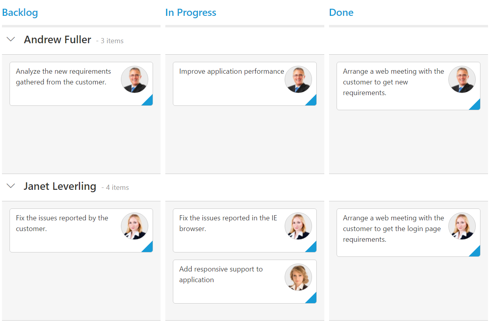

# Swim lanes

Swim lanes are a horizontal categorization of issues in the Kanban control which brings transparency to the workflow. This can be enabled by mapping the `swimlaneKey` to appropriate column name in the `dataSource`

The following code example describes the above behavior.



    <?php
    require_once '../EJ/AutoLoad.php';
    ?>
    

    <?php    
    $Json = '[{"Id": 1, "Status": "Open", "Summary": "Analyze the new requirements gathered from the customer.", "Type": "Story", "Priority": "Low", "Tags": "Analyze,Customer", "Estimate": 3.5, "Assignee": "Nancy Davloio", "ImgUrl": "Content/images/kanban/1.png", "RankId":1 }, { "Id": 2, "Status": "InProgress", "Summary": "Improve application performance", "Type": "Improvement", "Priority": "Normal", "Tags": "Improvement", "Estimate": 6, "Assignee": "Andrew Fuller", "ImgUrl": "Content/images/kanban/2.png", "RankId":1 }, { "Id": 3, "Status": "Open", "Summary": "Arrange a web meeting with the customer to get new requirements.", "Type": "Others", "Priority": "Critical", "Tags": "Meeting", "Estimate": 5.5, "Assignee": "Janet Leverling", "ImgUrl": "Content/images/kanban/3.png", "RankId":2 }, { "Id": 4, "Status": "InProgress", "Summary": "Fix the issues reported in the IE browser.", "Type": "Bug", "Priority": "Release Breaker", "Tags": "IE", "Estimate": 2.5, "Assignee": "Janet Leverling", "ImgUrl": "Content/images/kanban/3.png", "RankId":2 }, { "Id": 5, "Status": "Testing", "Summary": "Fix the issues reported by the customer.", "Type": "Bug", "Priority": "Low", "Tags": "Customer", "Estimate": "3.5", "Assignee": "Steven walker", "ImgUrl": "Content/images/kanban/5.png", "RankId":1 }, { "Id": 6, "Status": "Close", "Summary": "Arrange a web meeting with the customer to get the login page requirements.", "Type": "Others", "Priority": "Low", "Tags": "Meeting", "Estimate": 2, "Assignee": "Michael Suyama", "ImgUrl": "Content/images/kanban/6.png", "RankId":1 }, { "Id": 7, "Status": "Validate", "Summary": "Validate new requirements", "Type": "Improvement", "Priority": "Low", "Tags": "Validation", "Estimate": 1.5, "Assignee": "Robert King", "ImgUrl": "Content/images/kanban/7.png", "RankId":1 }, { "Id": 8, "Status": "Close", "Summary": "Login page validation", "Type": "Story", "Priority": "Release Breaker", "Tags": "Validation,Fix", "Estimate": 2.5, "Assignee": "Laura Callahan", "ImgUrl": "Content/images/kanban/8.png", "RankId":2 }, { "Id": 9, "Status": "Testing", "Summary": "Fix the issues reported in Safari browser.", "Type": "Bug", "Priority": "Release Breaker", "Tags": "Fix,Safari", "Estimate": 1.5, "Assignee": "Nancy Davloio", "ImgUrl": "Content/images/kanban/1.png", "RankId":2 }, { "Id": 10, "Status": "Close", "Summary": "Test the application in the IE browser.", "Type": "Story", "Priority": "Low", "Tags": "Testing,IE", "Estimate": 5.5, "Assignee": "Margaret hamilt", "ImgUrl": "Content/images/kanban/4.png", "RankId":3 }, { "Id": 11, "Status": "Validate", "Summary": "Validate the issues reported by the customer.", "Type": "Story", "Priority": "High", "Tags": "Validation,Fix", "Estimate": 1, "Assignee": "Steven walker", "ImgUrl": "Content/images/kanban/5.png", "RankId":1 }, { "Id": 12, "Status": "Testing", "Summary": "Check Login page validation.", "Type": "Story", "Priority": "Release Breaker", "Tags": "Testing", "Estimate": 0.5, "Assignee": "Michael Suyama", "ImgUrl": "Content/images/kanban/6.png", "RankId":3 }, { "Id": 13, "Status": "Open", "Summary": "API improvements.", "Type": "Improvement", "Priority": "High", "Tags": "Grid,API", "Estimate": 3.5, "Assignee": "Robert King", "ImgUrl": "Content/images/kanban/7.png", "RankId":3 }, { "Id": 14, "Status": "Validate", "Summary": "Add responsive support to application", "Type": "Epic", "Priority": "Critical", "Tags": "Responsive", "Estimate": 6, "Assignee": "Laura Callahan", "ImgUrl": "Content/images/kanban/8.png", "RankId":3 }, { "Id": 15, "Status": "Validate", "Summary": "Show the retrieved data from the server in grid control.", "Type": "Story", "Priority": "High", "Tags": "Database,SQL", "Estimate": 5.5, "Assignee": "Margaret hamilt", "ImgUrl": "Content/images/kanban/4.png", "RankId":4 }]';
    $Json = json_decode($Json,true);
    $kanban = new EJ\Kanban("default");    	
    $column = new EJ\Kanban\Column();
    $column ->key("Open")->headerText("Backlog");    
    $column1 = new EJ\Kanban\Column();
    $column1 ->key("InProgress")->headerText("In Progress");  	
    $column2 = new EJ\Kanban\Column();
    $column2 ->key("Close")->headerText("Done");   
    $fields = new EJ\Kanban\Field();
    $fields ->content("Summary")->primaryKey("Id")->imageUrl("ImgUrl")->swimlaneKey("Assignee");
    $columns = array( 
        $column,$column1,$column2
        );    
    echo $kanban ->columns($columns)->dataSource($Json)->fields($fields)->keyField("Status")->render();
    ?>
    

    


The following output is displayed as a result of the above code example.

## Drag And Drop between swim lanes

You can set 'allowDragAndDrop' property of 'swimlaneSettings' as true to enable Drag and Drop between the swim lanes.

If a card is to be dragged in the same swim lane, only a droppable target cell is added to the dotted line border. If a card is dragged from one swim lane to another, all the Kanban cells will be added to the dotted line borders, except the dragged card cell.

The following code example describes the above behavior.



    <?php
    require_once '../EJ/AutoLoad.php';
    ?>
    

    <?php    
    $Json = '[{"Id": 1, "Status": "Open", "Summary": "Analyze the new requirements gathered from the customer.", "Type": "Story", "Priority": "Low", "Tags": "Analyze,Customer", "Estimate": 3.5, "Assignee": "Nancy Davloio", "ImgUrl": "Content/images/kanban/1.png", "RankId":1 }, { "Id": 2, "Status": "InProgress", "Summary": "Improve application performance", "Type": "Improvement", "Priority": "Normal", "Tags": "Improvement", "Estimate": 6, "Assignee": "Andrew Fuller", "ImgUrl": "Content/images/kanban/2.png", "RankId":1 }, { "Id": 3, "Status": "Open", "Summary": "Arrange a web meeting with the customer to get new requirements.", "Type": "Others", "Priority": "Critical", "Tags": "Meeting", "Estimate": 5.5, "Assignee": "Janet Leverling", "ImgUrl": "Content/images/kanban/3.png", "RankId":2 }, { "Id": 4, "Status": "InProgress", "Summary": "Fix the issues reported in the IE browser.", "Type": "Bug", "Priority": "Release Breaker", "Tags": "IE", "Estimate": 2.5, "Assignee": "Janet Leverling", "ImgUrl": "Content/images/kanban/3.png", "RankId":2 }, { "Id": 5, "Status": "Testing", "Summary": "Fix the issues reported by the customer.", "Type": "Bug", "Priority": "Low", "Tags": "Customer", "Estimate": "3.5", "Assignee": "Steven walker", "ImgUrl": "Content/images/kanban/5.png", "RankId":1 }, { "Id": 6, "Status": "Close", "Summary": "Arrange a web meeting with the customer to get the login page requirements.", "Type": "Others", "Priority": "Low", "Tags": "Meeting", "Estimate": 2, "Assignee": "Michael Suyama", "ImgUrl": "Content/images/kanban/6.png", "RankId":1 }, { "Id": 7, "Status": "Validate", "Summary": "Validate new requirements", "Type": "Improvement", "Priority": "Low", "Tags": "Validation", "Estimate": 1.5, "Assignee": "Robert King", "ImgUrl": "Content/images/kanban/7.png", "RankId":1 }, { "Id": 8, "Status": "Close", "Summary": "Login page validation", "Type": "Story", "Priority": "Release Breaker", "Tags": "Validation,Fix", "Estimate": 2.5, "Assignee": "Laura Callahan", "ImgUrl": "Content/images/kanban/8.png", "RankId":2 }, { "Id": 9, "Status": "Testing", "Summary": "Fix the issues reported in Safari browser.", "Type": "Bug", "Priority": "Release Breaker", "Tags": "Fix,Safari", "Estimate": 1.5, "Assignee": "Nancy Davloio", "ImgUrl": "Content/images/kanban/1.png", "RankId":2 }, { "Id": 10, "Status": "Close", "Summary": "Test the application in the IE browser.", "Type": "Story", "Priority": "Low", "Tags": "Testing,IE", "Estimate": 5.5, "Assignee": "Margaret hamilt", "ImgUrl": "Content/images/kanban/4.png", "RankId":3 }, { "Id": 11, "Status": "Validate", "Summary": "Validate the issues reported by the customer.", "Type": "Story", "Priority": "High", "Tags": "Validation,Fix", "Estimate": 1, "Assignee": "Steven walker", "ImgUrl": "Content/images/kanban/5.png", "RankId":1 }, { "Id": 12, "Status": "Testing", "Summary": "Check Login page validation.", "Type": "Story", "Priority": "Release Breaker", "Tags": "Testing", "Estimate": 0.5, "Assignee": "Michael Suyama", "ImgUrl": "Content/images/kanban/6.png", "RankId":3 }, { "Id": 13, "Status": "Open", "Summary": "API improvements.", "Type": "Improvement", "Priority": "High", "Tags": "Grid,API", "Estimate": 3.5, "Assignee": "Robert King", "ImgUrl": "Content/images/kanban/7.png", "RankId":3 }, { "Id": 14, "Status": "Validate", "Summary": "Add responsive support to application", "Type": "Epic", "Priority": "Critical", "Tags": "Responsive", "Estimate": 6, "Assignee": "Laura Callahan", "ImgUrl": "Content/images/kanban/8.png", "RankId":3 }, { "Id": 15, "Status": "Validate", "Summary": "Show the retrieved data from the server in grid control.", "Type": "Story", "Priority": "High", "Tags": "Database,SQL", "Estimate": 5.5, "Assignee": "Margaret hamilt", "ImgUrl": "Content/images/kanban/4.png", "RankId":4 }]';
    $Json = json_decode($Json,true);
    $kanban = new EJ\Kanban("default");    	
    $column = new EJ\Kanban\Column();
    $column ->key("Open")->headerText("Backlog");    
    $column1 = new EJ\Kanban\Column();
    $column1 ->key("InProgress")->headerText("In Progress");  	
    $column2 = new EJ\Kanban\Column();
    $column2 ->key("Close")->headerText("Done");   
    $fields = new EJ\Kanban\Field();
    $fields ->content("Summary")->primaryKey("Id")->imageUrl("ImgUrl")->swimlaneKey("Assignee");
	$SwimlaneSettings= new EJ\Kanban\SwimlaneSetting();
	$SwimlaneSettings ->allowDragAndDrop(true);
    $columns = array( 
        $column,$column1,$column2
        );    
    echo $kanban ->columns($columns)->dataSource($Json)->SwimlaneSettings($SwimlaneSettings)->fields($fields)->keyField("Status")->render();
    ?>
    



The following output is displayed as a result of the above code example.

## Unassigned swim lane group

Unassigned swim lane feature provides option to group some common swim lane key values as separate swim lane group. You can enable and disable this behavior using the property enable.
User can use default common key values or user defined key values. 

    •	Using default values
    •	Using user defined values

N> By default, given common keys are grouped under the swim lane name “Unassigned”, user can customize the name using localization.

### Using default values

By default, the swim lane keys of card which is having null, undefined, empty string ("") values will be grouped as unassigned category when enable property is set as true. 
Default values in the keys collection are null, undefined, empty string ("").

The following code example describes the above behavior.



    <?php
    require_once '../EJ/AutoLoad.php';
    ?>
    

    <?php    
    $Json = '[{"Id": 1, "Status": "Open", "Summary": "Analyze the new requirements gathered from the customer.", "Type": "Story", "Priority": "Low", "Tags": "Analyze,Customer", "Estimate": 3.5, "Assignee": "Nancy Davloio", "ImgUrl": "Content/images/kanban/1.png", "RankId":1 }, { "Id": 2, "Status": "InProgress", "Summary": "Improve application performance", "Type": "Improvement", "Priority": "Normal", "Tags": "Improvement", "Estimate": 6, "Assignee": "Andrew Fuller", "ImgUrl": "Content/images/kanban/2.png", "RankId":1 }, { "Id": 3, "Status": "Open", "Summary": "Arrange a web meeting with the customer to get new requirements.", "Type": "Others", "Priority": "Critical", "Tags": "Meeting", "Estimate": 5.5, "Assignee": "Janet Leverling", "ImgUrl": "Content/images/kanban/3.png", "RankId":2 }, { "Id": 4, "Status": "InProgress", "Summary": "Fix the issues reported in the IE browser.", "Type": "Bug", "Priority": "Release Breaker", "Tags": "IE", "Estimate": 2.5, "Assignee": "Janet Leverling", "ImgUrl": "Content/images/kanban/3.png", "RankId":2 }, { "Id": 5, "Status": "Testing", "Summary": "Fix the issues reported by the customer.", "Type": "Bug", "Priority": "Low", "Tags": "Customer", "Estimate": "3.5", "Assignee": "Steven walker", "ImgUrl": "Content/images/kanban/5.png", "RankId":1 }, { "Id": 6, "Status": "Close", "Summary": "Arrange a web meeting with the customer to get the login page requirements.", "Type": "Others", "Priority": "Low", "Tags": "Meeting", "Estimate": 2, "Assignee": "Michael Suyama", "ImgUrl": "Content/images/kanban/6.png", "RankId":1 }, { "Id": 7, "Status": "Validate", "Summary": "Validate new requirements", "Type": "Improvement", "Priority": "Low", "Tags": "Validation", "Estimate": 1.5, "Assignee": "undefined", "RankId":1 }, { "Id": 8, "Status": "Close", "Summary": "Login page validation", "Type": "Story", "Priority": "Release Breaker", "Tags": "Validation,Fix", "Estimate": 2.5, "Assignee": "undefined", "RankId":2 }, { "Id": 9, "Status": "Testing", "Summary": "Fix the issues reported in Safari browser.", "Type": "Bug", "Priority": "Release Breaker", "Tags": "Fix,Safari", "Estimate": 1.5, "Assignee": "undefined", "RankId":2 }]';
    $Json = json_decode($Json,true);
    $kanban = new EJ\Kanban("default");    	
    $column = new EJ\Kanban\Column();
    $column ->key("Open")->headerText("Backlog");    
    $column1 = new EJ\Kanban\Column();
    $column1 ->key("InProgress")->headerText("In Progress");  	
    $column2 = new EJ\Kanban\Column();
    $column2 ->key("Close")->headerText("Done");   
    $fields = new EJ\Kanban\Field();
    $fields ->content("Summary")->primaryKey("Id")->imageUrl("ImgUrl")->swimlaneKey("Assignee");
    $columns = array( 
        $column,$column1,$column2
        );    
    echo $kanban ->columns($columns)->dataSource($Json)->fields($fields)->keyField("Status")->render();
    ?>
    



The output of the above code example.

