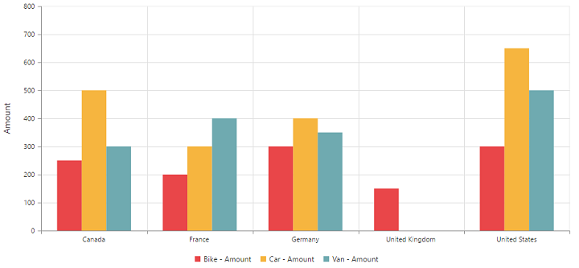
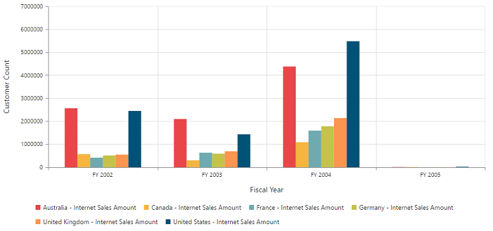

# Getting Started

This section explains you the steps required to populate the PivotChart in your application with **PHP** wrapper classes of EJ controls. This section covers only the minimal features that you need to know to get started with the PivotChart.

## Create PivotChart widget

You can create a PHP Project and add necessary scripts and styles with the help of the given PHP Getting Started Documentation.

Create a first PHP file in Xampp and name it appropriately with `.php` extension and also place it under the newly created sample folder. For example, say Index.php with the initial code as shown below -

Refer the required scripts and CSS files in your PHP page as mentioned below in order to render the PivotChart control - 



<!DOCTYPE html>
<html>
	<head>
			<title>Getting Started - PivotChart</title>
			<link href="http://cdn.syncfusion.com/{{ site.releaseversion }}/js/web/flat-azure/ej.web.all.min.css" rel="stylesheet" />
			<link href="http://cdn.syncfusion.com/{{ site.releaseversion }}/js/web/responsive-css/ej.responsive.css" rel="stylesheet" />
			
			
			
	</head>
	<body>
			<?php require_once 'EJ\AutoLoad.php'; ?>
	</body>
</html>



## Relational

Add the following code example to add list of items to the **PivotChart** and initialize the **PivotChart** widget with Relational data source.



<?php
$Json = '[{'Amount':100,'Country':'Canada','Date':'FY 2005','Product':'Bike','Quantity':2,'State':'Alberta'},{'Amount':200,'Country':'Canada','Date':'FY 2006','Product':'Van','Quantity':3,'State':'British Columbia'},{'Amount':300,'Country':'Canada','Date':'FY 2007','Product':'Car','Quantity':4,'State':'Brunswick'},{'Amount':150,'Country':'Canada','Date':'FY 2008','Product':'Bike','Quantity':3,'State':'Manitoba'},{'Amount':200,'Country':'Canada','Date':'FY 2006','Product':'Car','Quantity':4,'State':'Ontario'},{'Amount':100,'Country':'Canada','Date':'FY 2007','Product':'Van','Quantity':1,'State':'Quebec'},{'Amount':200,'Country':'France','Date':'FY 2005','Product':'Bike','Quantity':2,'State':'Charente-Maritime'},{'Amount':250,'Country':'France','Date':'FY 2006','Product':'Van','Quantity':4,'State':'Essonne'},{'Amount':300,'Country':'France','Date':'FY 2007','Product':'Car','Quantity':3,'State':'Garonne (Haute)'},{'Amount':150,'Country':'France','Date':'FY 2008','Product':'Van','Quantity':2,'State':'Gers'},{'Amount':200,'Country':'Germany','Date':'FY 2006','Product':'Van','Quantity':3,'State':'Bayern'},{'Amount':250,'Country':'Germany','Date':'FY 2007','Product':'Car','Quantity':3,'State':'Brandenburg'},{'Amount':150,'Country':'Germany','Date':'FY 2008','Product':'Car','Quantity':4,'State':'Hamburg'},{'Amount':200,'Country':'Germany','Date':'FY 2008','Product':'Bike','Quantity':4,'State':'Hessen'},{'Amount':150,'Country':'Germany','Date':'FY 2007','Product':'Van','Quantity':3,'State':'Nordrhein-Westfalen'},{'Amount':100,'Country':'Germany','Date':'FY 2005','Product':'Bike','Quantity':2,'State':'Saarland'},{'Amount':150,'Country':'United Kingdom','Date':'FY 2008','Product':'Bike','Quantity':5,'State':'England'},{'Amount':250,'Country':'United States','Date':'FY 2007','Product':'Car','Quantity':4,'State':'Alabama'},{'Amount':200,'Country':'United States','Date':'FY 2005','Product':'Van','Quantity':4,'State':'California'},{'Amount':100,'Country':'United States','Date':'FY 2006','Product':'Bike','Quantity':2,'State':'Colorado'},{'Amount':150,'Country':'United States','Date':'FY 2008','Product':'Car','Quantity':3,'State':'New Mexico'},{'Amount':200,'Country':'United States','Date':'FY 2005','Product':'Bike','Quantity':4,'State':'New York'},{'Amount':250,'Country':'United States','Date':'FY 2008','Product':'Car','Quantity':3,'State':'North Carolina'},{'Amount':300,'Country':'United States','Date':'FY 2007','Product':'Van','Quantity':4,'State':'South Carolina'}]';
// Convert Array to JSON String
$Json = json_decode($Json,true);

$pivotchart =  new EJ\PivotChart('PivotChart1');
$datasource = new EJ\PivotChart\DataSource();
$Country = new EJ\PivotChart\Row();
$Date = new EJ\PivotChart\Row();
$row=array($Country->fieldName('Country')->fieldCaption('Country'), $Date->fieldName('Date')->fieldCaption('Date'));
$column = new EJ\PivotChart\Column();
$column=array($column->fieldName('Product')->fieldCaption('Product'));
$value = new EJ\PivotChart\Value();
$value=array($value->fieldName('Amount')->fieldCaption('Amount'));

$series =  new EJ\Chart\CommonSeriesOption();
$tooltip =  new EJ\Chart\Tooltip();
$series->enableAnimation(true)->type('column')->tooltip($tooltip->visible(true));
$size =  new EJ\Chart\Size();
$size->height('460px')->width('950px');

$datasource->data($Json)->rows($row)->columns($column)->values($value);
echo $pivotchart->dataSource($datasource)->isResponsive(true)->commonSeriesOptions($series)->size($size)->load('loadTheme')->render();
?>



The above code will generate a simple PivotChart with sales amount over products in different regions.

## OLAP

Add the following code example to add list of items to the **PivotChart** and initialize the **PivotChart** widget with OLAP data source.



<?php
$pivotchart =  new EJ\PivotChart('PivotChart1');
$datasource = new EJ\PivotChart\DataSource();

$row = new EJ\PivotChart\Row();
$row=array($row->fieldName('[Date].[Fiscal]'));
$column = new EJ\PivotChart\Column();
$column=array($column->fieldName('[Customer].[Customer Geography]'));
$value = new EJ\PivotChart\Value();
$field = new EJ\PivotChart\Measure();
$value=array($value->measures(array($field->fieldName('[Measures].[Internet Sales Amount]')))->axis('columns'));

$series =  new EJ\Chart\CommonSeriesOption();
$tooltip =  new EJ\Chart\Tooltip();
$series->enableAnimation(true)->type('column')->tooltip($tooltip->visible(true));
$size =  new EJ\Chart\Size();
$size->height('460px')->width('950px');

$datasource->data('//bi.syncfusion.com/olap/msmdpump.dll')->catalog('Adventure Works DW 2008 SE')->cube('Adventure Works')->rows($row)->columns($column)->values($value);
echo $pivotchart->dataSource($datasource)->isResponsive(true)->commonSeriesOptions($series)->size($size)->load('loadTheme')->render();
?>



The above code will generate a simple PivotChart with internet sales amount over a period of fiscal years across different customer geographic locations.

