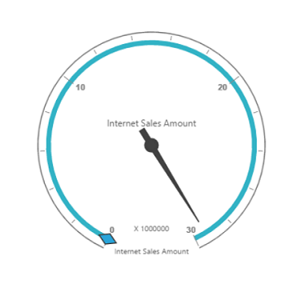

# Getting Started

This section explains you the steps required to populate the PivotGauge in your application with **PHP** wrapper classes of EJ controls. This section covers only the minimal features that you need to know to get started with the PivotGauge.

## Create PivotGauge widget

You can create a PHP Project and add necessary scripts and styles with the help of the given PHP Getting Started Documentation.

Create a first PHP file in Xampp and name it appropriately with `.php` extension and also place it under the newly created sample folder. For example, say Index.php with the initial code as shown below -

Refer the required scripts and CSS files in your PHP page as mentioned below in order to render the PivotGauge control - 



<!DOCTYPE html>
<html>
	<head>
			<title>Getting Started - PivotGauge</title>
			<link href="http://cdn.syncfusion.com/{{ site.releaseversion }}/js/web/flat-azure/ej.web.all.min.css" rel="stylesheet" />
			<link href="http://cdn.syncfusion.com/{{ site.releaseversion }}/js/web/responsive-css/ej.responsive.css" rel="stylesheet" />
			
			
			
	</head>
	<body>
			<?php require_once 'EJ\AutoLoad.php'; ?>
	</body>
</html>



## Relational

Add the following code example to add list of items to the **PivotGauge** and initialize the **PivotGauge** widget with Relational data source.



<?php
$Json = '[{'Amount':100,'Country':'Canada','Date':'FY 2005','Product':'Bike','Quantity':2,'State':'Alberta'},{'Amount':200,'Country':'Canada','Date':'FY 2006','Product':'Van','Quantity':3,'State':'British Columbia'},{'Amount':300,'Country':'Canada','Date':'FY 2007','Product':'Car','Quantity':4,'State':'Brunswick'},{'Amount':150,'Country':'Canada','Date':'FY 2008','Product':'Bike','Quantity':3,'State':'Manitoba'},{'Amount':200,'Country':'Canada','Date':'FY 2006','Product':'Car','Quantity':4,'State':'Ontario'},{'Amount':100,'Country':'Canada','Date':'FY 2007','Product':'Van','Quantity':1,'State':'Quebec'},{'Amount':200,'Country':'France','Date':'FY 2005','Product':'Bike','Quantity':2,'State':'Charente-Maritime'},{'Amount':250,'Country':'France','Date':'FY 2006','Product':'Van','Quantity':4,'State':'Essonne'},{'Amount':300,'Country':'France','Date':'FY 2007','Product':'Car','Quantity':3,'State':'Garonne (Haute)'},{'Amount':150,'Country':'France','Date':'FY 2008','Product':'Van','Quantity':2,'State':'Gers'},{'Amount':200,'Country':'Germany','Date':'FY 2006','Product':'Van','Quantity':3,'State':'Bayern'},{'Amount':250,'Country':'Germany','Date':'FY 2007','Product':'Car','Quantity':3,'State':'Brandenburg'},{'Amount':150,'Country':'Germany','Date':'FY 2008','Product':'Car','Quantity':4,'State':'Hamburg'},{'Amount':200,'Country':'Germany','Date':'FY 2008','Product':'Bike','Quantity':4,'State':'Hessen'},{'Amount':150,'Country':'Germany','Date':'FY 2007','Product':'Van','Quantity':3,'State':'Nordrhein-Westfalen'},{'Amount':100,'Country':'Germany','Date':'FY 2005','Product':'Bike','Quantity':2,'State':'Saarland'},{'Amount':150,'Country':'United Kingdom','Date':'FY 2008','Product':'Bike','Quantity':5,'State':'England'},{'Amount':250,'Country':'United States','Date':'FY 2007','Product':'Car','Quantity':4,'State':'Alabama'},{'Amount':200,'Country':'United States','Date':'FY 2005','Product':'Van','Quantity':4,'State':'California'},{'Amount':100,'Country':'United States','Date':'FY 2006','Product':'Bike','Quantity':2,'State':'Colorado'},{'Amount':150,'Country':'United States','Date':'FY 2008','Product':'Car','Quantity':3,'State':'New Mexico'},{'Amount':200,'Country':'United States','Date':'FY 2005','Product':'Bike','Quantity':4,'State':'New York'},{'Amount':250,'Country':'United States','Date':'FY 2008','Product':'Car','Quantity':3,'State':'North Carolina'},{'Amount':300,'Country':'United States','Date':'FY 2007','Product':'Van','Quantity':4,'State':'South Carolina'}]';
// Convert Array to JSON String
$Json = json_decode($Json,true);

$pivotgauge =  new EJ\PivotGauge('PivotGauge1');
$datasource = new EJ\PivotGauge\DataSource();
$Country = new EJ\PivotGauge\Row();
$Date = new EJ\PivotGauge\Row();
$row=array($Country->fieldName('Country'), $Date->fieldName('Date'));
$column = new EJ\PivotGauge\Column();
$column=array($column->fieldName('Product'));
$value = new EJ\PivotGauge\Value();
$value=array($value->fieldName('Amount'));
$labelformat = new EJ\PivotGauge\LabelFormatSetting();
$labelformat->decimalPlaces(2);

$scale = new EJ\CircularGauge\Scale();
$border = new EJ\CircularGauge\Border();
$pointer = new EJ\CircularGauge\Pointer();
$pointer1 = new EJ\CircularGauge\Pointer();
$pointer->showBackNeedle(true)->backNeedleLength(20)->length(120)->width(7);
$pointer1->type('marker')->markerType('diamond')->distanceFromScale(5)->placement('center')->backgroundColor('#29A4D9')->length(25)->width(15);
$pointers = array($pointer,$pointer1);
$tick = new EJ\CircularGauge\Tick();
$tick1 = new EJ\CircularGauge\Tick();
$tick->type('major')->distanceFromScale(2)->height(16)->width(1)->color('#8c8c8c');
$tick1->type('minor')->height(6)->width(1)->distanceFromScale(2)->color('#8c8c8c');
$ticks = array($tick,$tick1);
$label = new EJ\CircularGauge\Label();
$label=array($label->color('#8c8c8c'));
$range = new EJ\CircularGauge\Range();
$border1 = new EJ\CircularGauge\Border();
$range->distanceFromScale(-5)->backgroundColor('#fc0606')->border($border1->color('#fc0606'));
$range1 = new EJ\CircularGauge\Range();
$range1->distanceFromScale(-5);
$ranges=array($range,$range1);

$label1 = new EJ\CircularGauge\CustomLabel();
$position1 = new EJ\CircularGauge\Position();
$position1->x(180)->y(290);
$font1 = new EJ\CircularGauge\Font();
$font1->fontFamily('Segoe UI')->size('10px')->fontStyle('Normal');
$label1->color('#666666')->position($position1)->font($font1);

$label2 = new EJ\CircularGauge\CustomLabel();
$position2 = new EJ\CircularGauge\Position();
$position2->x(180)->y(320);
$font2 = new EJ\CircularGauge\Font();
$font2->fontFamily('Segoe UI')->size('10px')->fontStyle('Normal');
$label2->color('#666666')->position($position2)->font($font2);

$label3 = new EJ\CircularGauge\CustomLabel();
$position3 = new EJ\CircularGauge\Position();
$position3->x(180)->y(150);
$font3 = new EJ\CircularGauge\Font();
$font3->fontFamily('Segoe UI')->size('12px')->fontStyle('Normal');
$label3->color('#666666')->position($position3)->font($font3);
$customLabels = array($label1, $label2, $label3);

$scale=array($scale ->showRanges(true)->radius(150)->showScaleBar(true)->size(1)->border($border->width(0.5))->showIndicators(true)->showLabels(true)->pointers($pointers)->ticks($ticks)->labels($label)->ranges($ranges)->customLabels($customLabels));
$datasource->data($Json)->rows($row)->columns($column)->values($value);
echo $pivotgauge->dataSource($datasource)->isResponsive(true)->enableTooltip(true)->load('loadGaugeTheme')->labelFormatSettings($labelformat)->scales($scale)->render();
?>



The above code will generate a simple PivotGauge as shown in below figure.

## OLAP

Add the following code example to add list of items to the **PivotGauge** and initialize the **PivotGauge** widget with OLAP data source.



<?php
$pivotgauge =  new EJ\PivotGauge('PivotGauge1');
$datasource = new EJ\PivotGauge\DataSource();
$row = new EJ\PivotGauge\Row();
$row=array($row->fieldName('[Date].[Fiscal]'));
$column = new EJ\PivotGauge\Column();
$column=array($column->fieldName('[Customer].[Customer Geography]'));
$value = new EJ\PivotGauge\Value();
$field = new EJ\PivotGauge\Measure();
$value=array($value->measures(array($field->fieldName('[Measures].[Internet Sales Amount]')))->axis('columns'));
$labelformat = new EJ\PivotGauge\LabelFormatSetting();
$labelformat->decimalPlaces(2);

$scale = new EJ\CircularGauge\Scale();
$border = new EJ\CircularGauge\Border();
$pointer = new EJ\CircularGauge\Pointer();
$pointer1 = new EJ\CircularGauge\Pointer();
$pointer->showBackNeedle(true)->backNeedleLength(20)->length(120)->width(7);
$pointer1->type('marker')->markerType('diamond')->distanceFromScale(5)->placement('center')->backgroundColor('#29A4D9')->length(25)->width(15);
$pointers = array($pointer,$pointer1);
$tick = new EJ\CircularGauge\Tick();
$tick1 = new EJ\CircularGauge\Tick();
$tick->type('major')->distanceFromScale(2)->height(16)->width(1)->color('#8c8c8c');
$tick1->type('minor')->height(6)->width(1)->distanceFromScale(2)->color('#8c8c8c');
$ticks = array($tick,$tick1);
$label = new EJ\CircularGauge\Label();
$label=array($label->color('#8c8c8c'));
$range = new EJ\CircularGauge\Range();
$border1 = new EJ\CircularGauge\Border();
$range->distanceFromScale(-5)->backgroundColor('#fc0606')->border($border1->color('#fc0606'));
$range1 = new EJ\CircularGauge\Range();
$range1->distanceFromScale(-5);
$ranges=array($range,$range1);

$label1 = new EJ\CircularGauge\CustomLabel();
$position1 = new EJ\CircularGauge\Position();
$position1->x(180)->y(290);
$font1 = new EJ\CircularGauge\Font();
$font1->fontFamily('Segoe UI')->size('10px')->fontStyle('Normal');
$label1->color('#666666')->position($position1)->font($font1);

$label2 = new EJ\CircularGauge\CustomLabel();
$position2 = new EJ\CircularGauge\Position();
$position2->x(180)->y(320);
$font2 = new EJ\CircularGauge\Font();
$font2->fontFamily('Segoe UI')->size('10px')->fontStyle('Normal');
$label2->color('#666666')->position($position2)->font($font2);

$label3 = new EJ\CircularGauge\CustomLabel();
$position3 = new EJ\CircularGauge\Position();
$position3->x(180)->y(150);
$font3 = new EJ\CircularGauge\Font();
$font3->fontFamily('Segoe UI')->size('12px')->fontStyle('Normal');
$label3->color('#666666')->position($position3)->font($font3);
$customLabels = array($label1, $label2, $label3);

$scale=array($scale ->showRanges(true)->radius(150)->showScaleBar(true)->size(1)->border($border->width(0.5))->showIndicators(true)->showLabels(true)->pointers($pointers)->ticks($ticks)->labels($label)->ranges($ranges)->customLabels($customLabels));

$datasource->data('//bi.syncfusion.com/olap/msmdpump.dll')->catalog('Adventure Works DW 2008 SE')->cube('Adventure Works')->rows($row)->columns($column)->values($value);
echo $pivotgauge->dataSource($datasource)->isResponsive(true)->enableTooltip(true)->load('loadGaugeTheme')->labelFormatSettings($labelformat)->scales($scale)->render();
?>



The above code will generate a simple PivotGauge as shown in below figure.

