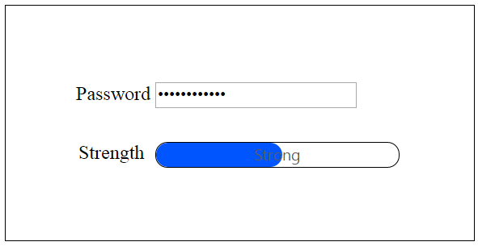

# Getting Started

The external script dependencies of the ProgressBar widget is,

* [jQuery 1.7.1](https://jquery.com/) and later versions.

And the internal script dependencies of the ProgressBar widget are:

<table>
	<tr>
		<th>File </th>
		<th>Description / Usage </th>
	</tr>
	<tr>
		<td>ej.core.min.js</td>
		<td>Must be referred always before using all the JS controls.</td>
	</tr>
	<tr>
		<td>ej.progressbar.min.js</td>
		<td>The progressbar’s main file</td>
	</tr>
</table>

For getting started you can use the ‘ej.web.all.min.js’ file, which encapsulates all the 'ej' controls and frameworks in one single file.  

For themes, you can use the ‘ej.web.all.min.css’ CDN link from the snippet given. To add the themes in your application, please refer [this link](https://help.syncfusion.com/js/theming-in-essential-javascript-components#adding-specific-theme-to-your-application).

## Preparing HTML document

You can create a PHP Project and add necessary scripts and styles with the help of the given PHP Getting Started Documentation.

Create a first PHP file in Xampp and name it appropriately with `.php` extension and also place it under the newly created sample folder. For example, say Index.php with the initial code as shown below -

Refer the required scripts and CSS files in your PHP page as mentioned below in order to render the ProgressBar control - 



    <!DOCTYPE html>
       <html>
        <head>
                <title>Getting Started - ProgressBar</title>
                <link href="http://cdn.syncfusion.com/{{ site.releaseversion }}/js/web/flat-azure/ej.web.all.min.css" rel="stylesheet" />
                <link href="http://cdn.syncfusion.com/{{ site.releaseversion }}/js/web/responsive-css/ej.responsive.css" rel="stylesheet" />
                
                
        </head>
        <body>
           <?php require_once 'EJ/AutoLoad.php'; ?>
        </body>
    </html>



## Create a ProgressBar

The ProgressBar can be created in **PHP** by using the below given code.



  <?php
	$progressBar = new EJ\ProgressBar('progressBar');
	echo $progressBar->render();
  ?> 



It also includes a Password field and through that the progress of the **ProgressBar** can be controlled



   

      

         

            

               <!--Initializing password field*-->
               <label for="startButton">Password</label>
               <input type="password" id="password" style="border-radius:0px"/>
            

            

               <!--initializing ProgressBar control-->
                <?php
                    $progressBar = new EJ\ProgressBar('progressBar');
                    echo $progressBar->render();
                ?> 
            

         

      

   



Here, you can initialize the properties of the **ProgressBar** such as height, value, width, text that is applied to the control by default.


    
            

                <?php
	                $progressBar = new EJ\ProgressBar('progressBar');
	                echo $progressBar->width(200)->height(20)->value(30)->render();
	                echo('');
                ?> 
            



The following screenshot displays a **ProgressBar** control.

 

Include the following code within the **&lt;head&gt;** tag to change the page layout.



   .frame {
       border: 1px solid #BBBCBB;
       border-radius: 10px 10px 10px 10px;
       padding: 50px 60px;
       margin-top: 40px;
       width: 400px;
       margin-left: 400px;
   }
   .control {
       margin-bottom: 5px;
       margin-left: 230px;
   }
   .wrap_up {
       margin-left: 105px;
       font-size: 18px;
   }
   #progressBar {
       margin-top: 10px;
   }



## Progress Control using Length of the Password Field

In real-time scenario, the progress of **ProgressBar** is changed according to the length of text in the password field by binding the change in the properties of control and checking the length of the password field.

Add the following code example inside the **&lt;script&gt;** tag of your **HTML** file.


    var progresObj, buttonObj, k = 10, timer = window.clearInterval(timer), i = 0, obj;
    $(document).keypress(function () {             
        i = $("#password").val().length;
        if (i < 5) 
            weak();
        else if (i > 5 && i < 7) 
            Strong();
        else if(i>7) {
        var pwd = $("#password").val();
        if(/^[a-zA-Z0-9- ]*$/.test(pwd) == false);
            very_strong();
		}
    });
    function Strong() {  
        var progresObj = $("#progressBar").data("ejProgressBar");	//Change the width and text of the progress ... called when the length is greater than 5
        progresObj.option("text", "strong");
        progresObj.option("percentage", k + 50);
        $(".e-progress").css("background-color", "#0055FF");
        $(".e-progressbar").css("color", "#000000");       
    }
    function very_strong() {     //Change the width and text of the progress ... called when the length is greater than 7
        var progresObj = $("#progressBar").data("ejProgressBar");
        progresObj.option("text", "Very strong");
        progresObj.option("percentage", k + 90);
        $(".e-progress").css("background-color", "Green");
        $(".e-progressbar").css("color", "#000000");   
    }
    function weak() {     //Change the width and text of the progress... called when the length is less than 5
        var progresObj = $("#progressBar").data("ejProgressBar");
        progresObj.option("text", "Weak");
        progresObj.option("percentage", k+20 );
        $(".e-progress").css("background-color", "#DE0909");
        $(".e-progressbar").css("border-radius", "10px");      
    }



You can calculate length of the password and call the appropriate function that changes the percentage property of **ProgressBar**.

* The **weak()** function changes the text inside the ProgressBar to **Weak** and percentage to 30, that is invoked when the length of the text is less than 5.
* The **strong()** function changes the text inside the ProgressBar to **Strong** and percentage to 60, that is invoked when the length of the text exceeds 5.
* The **very_strong()** function changes the text inside the ProgressBar to Very **Strong** and percentage to 100, that is invoked when the length of the text exceeds 7 and the text contains a symbol in it.

You can change themes or appearance of the ProgressBar as required.

The final output is displayed as follows.

 

 

 

You can also bind an event at the start and finish of a ProgressBar by using the start, complete and change properties of the ProgressBar.

