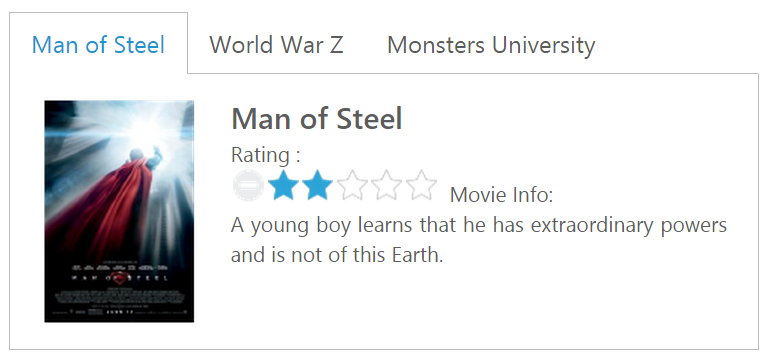

# Getting Started with PHP Rating

This section explains briefly about how to create a **Rating** control in your application with **PHP**. **Rating** helps to select the number of stars that represent Rating. Here, you can learn how to create **Rating** control in a real-time movie download application and also learn how to rate the application.

The following screenshot illustrates the functionality of a Rating widget with a Rating range of 0 to 5. 

 

The external script dependencies of the Rating widget is,

* [jQuery 1.7.1](http://jquery.com/) and later versions.

And the internal script dependencies of the Rating widget are:

<table>
	<tr>
		<th>File </th>
		<th>Description / Usage </th>
	</tr>
	<tr>
		<td>ej.core.min.js</td>
		<td>Must be referred always before using all the JS controls.</td>
	</tr>
	<tr>
		<td>ej.rating.min.js</td>
		<td>The rating’s main file</td>
	</tr>
	<tr>
		<td>ej.tooltip.min.js</td>
		<td>Should be referred when using tooltip</td>
	</tr>
</table>

For getting started you can use the ‘ej.web.all.min.js’ file, which encapsulates all the 'ej' controls and frameworks in one single file.  

For themes, you can use the ‘ej.web.all.min.css’ CDN link from the snippet given. To add the themes in your application, please refer [this link](http://help.syncfusion.com/js/theming-in-essential-javascript-components#adding-specific-theme-to-your-application).

## Preparing HTML document

You can create a PHP Project and add necessary scripts and styles with the help of the given PHP Getting Started Documentation.

Create a first PHP file in Xampp and name it appropriately with `.php` extension and also place it under the newly created sample folder. For example, say Index.php with the initial code as shown below -

Refer the required scripts and CSS files in your PHP page as mentioned below in order to render the Rating control - 



    <!DOCTYPE html>
       <html>
        <head>
                <title>Getting Started - Rating</title>
                <link href="http://cdn.syncfusion.com/{{ site.releaseversion }}/js/web/flat-azure/ej.web.all.min.css" rel="stylesheet" />
                <link href="http://cdn.syncfusion.com/{{ site.releaseversion }}/js/web/responsive-css/ej.responsive.css" rel="stylesheet" />
                
                
        </head>
        <body>
           <?php require_once 'EJ/AutoLoad.php'; ?>
        </body>
    </html>



##Create a Rating Widget

The **Rating** widget is provided with built-in features such as precision, orientation and flexible API’s. 

The Rating can be created in **PHP** by using the below given code.


    <?php
		$rating1 =new EJ\Rating('mosRating');
		echo $rating1->value(2)->render();
		?> 



 Add movies list in the table to render Rating control. Here, you can add corresponding images in the images folder and give the accurate image path.



        

            

                

                    <?php	
                        $tab =new EJ\Tab("moviesTab");	
                        $tab->templateStart();
                    ?>	 
                        <ul>
                            <li><a href="#steelman">Man of Steel</a></li>
                            <li><a href="#woldwar">World War Z</a></li>
                            <li><a href="#unive">Monsters University</a></li>
                        </ul>
                        

                            

                                <table>
                                    <tr>
                                        <td class="movies-img" valign="top">
                                            
                                        </td>
                                        <td valign="top">
                                            

                                                Man of Steel 
                                                Rating :
                                                         
															<?php
                                                            $rating1 =new EJ\Rating('mosRating');
                                                            echo $rating1->value(2)->render();
                                                            ?> 
                                                Movie Info:
                                                

                                                    A young boy learns that he has extraordinary powers and is not of this Earth.
                                                

                                            

                                        </td>
                                    </tr>
                                </table>
                            

                        

                        

                            <table>
                                <tr>
                                    <td class="movies-img" valign="top">
                                        
                                    </td>
                                    <td valign="top">
                                        

                                            World War Z 
                                            Rating :
                                                     
														<?php
                                                        $rating1 =new EJ\Rating('wwzRating');
                                                        echo $rating1->value(4)->render();
                                                        ?> 
                                            Movie Info:
                                            

                                                The story revolves around United Nations employee Gerry Lane (Pitt).
                                            

                                        

                                    </td>
                                </tr>
                            </table>
                        

                        

                            <table>
                                <tr>
                                    <td class="movies-img" valign="top">
                                        
                                    </td>
                                    <td valign="top">
                                        

                                            Monsters University 
                                            Rating :
                                                     
														<?php
                                                        $rating1 =new EJ\Rating('univRating');
                                                        echo $rating1->value(4)->render();
                                                        ?> 
                                            Movie Info:
                                            

                                                Mike Wazowski and James P. Sullivan are an inseparable pair, but that wasn't always the case. 
                                            

                                        

                                    </td>
                                </tr>
                            </table>
                        

                    

                    <?php
                    $tab->templateEnd();
                    echo $tab->width("500px")->render();
                    ?>
                

            

        

    



 Apply the following styles to show the Rating widget in the horizontal order.





 The following screenshot displays a Rating widget.

 

## Set the Min and Max Value

In a real-time scenario, you can extend the range by using the properties **minValue** and **maxValue** in the **Rating** widget. 



<body>

        

            

                

                    <table>
                        <tr>
                            <td valign="top">Rate:
                            </td>
                            <td>
                                <?php									
                                    require_once '../EJ/AutoLoad.php';						 
                                    $rating1 =new EJ\Rating('fullRating');
                                    echo $rating1->value(4)->minValue(2)->maxValue(10)->render();
                                ?> 
                            </td>
                            </tr>
                    </table>
                

            

        

    

</body>



The above code example displays the following output.

## Set Precision

In a real-time movie **Rating** scenario, you can set precision in between two whole numbers, such as 2.5 or 3.7 and it is done using the property **precision** by changing the value to **half** or **exact.**



<body>
<?php
    require_once '../EJ/AutoLoad.php';
?> 

        

            

                

                    <table>
                        <tr>
                            <td valign="top">Full Precision :
                            </td>
                            <td>
                                <?php							 
                                $rating1 =new EJ\Rating('fullRating');
                                echo $rating1->value(4)->render();
                                ?> 
                            </td>
                        </tr>
                        <tr>
                            <td valign="top">Half Precision :
                            </td>
                            <td>
                               <?php
                                $rating1 =new EJ\Rating('halfRating');
                                echo $rating1->value(3.5)->precision("half")->render();
                                ?> 
                            </td>
                        </tr>
                        <tr>
                            <td valign="top">Exact Precision :
                            </td>
                            <td>
                                <?php
                                $rating1 =new EJ\Rating('exactRating');
                                echo $rating1->value(3.7)->precision("exact")->render();
                                ?> 
                            </td>
                        </tr>
                    </table>
                

            

        

    

    
</body>



The above code example displays the following output.

You can also add additional functionalities such as orientation, event tracer and API’s to the **Rating**. 

