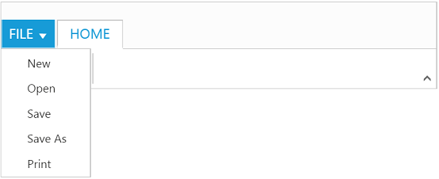

# Application Tab

The Application Tab is used to represent a Menu that do some operations, such as File menu to create, open, and print documents. Application Tab classified by type property with the following:

* [menu]
* [backstage]

# Application Menu

The Application Menu is similar to traditional file menu options and Syncfusion ejMenu control is used internally to render this. To show Application Menu in Ribbon, set the type as menu and menuSettings to customize properties of ejMenu.

## Create Using Template

Set the UL element id to menuItemID property to create Application Menu and it will acts as template to render menu.



          

          <ul id="ribbonmenu">
              <li><a>FILE</a>
          <ul>
              <li><a>New</a></li>
              <li><a>Open</a></li>
              <li><a>Save</a></li>
              <li><a>Print</a></li>
          </ul>
              </li>
          </ul>
          <?php 
          require_once 'EJ\AutoLoad.php';
          $ribbon = new  \EJ\Ribbon('defaultRibbon');
          $aTab = new \EJ\Ribbon\ApplicationTab();           
          $aTab->type('menu')->menuItemID('ribbonmenu');
		  $hometab  = new \EJ\Ribbon\Tab();
          $clipboard  = new \EJ\Ribbon\Group();
          $grpcontent = new \EJ\Ribbon\Content();
          $contentgroup=new \EJ\Ribbon\ContentGroup();
          $btnsettings=array('contentType'=>'imageonly','prefixIcon'=>'e-icon e-ribbon e-new');
          $contentgroup->text('New')->type('custom')->contentID('Contents')->buttonSettings($btnsettings);   
          $grpcontent->groups(array($contentgroup));
          $clipboard->text('New')->content(array($grpcontent));
          $hometab->id('home')->text('HOME')->groups(array($clipboard));
          echo $ribbon ->width('500px')->applicationTab($aTab)->tabs(array($hometab))->render();
          ?>



## Backstage Page

The Backstage page is where documents and related data of those can be managed, such as Create, Save and other information.

The Backstage page has a feature to add custom Control in left side of the page which contains menu items and the right side contains corresponding user controls.

You can set Application Tab type as backstage and set id , text to backstage items. Backstage pages can be added with required itemType and contentID as template id to render template into Backstage.

Separator between Backstage items can be enabled by setting enableSeparator as true. Width of back stage side header can be customized using headerWidth, If not set based on content given width will be considered.

To render the Ribbon with the Backstage page, refer to the following code snippet.



           

           

           <table>
             <tr>
                <td><button id="btn1" class="e-bsnewbtnstyle">Blank WorkBook</button></td>
             </tr>
           </table>
           

           

		   

                User Information
           

           

           

               
user

               
xyz@syncfusion.com

           

           

           

               <a href="#">Sign out</a>
           

           <?php 
           require_once 'EJ\AutoLoad.php';
           $btn1 =  new EJ\Button("btn1");
           echo $btn1->contentType("textandimage")->prefixIcon("e-blank e-infopageicon")->imagePosition("imagetop")->width(205)->height(200)->size("large")->render();
           $ribbon = new  \EJ\Ribbon("defaultRibbon");
           $aTab = new \EJ\Ribbon\ApplicationTab();      
           $backstage = new \EJ\Ribbon\BackstageSetting();
           $backstagepages1=new EJ\Ribbon\Page();
           $backstagepages1->id("new")->text("New")->contentID("newCon");
           $backstagepages2=new EJ\Ribbon\Page();
           $backstagepages2->id("close")->text("Close")->enableSeparator("true")->itemType("button");
           $backstagepages3=new EJ\Ribbon\Page();
           $backstagepages3->id("account")->text("Office Account")->contentID("infoCon");
           $backstage->text("FILE")->height("350")->width("600px")->headerWidth("120px")->pages(array($backstagepages1,$backstagepages2,$backstagepages3));
           $aTab->type("backstage")->backstageSettings($backstage);
           $hometab  = new \EJ\Ribbon\Tab();
           $clipboard  = new \EJ\Ribbon\Group();
           $grpcontent = new \EJ\Ribbon\Content();
           $contentgroup=new \EJ\Ribbon\ContentGroup();
           $contentgroup->text('New')->type('custom')->contentID('ribbonContent');   
           $grpcontent->groups(array($contentgroup));
           $clipboard->text('New')->content(array($grpcontent));
           $hometab->id('home')->text('HOME')->groups(array($clipboard));
           echo $ribbon ->width('500px')->applicationTab($aTab)->render();
           ?>
		   



N> Height & width of backstage can be set using height and width, if these are not set, Ribbon�s height & width will be considered.

