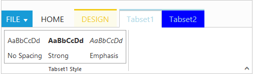

# Contextual Tabs

Contextual Tabs are collection of Tabs that extended styling and can be shown based on some criteria. Contextual Tabs can be added like tabs including groups and content section. You can set backgroundColor and borderColor to highlight them as Tab set



          

	       <ul id="ribbonmenu">
		      <li><a>FILE</a>    
		       <ul>
		          <li><a>New</a></li>
		       </ul>
		      </li>
	       </ul>
          
Custom Control

          

           

              
AaBbCcDd

              
No Spacing

           

           

              
AaBbCcDd

              
Strong

           

           

              
AaBbCcDd

              
Emphasis

           

          

          <table id="design" class="e-designtablestyle">
            <tr>
               <td>
                 <input type="checkbox" id="Check2" />
                 <label for="Check2">First Column</label>
               </td>
               <td>
                 <input type="checkbox" id="check4" checked="checked" />
                 <label for="check4">Total Row</label>
               </td>
            </tr>
          </table>
          <?php
		  require_once 'EJ\AutoLoad.php';
          $ribbon = new  \EJ\Ribbon('defaultRibbon');
          $aTab = new \EJ\Ribbon\ApplicationTab();           
          $aTab->type('menu')->menuItemID('ribbonmenu');  
          $hometab  = new \EJ\Ribbon\Tab();
          $clipboard  = new \EJ\Ribbon\Group();
          $clipboard->text('CustomControls')->type('custom')->contentID('Contents');     
          $hometab->id('home')->text('HOME')->groups(array($clipboard));
          $contextab  = new \EJ\Ribbon\ContextualTab();
          $contextab1  = new \EJ\Ribbon\ContextualTab();
          $designtab = new \EJ\Ribbon\Tab();
          $clipboard1  = new \EJ\Ribbon\Group();
          $clipboard1->text('Table Style Options')->type('custom')->contentID('design');
          $designtab->id('Design')->text('DESIGN')->groups(array($clipboard1));
          $contextab->backgroundColor('#FCFBEB')->borderColor('#F2CC1C')->tabs(array($designtab));
          $tabset1 = new \EJ\Ribbon\Tab();
          $clipboard2  = new \EJ\Ribbon\Group();
          $clipboard2->text('Tabset1 Style')->type('custom')->contentID('headings');
          $tabset1->id('tabset1')->text('Tabset1')->groups(array($clipboard2));
          $tabset2 = new \EJ\Ribbon\Tab();
          $clipboard3  = new \EJ\Ribbon\Group();
          $grpcontent = new \EJ\Ribbon\Content();
          $contentgroup=new \EJ\Ribbon\ContentGroup();
          $contentgroup1=new \EJ\Ribbon\ContentGroup();
          $btnsettings=array('contentType'=>'imageonly','prefixIcon'=>' e-ribbon e-uppercase');
          $contentgroup->id('uppercase')->text('Upper Case')->buttonSettings($btnsettings);
          $btnsettings1=array('contentType'=>'imageonly','prefixIcon'=>' e-ribbon e-lowercase');
          $contentgroup1->id('lowercase')->text('Lower Case')->buttonSettings($btnsettings1);
          $default = new \EJ\Ribbon\Defaults();
          $default->isBig('true');
          $grpcontent->groups(array($contentgroup,$contentgroup1))->defaults($default);
          $clipboard3->text('TabSet2 Style')->content(array($grpcontent));
          $tabset2->id('tabset2')->text('Tabset2')->groups(array($clipboard3));
          $contextab1->backgroundColor('blue')->borderColor('lightblue')->tabs(array($tabset1,$tabset2));
          echo $ribbon ->width('500px')->applicationTab($aTab)->tabs(array($hometab))->contextualTabs(array($contextab,$contextab1))->render();
          ?>



