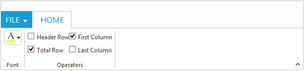

# Controls Support

Button, Split Button, DropdownList, Toggle button, Gallery and Custom controls can be added to each groups. You can set type property in group to define the controls. Default type is button.

## Built in Controls

The following table describes about the built in controls type and their corresponding control settings.

<table>
   <tr>
      <th>
         <b>Type </b>
      </th>
      <th>
         <b>Control Settings </b>
      </th>
	  <th>
         <b>Example </b>
      </th>
	</tr>
	<tr>
      <td>
         Button
      </td>
      <td>
         ejButton - buttonSettings
      </td>
	  <td>
         $btnsettings=array('contentType'=>'imageonly','imagePosition'=>'imagetop','prefixIcon'=>'e-icon e-ribbon e-new');
         $contentgroup->id('new')->text('New')->toolTip("New")->buttonSettings($btnsettings); 
      </td>
    </tr>
	<tr>
      <td>
         SplitButton
      </td>
      <td>
         ejSplitButton - splitButtonSettings
      </td>
	  <td>
          $splitButton=array('contentType'=>'imageonly','prefixIcon'=>'e-icon e-ribbon e-ribbonpaste','targetID'=>'pasteSplit','buttonMode'=>'dropdown','arrowPosition'=>'bottom');
          $contentgroup1->id('new')->text('New')->toolTip("New")->splitButtonSettings($splitButton); 
      </td>
    </tr>
	<tr>
      <td>
         ToggleButton
      </td>
      <td>
         ejToggleButton - toggleButtonSettings
      </td>
	  <td>
          $togglebutton =  array('defaultText'=>'Bold','activeText'=>'Bold','defaultPrefixIcon'=>'e-icon e-ribbon e-ribbonbold','activePrefixIcon'=>'e-icon e-ribbon e-bold'); 
          $contentgroup4->id('bold')->toolTip('Bold')->type('togglebutton')->toggleButtonSettings($togglebutton);
      </td>
    </tr>
	<tr>
      <td>
         DropDownList
      </td>
      <td>
         ejDropDownList - dropdownSettings
      </td>
	  <td>
         $dropdownButton=array('dataSource'=>$fontfamily,'text'=>'Segeo UI','width'=>150);
         $contentgroup2->id('fontfamily')->toolTip('Font')->dropdownSettings($dropdownButton); 
      </td>
    </tr>
</table>

N> 1. You can specify type either to group's collection or to each group.
N> 2. For type property you can assign either string value (`splitbutton`) or enum value (ej.Ribbon.type.splitButton).



         

	      <ul id="ribbonmenu">
		      <li><a>FILE</a>    
		       <ul>
		          <li><a>New</a></li>
		       </ul>
		      </li>
	      </ul>
          <ul id="pasteSplit">
              <li><a>Paste</a></li>
          </ul>
         <?php
         $fontfamily = ["Segoe UI", "Arial", "Times New Roman", "Tahoma", "Helvetica"];
         $fontsize = ["1pt", "2pt", "3pt", "4pt", "5pt"];
         $action1 = ["New", "Clear"];
         $action2 = ["Bold", "Italic", "Underline", "strikethrough", "superscript", "subscript", "JustifyLeft", "JustifyCenter", "JustifyRight", "JustifyFull", "Undo", "Redo"]; 
		 require_once 'EJ\AutoLoad.php';
         $ribbon = new  \EJ\Ribbon('defaultRibbon');
         $aTab = new \EJ\Ribbon\ApplicationTab();           
         $aTab->type('menu')->menuItemID('ribbonmenu');  
         $hometab  = new \EJ\Ribbon\Tab();
         $clipboard  = new \EJ\Ribbon\Group();
         $grpcontent = new \EJ\Ribbon\Content();
         $contentgroup=new \EJ\Ribbon\ContentGroup();
         $btnsettings=array('contentType'=>'imageonly','imagePosition'=>'imagetop','prefixIcon'=>'e-icon e-ribbon e-new');
         $contentgroup->id('new')->text('New')->toolTip("New")->buttonSettings($btnsettings);     
         $default = new \EJ\Ribbon\Defaults();
         $default->width(60)->height(70)->type("button");
         $grpcontent->groups(array($contentgroup))->defaults($default);
         $clipboard->text('New')->alignType('rows')->content(array($grpcontent));
         $clipboard1  = new \EJ\Ribbon\Group();
         $grpcontent1 = new \EJ\Ribbon\Content();
         $contentgroup1 = new \EJ\Ribbon\ContentGroup();
         $splitButton=array('contentType'=>'imageonly','prefixIcon'=>'e-icon e-ribbon e-ribbonpaste','targetID'=>'pasteSplit','buttonMode'=>'dropdown','arrowPosition'=>'bottom');
         $contentgroup1->id('new')->text('New')->toolTip("New")->splitButtonSettings($splitButton);     
         $default1 = new \EJ\Ribbon\Defaults();
         $default1->width(50)->height(70)->type("splitbutton");
         $grpcontent1->groups(array($contentgroup1))->defaults($default1);
         $clipboard1->text('Clipboard')->alignType('columns')->content(array($grpcontent1));
         $clipboard2  = new \EJ\Ribbon\Group();
         $grpcontent2 = new \EJ\Ribbon\Content();
         $contentgroup2 = new \EJ\Ribbon\ContentGroup();
         $contentgroup3 = new \EJ\Ribbon\ContentGroup();
         $dropdownButton=array('dataSource'=>$fontfamily,'text'=>'Segeo UI','width'=>150);
         $contentgroup2->id('fontfamily')->toolTip('Font')->dropdownSettings($dropdownButton);     
         $dropdownButton1=array('dataSource'=>$fontsize,'text'=>'1pt','width'=>65);
         $contentgroup3->id('fontsize')->toolTip('FontSize')->dropdownSettings($dropdownButton1);
         $default2 = new \EJ\Ribbon\Defaults();
         $default2->height(28)->type("dropdownlist");
         $grpcontent2->groups(array($contentgroup2,$contentgroup3))->defaults($default2);
         $clipboard2->text('Font')->alignType('rows')->content(array($grpcontent2));
         $clipboard3  = new \EJ\Ribbon\Group();
         $grpcontent3 = new \EJ\Ribbon\Content();
         $contentgroup4 = new \EJ\Ribbon\ContentGroup();
         $contentgroup5 = new \EJ\Ribbon\ContentGroup();
         $togglebutton =  array('defaultText'=>'Bold','activeText'=>'Bold','defaultPrefixIcon'=>'e-icon e-ribbon e-ribbonbold','activePrefixIcon'=>'e-icon e-ribbon e-bold'); 
         $contentgroup4->id('bold')->toolTip('Bold')->type('togglebutton')->toggleButtonSettings($togglebutton);
         $togglebutton1 =  array('defaultText'=>'Italic','activeText'=>'Italic','defaultPrefixIcon'=>'e-icon e-ribbon e-ribbonitalic','activePrefixIcon'=>'e-icon e-ribbon e-italic'); 
         $contentgroup5->id('italic')->toolTip('Italic')->type('togglebutton')->toggleButtonSettings($togglebutton1);
         $default2 = new \EJ\Ribbon\Defaults();
         $default2->isBig('false');
         $grpcontent3->groups(array($contentgroup4,$contentgroup5))->defaults($default2);
         $clipboard3->text('Font')->content(array($grpcontent3));
         $hometab->id('home')->text('HOME')->groups(array($clipboard,$clipboard1,$clipboard2,$clipboard3));
         echo $ribbon ->width('500px')->applicationTab($aTab)->tabs(array($hometab))->render();
         ?>



## Custom

You can set type as custom to render custom controls and Custom element id has to be specified as contentID.You can change the element defined in the custom template to appropriate Syncfusion control in the event of Ribbon create.



         

	      <ul id="ribbonmenu">
		      <li><a>FILE</a>    
		       <ul>
			      <li><a>New</a></li>
                  <li><a>Print</a></li>
	           </ul>
		      </li>
	      </ul>
          <input id="fontcolor" />
          <table id="design" class="e-designtablestyle">
            <tr>
              <td>
                 <input type="checkbox" id="check1" /><label for="check1">Header Row</label></td>
              <td>
                 <input type="checkbox" id="Check2" checked="checked" /><label for="Check2">First Column</label></td>
            </tr>
            <tr>
              <td>
                 <input type="checkbox" id="check4" checked="checked" /><label for="check4">Total Row</label></td>
              <td>
                 <input type="checkbox" id="Check5" /><label for="Check5">Last Column</label></td>
            </tr>
          </table>
         <?php
		 require_once 'EJ\AutoLoad.php';
         $ribbon = new  \EJ\Ribbon('defaultRibbon');
         $aTab = new \EJ\Ribbon\ApplicationTab();           
         $aTab->type('menu')->menuItemID('ribbonmenu');
         $hometab  = new \EJ\Ribbon\Tab();
         $clipboard  = new \EJ\Ribbon\Group();
         $grpcontent = new \EJ\Ribbon\Content();
         $contentgroup=new \EJ\Ribbon\ContentGroup();
         $contentgroup->id('fontcolor')->toolTip('Font Color')->contentID('fontcolor');
         $default = new \EJ\Ribbon\Defaults();
         $default->height(30)->type('custom');
         $grpcontent->groups(array($contentgroup))->defaults($default);
         $clipboard->text('Font')->content(array($grpcontent));
         $clipboard1  = new \EJ\Ribbon\Group();
         $grpcontent1 = new \EJ\Ribbon\Content();
         $contentgroup1=new \EJ\Ribbon\ContentGroup();
         $contentgroup1->id('design')->type('custom')->contentID('design'); 
         $grpcontent1->groups(array($contentgroup1));
         $clipboard1->text('Operators')->content(array($grpcontent1));
         $hometab->id('home')->text('HOME')->groups(array($clipboard,$clipboard1));
         echo $ribbon ->create('createControl')->width('500px')->applicationTab($aTab)->tabs(array($hometab))->render();   
         ?>
         
               


