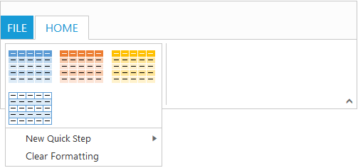

# Gallery

Galleries are used to display items that can be arranged in a grid-type layout. Items in the gallery can be customized as button/menu to display images, text, or both images and text. You can set type of group as gallery.

## Gallery Items

Gallery items are collection of the items to be included in the main gallery. You can set text and toolTip to gallery item which can also be customized with buttonSettings.

Number of columns to display in gallery for each row should be specified and the Number of columns in Expanded State (expandedColumns) can be customized, if not set, columns count will be set as default.

N> The itemHeight and itemWidth for gallery item can be set, if not set default values will be used.



       

	    <ul id="ribbonmenu">
		   <li><a>FILE</a>    
	        <ul>
		       <li><a>Open</a></li>
	        </ul>
		   </li>
	    </ul>
       <?php
	   require_once 'EJ\AutoLoad.php';
       $ribbon = new  \EJ\Ribbon('defaultRibbon');
       $aTab = new \EJ\Ribbon\ApplicationTab();           
       $aTab->type('menu')->menuItemID('ribbonmenu');  
       $hometab  = new \EJ\Ribbon\Tab();
       $clipboard  = new \EJ\Ribbon\Group();
       $grpcontent = new \EJ\Ribbon\Content();
       $contentgroup=new \EJ\Ribbon\ContentGroup();
       $btnsettings=array('contentType'=>'imageonly','prefixIcon'=>'e-icon e-gallerycontent1 e-gbtnimg','cssClass'=>' e-gbtnposition');
       $gallery=new \EJ\Ribbon\GalleryItem();
	   $gallery->text('GalleryContent1')->toolTip('GalleryContent1')->buttonSettings($btnsettings);
       $btnsettings1=array('contentType'=>'imageonly','prefixIcon'=>'e-icon e-gallerycontent2 e-gbtnimg','cssClass'=>' e-gbtnposition');
       $gallery1=new \EJ\Ribbon\GalleryItem();
	   $gallery1->text('GalleryContent2')->toolTip('GalleryContent2')->buttonSettings($btnsettings1);
       $btnsettings2=array('contentType'=>'imageonly','prefixIcon'=>'e-icon e-gallerycontent3 e-gbtnimg','cssClass'=>' e-gbtnposition');
       $gallery2=new \EJ\Ribbon\GalleryItem();
	   $gallery2->text('GalleryContent3')->toolTip('GalleryContent3')->buttonSettings($btnsettings2);
       $btnsettings3=array('contentType'=>'imageonly','prefixIcon'=>'e-icon e-gallerycontent4 e-gbtnimg','cssClass'=>' e-gbtnposition');
       $gallery3=new \EJ\Ribbon\GalleryItem();
	   $gallery3->text('GalleryContent4')->toolTip('GalleryContent4')->buttonSettings($btnsettings3);
       $contentgroup->id('Gallery')->columns(2)->itemHeight(54)->itemWidth(73)->expandedColumns(3)->type('gallery')->galleryItems(array($gallery,$gallery1,$gallery2,$gallery3));
       $grpcontent->groups(array($contentgroup));     
       $clipboard->text('Gallery')->type('gallery')->content(array($grpcontent));
	   $hometab->id('home')->text('HOME')->groups(array($clipboard));
       echo $ribbon ->width('500px')->applicationTab($aTab)->tabs(array($hometab))->render();
       ?>
       



## Custom Gallery Items

Custom gallery items are the additional items to be displayed at gallery expanded state. You can set customItemType as button or menu, Default is button.

You can also set text and toolTip to custom gallery item which can also be customized with buttonSettings/menuSettings based on the customItemType specified.



    

	 <ul id="ribbonmenu">
		 <li><a>FILE</a></li>
	 </ul>
     <ul id="custommenu">
		 <li><a>New Quick Steps</a>
	      <ul>
             <li><a>Flag and Move</a></li>
	      </ul>
         </li>
	 </ul>
    <?php
	require_once 'EJ\AutoLoad.php';
    $ribbon = new  \EJ\Ribbon('defaultRibbon');
    $aTab = new \EJ\Ribbon\ApplicationTab();           
    $aTab->type('menu')->menuItemID('ribbonmenu');  
    $hometab = new \EJ\Ribbon\Tab();
    $clipboard = new \EJ\Ribbon\Group();
    $grpcontent = new \EJ\Ribbon\Content();
    $contentgroup=new \EJ\Ribbon\ContentGroup();
    $btnsettings=array('contentType'=>'imageonly','prefixIcon'=>'e-icon e-gallerycontent1 e-gbtnimg','cssClass'=>' e-gbtnposition');
    $gallery=new \EJ\Ribbon\GalleryItem();
	$gallery->text('GalleryContent1')->toolTip('GalleryContent1')->buttonSettings($btnsettings);
    $btnsettings1=array('contentType'=>'imageonly','prefixIcon'=>'e-icon e-gallerycontent2 e-gbtnimg','cssClass'=>' e-gbtnposition');
    $gallery1=new \EJ\Ribbon\GalleryItem();
	$gallery1->text('GalleryContent2')->toolTip('GalleryContent2')->buttonSettings($btnsettings1);
    $btnsettings2=array('contentType'=>'imageonly','prefixIcon'=>'e-icon e-gallerycontent3 e-gbtnimg','cssClass'=>' e-gbtnposition');
    $gallery2=new \EJ\Ribbon\GalleryItem();
	$gallery2->text('GalleryContent3')->toolTip('GalleryContent3')->buttonSettings($btnsettings2);
    $btnsettings3=array('contentType'=>'imageonly','prefixIcon'=>'e-icon e-gallerycontent4 e-gbtnimg','cssClass'=>' e-gbtnposition');
    $gallery3=new \EJ\Ribbon\GalleryItem();
	$gallery3->text('GalleryContent4')->toolTip('GalleryContent4')->buttonSettings($btnsettings3);
    $customGallery=new \EJ\Ribbon\CustomGalleryItem();
    $customGallery1=new \EJ\Ribbon\CustomGalleryItem();
    $menu=array('openOnClick'=>false);
    $customGallery->customItemType('menu')->menuId('custommenu')->menuSettings($menu);
    $btnsettings4=array('cssClass'=>'e-extrabtnstyle');
    $customGallery1->text('Clear Formatting')->toolTip('clear Formatting')->customItemType('button')->buttonSettings($btnsettings4);
    $contentgroup->id('Gallery')->columns(2)->itemHeight(54)->itemWidth(73)->expandedColumns(3)->type('gallery')->galleryItems(array($gallery,$gallery1,$gallery2,$gallery3))->customGalleryItems(array($customGallery,$customGallery1));
    $grpcontent->groups(array($contentgroup));     
    $clipboard->text('Gallery')->type('gallery')->content(array($grpcontent));
    $hometab->id('home')->text('HOME')->groups(array($clipboard));
    echo $ribbon ->width('500px')->applicationTab($aTab)->tabs(array($hometab))->render();
    ?>
    
			


