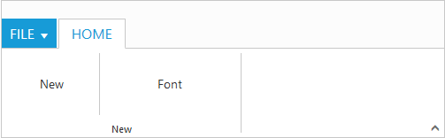

# Group

Group is a collection of logical content groups that are combined under related Tab. Each group can be defined using content groups or custom content.

## Adding Tab Groups

Group items can be added to Tabs by specifying text and corresponding content to be displayed. The content of group can be specified as either with content collection, contentID or customContent. You can add tab group dynamically in the ribbon control with given tab index, tab group object and group index position by using [`addTabGroup`](https://help.syncfusion.com/api/js/ejribbon#methods:addtabgroup) method.

### Adding Content

Add content to Group item which is based on type of content specified. The available types are button, splitButton, toggleButton,gallery, and dropDownList.

Groups and defaults settings can be added with the content. You can add group content dynamically in the ribbon control with given tab index, group index, content, content index and sub group index position by using [`addTabGroupContent`](https://help.syncfusion.com/api/js/ejribbon#methods:addtabgroupcontent).

## Defaults

The [`tabs.groups.content.defaults.height`](https://help.syncfusion.com/api/js/ejribbon#members:tabs-groups-content-defaults-height), [`tabs.groups.content.defaults.width`](https://help.syncfusion.com/api/js/ejribbon#members:tabs-groups-content-defaults-width), 
[`tabs.groups.content.defaults.type`](https://help.syncfusion.com/api/js/ejribbon#members:tabs-groups-content-defaults-type), [`tabs.groups.content.defaults.isBig`](https://help.syncfusion.com/api/js/ejribbon#members:tabs-groups-content-defaults-isbig) property to the controls in the [`group`](https://help.syncfusion.com/api/js/ejribbon#members:tabs-groups-content-groups) can be specified commonly.

The height & width applicable to button, split button, dropdown list ,Toggle button controls and isBig applicable to only button controls ( button, split , toggle)

## Adding Content Groups

Controls such as button, split button, dropdown list, toggle button, gallery in the subgroup of the Ribbon tab can be rendered. All of these can be customized using its corresponding settings property such as buttonSettings, dropdownSettings, etc.

Custom controls or items (such as table, div etc.) can be added when the type set as custom. defaults control settings of group can be specified for an individual group instead of specifying them to groups collection commonly.

Tooltip and Custom Tooltip can be specified for each group controls.



        

	     <ul id="ribbonmenu">
		    <li><a>FILE</a>
		     <ul>
		        <li><a>Open</a></li>
		     </ul>
		    </li>
	     </ul>
	     <ul id="pasteSplit">
		    <li>Paste</li>
		    <li>Paste Special</li>
	     </ul>
        <?php
		require_once 'EJ\AutoLoad.php';
        $ribbon = new  \EJ\Ribbon('defaultRibbon');
        $aTab = new \EJ\Ribbon\ApplicationTab();           
        $aTab->type('menu')->menuItemID('ribbonmenu');  
        $hometab  = new \EJ\Ribbon\Tab();
        $clipboard  = new \EJ\Ribbon\Group();
        $grpcontent = new \EJ\Ribbon\Content();
        $contentgroup=new \EJ\Ribbon\ContentGroup();
        $splitButtonSettings = array('contentType'=>'imageonly','targetID'=>'pasteSplit','imagePosition'=>'imagetop','prefixIcon'=>'e-icon e-ribbon e-ribbonpaste'); 
        $contentgroup->id('paste')->text('Paste')->toolTip('Paste')->splitButtonSettings($splitButtonSettings);   
        $default= new \EJ\Ribbon\Defaults();
        $default->width(60)->height(40)->type("splitbutton");
        $grpcontent->groups(array($contentgroup))->defaults($default);
        $clipboard->text('ClipBoard')->content(array($grpcontent));
        $clipboard1  = new \EJ\Ribbon\Group();
        $grpcontent1 = new \EJ\Ribbon\Content();
        $contentgroup1=new \EJ\Ribbon\ContentGroup();
        $contentgroup2=new \EJ\Ribbon\ContentGroup();
        $togglebutton =  array('defaultText'=>'Cut','targetID'=>'pasteSplit','activeText'=>'Cut Over'); 
        $togglebutton1 =  array('defaultText'=>'Copy','targetID'=>'pasteSplit','activeText'=>'Copy Over'); 
        $contentgroup1->id('cut')->toggleButtonSettings($togglebutton);
        $contentgroup2->id('copy')->toggleButtonSettings($togglebutton1);
        $default1= new \EJ\Ribbon\Defaults();
        $default1->width(75)->height(30)->type("togglebutton");
        $grpcontent1->groups(array($contentgroup1,$contentgroup2))->defaults($default1);
        $clipboard1->text('Font')->alignType("columns")->content(array($grpcontent1));
        $hometab->id('home')->text('HOME')->groups(array($clipboard,$clipboard1));
        echo $ribbon ->width('500px')->applicationTab($aTab)->tabs(array($hometab))->render();
        ?>



## Enable Separator

Separates the control from the next control in the group when group alignType is row. Set �true� to enableSeparator.



        

	     <ul id="ribbonmenu">
		    <li><a>FILE</a>
		     <ul>
			    <li><a>New</a></li>
                <li><a>Open</a></li>
		     </ul>
		    </li>
	     </ul>
        <?php
		require_once 'EJ\AutoLoad.php';
        $ribbon = new  \EJ\Ribbon('defaultRibbon');
        $aTab = new \EJ\Ribbon\ApplicationTab();           
        $aTab->type('menu')->menuItemID('ribbonmenu');  
        $hometab  = new \EJ\Ribbon\Tab();
        $clipboard  = new \EJ\Ribbon\Group();
        $grpcontent = new \EJ\Ribbon\Content();
        $contentgroup=new \EJ\Ribbon\ContentGroup();
        $contentgroup1=new \EJ\Ribbon\ContentGroup();
        $btnsettings = array('width'=> 100); 
        $contentgroup->id('new')->text('New')->toolTip('New')->enableSeparator('true')->buttonSettings($btnsettings);   
        $btnsettings1 = array('width'=> 150);
        $contentgroup1->id('font')->text('Font')->toolTip('Font')->buttonSettings($btnsettings1);  
        $default= new \EJ\Ribbon\Defaults();
        $default->width(70)->type('button');
        $grpcontent->groups(array($contentgroup,$contentgroup1))->defaults($default);
        $clipboard->text('New')->alignType('rows')->content(array($grpcontent));
        $hometab->id('home')->text('HOME')->groups(array($clipboard));
        echo $ribbon ->width('500px')->applicationTab($aTab)->tabs(array($hometab))->render();
        ?>



## Adding Custom Content

Set group type as custom to add custom items such as div, table and custom controls. With type as custom, content can be added in two ways as specified below.

* HTML contents can be directly added into the groups as string content using customContent property
* Custom template id can be specified to render those specific custom template using contentID property



        

	     <ul id="ribbonmenu">
		    <li><a>FILE</a>    
		     <ul>
			    <li><a>New</a></li>
		     </ul>
		    </li>
	     </ul>
         <button id='btn'>Using Content ID</button>
        <?php
		require_once 'EJ\AutoLoad.php';
        $ribbon = new  \EJ\Ribbon('defaultRibbon');
        $aTab = new \EJ\Ribbon\ApplicationTab();           
        $aTab->type('menu')->menuItemID('ribbonmenu');  
        $hometab  = new \EJ\Ribbon\Tab();
        $clipboard  = new \EJ\Ribbon\Group();
        $clipboard1  = new \EJ\Ribbon\Group();
        $grpcontent = new \EJ\Ribbon\Content();
        $grpcontent1 = new \EJ\Ribbon\Content();
        $contentgroup=new \EJ\Ribbon\ContentGroup();
        $contentgroup1=new \EJ\Ribbon\ContentGroup(); 
        $clipboard->text('New')->type('custom')->customContent("<button id='customContent'>Using Custom Content</button>");   
        $clipboard1->text('Data')->type('custom')->contentID('btn');  
        $hometab->id('home')->text('HOME')->groups(array($clipboard,$clipboard1));
        echo $ribbon ->width('500px')->applicationTab($aTab)->tabs(array($hometab))->render();
        ?>  
              


## Group Expander

Set enableGroupExpander as true to show Group Expander for each group in Tab. These expanders can be customized using groupExpand event, such as to show popup dialog. To specify tooltip for the group expander of the group [`tabs.groups.groupExpanderSettings`](https://help.syncfusion.com/api/js/ejribbon#members:tabs-groups-groupexpandersettings) and 
[`tabs.groups.groupExpanderSettings.toolTip`](https://help.syncfusion.com/api/js/ejribbon#members:tabs-groups-groupexpandersettings-tooltip) can be used.



        

	     <ul id="ribbonmenu">
		    <li><a>FILE</a>    
		     <ul>
			    <li><a>New</a></li>
		     </ul>
		    </li>
	     </ul>
         <button id='btn'>Home button</button>
        <?php
		require_once 'EJ\AutoLoad.php';
        $ribbon = new  \EJ\Ribbon('defaultRibbon');
        $aTab = new \EJ\Ribbon\ApplicationTab();           
        $aTab->type('menu')->menuItemID('ribbonmenu');  
        $hometab  = new \EJ\Ribbon\Tab();
        $clipboard  = new \EJ\Ribbon\Group();
        $clipboard->text('New')->alignType("rows")->type('custom')->enableGroupExpander(true)->contentID('btn');    
        $hometab->id('home')->text('HOME')->groups(array($clipboard));
        echo $ribbon ->width('500px')->applicationTab($aTab)->tabs(array($hometab))->render();
        ?>
        
              


