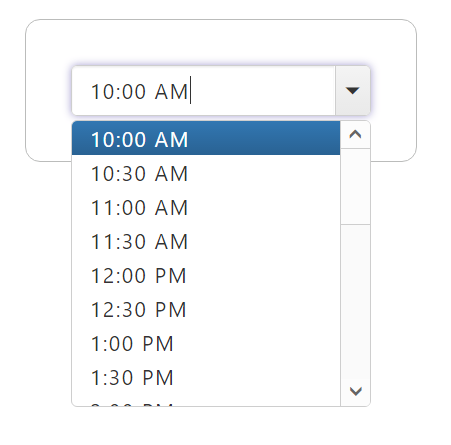
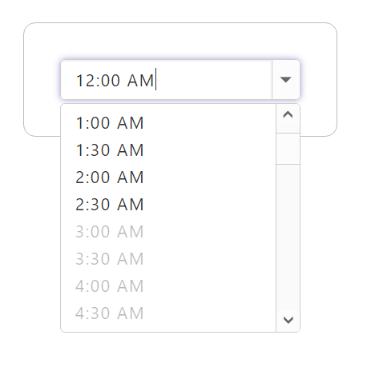

--
title: Getting Started with TimePicker | TimePicker | PHP | Syncfusion
description: Getting Started with TimePicker
platform: php
control: TimePicker
documentation: ug
keywords: Timepicker getting started, Timepicker features
---

# Getting Started

This section illustrates the details on how to render and customize a TimePicker control using various methods available in PHP wrapper classes.

Create a PHP Project and add necessary scripts and styles with the help of the given PHP [Getting Started]() Documentation.

## Create TimePicker

Create a TimePicker control by instantiating the PHP wrapper class available in EJ namespace as shown below.



    <?php
        $time = new EJ\TimePicker("time");
        echo $time->value(new DateTime())->render();
    ?>
    


The following screenshot illustrates the output of above code.

   

## Configuring TimePicker

### Set MinTime and MaxTime

EJ DatePicker provides API through which you can set the maximum and minimum allowed time values to be picked from the popup. Min and Max time values can be set at initialization as show below.



    <?php
        $time_minmax = new EJ\TimePicker("time_minmax");
        echo $time_minmax->value(new DateTime())->minTime("10:00 AM")->maxTime("10:00 PM")->render();
    ?>

  

The following screenshot illustrates the output of above code.

 

### Disable Time Ranges

With this API, you can disable a set of Time ranges to prevent the user from selected a set a time ranges from time popup as shown below.



    <?php
        $time_disable = new EJ\TimePicker("time_disable");
        echo $time_disable->value(new DateTime())->disableTimeRanges(array(
                    array("startTime" => "3:00 AM", "endTime" => "6:00 AM"),
                    array("startTime" => "1:00 PM", "endTime" => "3:00 PM"),
                    array("startTime" => "8:00 PM", "endTime" => "10:00 PM")))->render();
    ?>



The following screenshot illustrates the output of above code.

