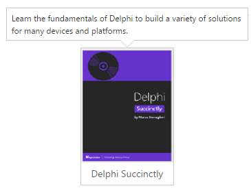

# Getting started

## Preparing HTML document

The Tooltip control has the following list of external JavaScript dependencies. 

* [jQuery](https://jquery.com/) 1.7.1 and later versions

* [jQuery.easing](https://gsgd.co.uk/sandbox/jquery/easing/) - to support animation effects in the components

Refer to the internal dependencies in the following table.

<table>
<tr>
<th>
File                                </th><th>
Description/Usage</th></tr>
<tr>
<td>
ej.core.min.js</td><td>
It is referred always before using all the JS controls.</td></tr>
<tr>
<td>
ej.tooltip.min.js</td><td>
The Tooltip's main file.</td></tr>
</table>

To get started, you can use the `ej.web.all.min.js` file that encapsulates all the `ej` controls and frameworks in one single file. 

You can create a PHP Project and add necessary scripts and styles with the help of the given PHP Getting Started Documentation.

Create a first PHP file in Xampp and name it appropriately with `.php` extension and also place it under the newly created sample folder. For example, say Index.php with the initial code as shown below -

Refer the required scripts and CSS files in your PHP page as mentioned below in order to render the Tooltip control - 



    <!DOCTYPE html>
    <html>
        <head>
                <title>Getting Started - Tooltip</title>
                <link href="http://cdn.syncfusion.com/{{ site.releaseversion }}/js/web/flat-azure/ej.web.all.min.css" rel="stylesheet" />
                <link href="http://cdn.syncfusion.com/{{ site.releaseversion }}/js/web/responsive-css/ej.responsive.css" rel="stylesheet" />
                
                
                
        </head>
        <body>
           <?php require_once 'EJ\AutoLoad.php'; ?>
        </body>
    </html>



For themes, you can use the `ej.web.all.min.css` CDN link from the code example given. To add the themes in your application, please refer to [this link](https://help.syncfusion.com/js/theming-in-essential-javascript-components).

## Create a Tooltip

The Tooltip can be created from any HTML element with the HTML `id` attribute and pre-defined options set to it. To create the Tooltip, you should call the `ejTooltip` jQuery plug-in function with the options as parameter. Refer to the following code example.


 
     

        
        
Delphi Succinctly

    

    <?php
    $tooltip1 =new EJ\Tooltip('sample');
    $pos1 = new EJ\Tooltip\Position();
    $tar1 = new EJ\Tooltip\Target();
    $stem1 = new EJ\Tooltip\Stem();
    $tar1->horizontal('top')->vertical('top');
    $stem1->horizontal('top')->vertical('top');
    $pos1->target($tar1)->stem($stem1);
    echo $tooltip1->content('Learn the fundamentals of Delphi to build a variety of solutions for many devices and platforms.')->render();
    ?>



Apply the following style sheet



    
    


## Setting Dimensions

Tooltip dimensions can be set using [width](https://help.syncfusion.com/js/api/ejtooltip#members:width) and [height](https://help.syncfusion.com/js/api/ejtooltip#members:height) API.


 
     

        
        
Delphi Succinctly

     

     <?php
       $tooltip1 =new EJ\Tooltip('sample');
       $pos1 = new EJ\Tooltip\Position();
       $tar1 = new EJ\Tooltip\Target();
       $stem1 = new EJ\Tooltip\Stem();
       $tar1->horizontal('top')->vertical('top');
       $stem1->horizontal('top')->vertical('top');
       $pos1->target($tar1)->stem($stem1);
      echo $tooltip1->width('200px')->height('100px')->content('Learn the fundamentals of Delphi to build a variety of solutions for many devices and platforms.')->render();
    ?>
    


## Tooltip Appearance 

You can configure the appearance of the Tooltip with the title, close button and call out as your application requires.


 
      

        
        
Delphi Succinctly

     

     <?php
      $tooltip1 =new EJ\Tooltip('sample');
      $pos1 = new EJ\Tooltip\Position();
      $tar1 = new EJ\Tooltip\Target();
      $stem1 = new EJ\Tooltip\Stem();
      $tar1->horizontal('top')->vertical('top');
      $stem1->horizontal('top')->vertical('top');
      $pos1->target($tar1)->stem($stem1);
      echo $tooltip1->width('200px')->height('100px')->content('Learn the fundamentals of Delphi to build a variety of solutions for many devices and platforms.')->title('Delphi Succintly')->closeMode('sticky')->isBalloon(false)->render();
    ?>
    


Apply the following styles to show the Tooltip.



    
    


