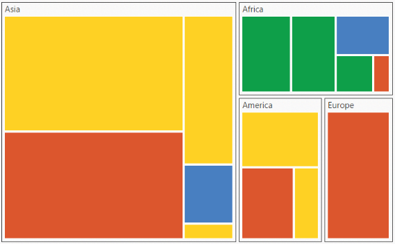

# Getting Started

This section explains briefly about how to create a **TreeMap** in your application with **PHP**.

## Create your first TreeMap in PHP

You can configure an **Essential PHP TreeMap** in simple steps. In this section, you can learn how to configure a TreeMap control in a real-time scenario where it is used to visually represent the percentage of growth in population in each continent. It also provides a walk-through on some of the customization features available in TreeMap control. 

## Adding PHP EJ source and script reference

Create a first PHP file in Xampp and name it appropriately with .php extension and also place it under the newly created sample folder. Now refer AutoLoad.php file from EJ source of PHP in the sample page. For example, say Index.php with the initial code as shown below -

Refer the required scripts files in your PHP page as mentioned below in order to render the TreeMap control.



<!DOCTYPE html>
<html>
<head>
<!--  jquery script  -->
        

<!-- JS Render widget -->
    

    <!-- Essential JS UI widget -->
    
</head>

<body>
<!--Refer AutoLoad.php common source to render the control-->
   <?php
      require_once '../EJ/AutoLoad.php';
    ?>
</body>
</html>



In the above code, ej.web.all.min.js script reference has been added for demonstration purpose. It is not recommended to use this for deployment purpose, as its file size is larger since it contains all the widgets. Instead, you can use [`CSG`](http://csg.syncfusion.com/) utility to generate a custom script file with the required widgets for deployment purpose.

## Initialize TreeMap

Add the following code in the index.php file to create the TreeMap control in index page.



   

    <?php
    require_once '../EJ/AutoLoad.php';
    ?>

    <?php
        $treeMap = new EJ\TreeMap("treemap1");    
	
        echo $treeMap->render();
    ?>



### Populate DataSource

The `dataSource` property accepts the collection values as input. For example, you can provide the list of objects as input.

### Weight Value Path

You can calculate the size of the object using `weightValuePath` of **TreeMap**.

Populate the TreeMap data in PHP JSON object. For example, you can use population data of countries to generate TreeMap data as illustrated in the following code sample. 



    <!DOCTYPE html>
    <html>
        <head>
         <title>Getting Started - TreeMap</title>
         <link href="http://cdn.syncfusion.com/14.4.0.15/js/web/flat-azure/ej.web.all.min.css" rel="stylesheet" />
         
         
        </head>
<body>

    <?php
    require_once '../EJ/AutoLoad.php';
    ?>

    <?php
    $treeMap = new EJ\TreeMap("treemap1");    
	
       $population_data = '[
                   { "Continent": "Asia", "Region": "Southern Asia", "Growth": 1.32, "Population": 1749046000 },
                   { "Continent": "Asia", "Region": "Eastern Asia", "Growth": 0.57, "Population": 1620807000 },
                   { "Continent": "Asia", "Region": "South-Eastern Asia", "Growth": 1.20, "Population": 618793000 },
                   { "Continent": "Asia", "Region": "Western Asia", "Growth": 1.98, "Population": 245707000 },
                   { "Continent": "Asia", "Region": "Central Asia", "Growth": 1.43, "Population": 64370000 },
                   { "Continent": "Europe", "Region": "Europe", "Growth": 0.10, "Population": 742452000 },
                   { "Continent": "America", "Region": "South America", "Growth": 1.06, "Population": 406740000 },
                   { "Continent": "America", "Region": "Northern America", "Growth": 0.85, "Population": 355361000 },
                   { "Continent": "America", "Region": "Central America", "Growth": 1.40, "Population": 167387000 },
                   { "Continent": "Africa", "Region": "Eastern Africa", "Growth": 2.89, "Population": 373202000 },
                   { "Continent": "Africa", "Region": "Western Africa", "Growth": 2.78, "Population": 331255000 },
                   { "Continent": "Africa", "Region": "Northern Africa", "Growth": 1.70, "Population": 210002000 },
                   { "Continent": "Africa", "Region": "Middle Africa", "Growth": 2.79, "Population": 135750000 },
                   { "Continent": "Africa", "Region": "Southern Africa", "Growth": 0.91, "Population": 60425000 }]';
    $JsonData = json_decode($population_data,true);

    echo $treeMap->dataSource($JsonData)->weightValuePath("Population")->render();
    ?>
   

 </body>
</html>



N> Population data is referred from [List of continents by population](http://en.wikipedia.org/wiki/List_of_continents_by_population).

## Group with Levels

You can group TreeMap items using the levels in it.

### Group Path

You can use `groupPath` property for every flat level of the TreeMap control. It is a path to a field on the source object that serves as the “Group” for the level specified. You can group the data based on the `groupPath` in the TreeMap control. When the `groupPath` is not specified, then the items are not grouped and the data is displayed in the order specified in the `dataSource`.

### Group Gap

You can use `groupGap` property to separate the items from every flat level and to differentiate the levels mentioned in the TreeMap control.

The following code sample explains how to group TreeMap Items using ‘Levels’.



 <?php
    $treeMap = new EJ\TreeMap("treemap1");
	$level = new EJ\TreeMap\Level();
	$level->groupPath("Continent")->groupGap(5);
	$levels = array($level);
    echo $treeMap->dataSource($JsonData)->levels($levels)->weightValuePath("Population")->render();
    ?>



The following screenshot displays grouping of **TreeMap****Items** using **Levels**.

## Customize TreeMap by Range

You can differentiate the nodes based on its value and color ranges using Range color. You can also define the color value range using from and to properties. 

### Color Value Path

The `colorValuePath` of TreeMap is a path to a field on the source object. You can determine the color for the object using `colorValuePath` of TreeMap.

The following code sample explains how to customize TreeMap appearance using Range.



 <?php
    $treeMap = new EJ\TreeMap("treemap1");

    $rangeColor1 = new EJ\TreeMap\RangeColorMapping();
	$rangeColor1->color("#DC562D")->from("0")->to("1");
	$rangeColor2 = new EJ\TreeMap\RangeColorMapping();
	$rangeColor2->color("#FED124")->from("1")->to("1.5");
	$rangeColor3 = new EJ\TreeMap\RangeColorMapping();
	$rangeColor3->color("#487FC1")->from("1.5")->to("2");
	$rangeColor4 = new EJ\TreeMap\RangeColorMapping();
	$rangeColor4->color("#0E9F49")->from("2")->to("3");
	$rangeColors = array($rangeColor1, $rangeColor2, $rangeColor3, $rangeColor4);
	
	$level = new EJ\TreeMap\Level();
	$level->groupPath("Continent")->groupGap(5);
	$levels = array($level);
    echo $treeMap->dataSource($JsonData)->levels($levels)->weightValuePath("Population")
	             ->colorValuePath("Growth")->rangeColorMapping($rangeColors)
	             ->render();
    ?>



The following screenshot displays a customized **TreeMap** control. 

## Enable Tooltip

You can enable the tooltip by setting `showTooltip` property to “True”. By default, it takes the property of the bound object that is referred in the `weightValuePath` and displays its content when the corresponding node is hovered. You can customize the template for tooltip using `tooltipTemplate` property.

## Leaf ItemSettings

You can customize the Leaf level TreeMap items using `leafItemSettings`. The Label and tooltip values take the property of bound object that is referred in the `labelPath` when defined. The following code sample displays how the tooltip is enabled.



        <?php
    $treeMap = new EJ\TreeMap("treemap1");

              $rangeColor1 = new EJ\TreeMap\RangeColorMapping();
	$rangeColor1->color("#DC562D")->from("0")->to("1");
	$rangeColor2 = new EJ\TreeMap\RangeColorMapping();
	$rangeColor2->color("#FED124")->from("1")->to("1.5");
	$rangeColor3 = new EJ\TreeMap\RangeColorMapping();
	$rangeColor3->color("#487FC1")->from("1.5")->to("2");
	$rangeColor4 = new EJ\TreeMap\RangeColorMapping();
	$rangeColor4->color("#0E9F49")->from("2")->to("3");
	$rangeColors = array($rangeColor1, $rangeColor2, $rangeColor3, $rangeColor4);
	
	$leafItem = new EJ\TreeMap\LeafItemSetting();
	$leafItem->labelPath("Region");
	
	$level = new EJ\TreeMap\Level();
	$level->groupPath("Continent")->groupGap(5);
	$levels = array($level);
    echo $treeMap->dataSource($JsonData)->levels($levels)->weightValuePath("Population")
	             ->colorValuePath("Growth")->rangeColorMapping($rangeColors)->leafItemSettings($leafItem)
				 ->showTooltip(true)
	             ->render();
    ?>



The following screenshot displays a ToolTip in a **TreeMap** control.

## Enable Legend

You can set the color value of leaf nodes using TreeMap Legend. This legend is appropriate only for the TreeMap whose leaf nodes are colored using `rangeColorMapping`. You can set `showLegend` property value to “True” to make a legend visible.

### Label for Legend

You can customize the labels of the legend item using `legendLabel` property of `rangeColorMapping`. 

The following code sample illustrates how to add labels for legend in a TreeMap.



  <?php
    $treeMap = new EJ\TreeMap("treemap1");  

    $rangeColor1 = new EJ\TreeMap\RangeColorMapping();
	$rangeColor1->color("#DC562D")->from("0")->to("1")->legendLabel("0 - 1%");
	$rangeColor2 = new EJ\TreeMap\RangeColorMapping();
	$rangeColor2->color("#FED124")->from("1")->to("1.5")->legendLabel("1 - 1.5%");
	$rangeColor3 = new EJ\TreeMap\RangeColorMapping();
	$rangeColor3->color("#487FC1")->from("1.5")->to("2")->legendLabel("1.5 - 2%");
	$rangeColor4 = new EJ\TreeMap\RangeColorMapping();
	$rangeColor4->color("#0E9F49")->from("2")->to("3")->legendLabel("2 - 3%");
	$rangeColors = array($rangeColor1, $rangeColor2, $rangeColor3, $rangeColor4);
	
	$leafItem = new EJ\TreeMap\LeafItemSetting();
	$leafItem->labelPath("Region");
	
	$legend = new EJ\TreeMap\LegendSetting();
	$legend->height(38)->width(690);
	
	$level = new EJ\TreeMap\Level();
	$level->groupPath("Continent")->groupGap(5);
	$levels = array($level);
    echo $treeMap->dataSource($JsonData)->levels($levels)->weightValuePath("Population")
	             ->colorValuePath("Growth")->rangeColorMapping($rangeColors)->leafItemSettings($leafItem)
				 ->showTooltip(true)->legendSettings($legend)->showLegend(true)
	             ->render();
    ?>



The following screenshot displays labels in a **TreeMap** control. 

N> Population data is referred from [List of continents by population](http://en.wikipedia.org/wiki/List_of_continents_by_population).

