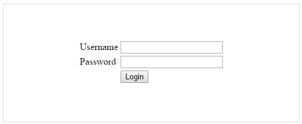

# Getting Started

This section explains briefly about how to create a **WaitingPopup** in your application with **PHP**.
**WaitingPopup** provides support to display a **WaitingPopup** within your web page. From the following guidelines, you can learn how to create a **WaitingPopup** in a real-time login page authentication scenario. 

The following screenshot illustrates the functionality of a **WaitingPopup** with login page scenario.

 

You can give the Username and Password in the **login page**. When you click the **Login** button, you get the **WaitingPopup**. After loading, the alert box pops up with the message “Signed in successfully”.

The external script dependencies of the WaitingPopup widget is,

* [jQuery 1.7.1](http://jquery.com/) and later versions.

And the internal script dependencies of the WaitingPopup widget are:

<table>
	<tr>
		<th>File </th>
		<th>Description / Usage </th>
	</tr>
	<tr>
		<td>ej.core.min.js</td>
		<td>Must be referred always before using all the JS controls.</td>
	</tr>
	<tr>
		<td>ej.waitingpopup.min.js</td>
		<td>The waitingpopup’s main file</td>
	</tr>
</table>

For getting started you can use the ‘ej.web.all.min.js’ file, which encapsulates all the 'ej' controls and frameworks in one single file.  

For themes, you can use the ‘ej.web.all.min.css’ CDN link from the snippet given. To add the themes in your application, please refer [this link](http://help.syncfusion.com/js/theming-in-essential-javascript-components#adding-specific-theme-to-your-application).

## Preparing HTML document

You can create a PHP Project and add necessary scripts and styles with the help of the given PHP Getting Started Documentation.

Create a first PHP file in Xampp and name it appropriately with `.php` extension and also place it under the newly created sample folder. For example, say Index.php with the initial code as shown below -

Refer the required scripts and CSS files in your PHP page as mentioned below in order to render the WaitingPopup control - 



    <!DOCTYPE html>
       <html>
        <head>
                <title>Getting Started - WaitingPopup</title>
                <link href="http://cdn.syncfusion.com/{{ site.releaseversion }}/js/web/flat-azure/ej.web.all.min.css" rel="stylesheet" />
                <link href="http://cdn.syncfusion.com/{{ site.releaseversion }}/js/web/responsive-css/ej.responsive.css" rel="stylesheet" />
                
                
        </head>
        <body>
           <?php require_once 'EJ/AutoLoad.php'; ?>
        </body>
    </html>



## Create a WaitingPopup

**WaitingPopup** widget basically renders built-in features like blocking the other actions until the page is loaded.

The Tab can be created in **PHP** by using the below given code.



   <table class="loginTable">
      <tr>
         <td>Username</td>
         <td><input type="text"/></td>
      </tr>
      <tr>
         <td>Password</td>
         <td><input type="password"/></td>
      </tr>
      <tr>
         <td></td>
         <td><button id="target">Login</button></td>
      </tr>
   </table>
    <?php
        $waitingpopup =new EJ\WaitingPopup('popup');
        echo $waitingpopup->showOnInit(false)->target("#targetElements")->appendTo('body')->render();
    ?>



 Initialize **Click function** using the following code example.



<?php
        $waitingpopup =new EJ\WaitingPopup('popup');
        echo $waitingpopup->showOnInit(false)->target("#targetElements")->appendTo('body')->render();
		echo('');
        ?>



 Apply the following styles to show the **WaitingPopup**.





The following screenshot displays a **User** **login**.

 

## Add WaitingPopup Widget

 In a real-time login page scenario, when you click the Login button, the WaitingPopup is displayed. 



    <?php
        $waitingpopup =new EJ\WaitingPopup('popup');
        echo $waitingpopup->showOnInit(false)->target("#targetElements")->appendTo('body')->render();
		echo('');
    ?>



 The following screenshot shows the output of the above code example.

 

